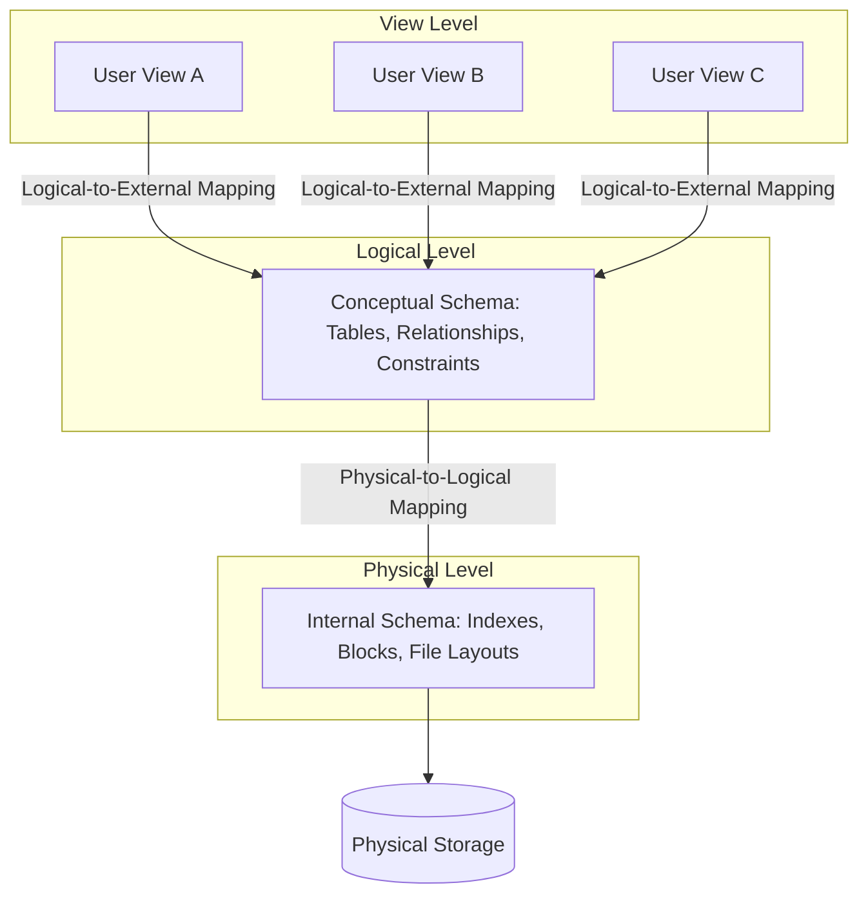

# Database Architectures

A Database Management System (DBMS) is software designed to store, retrieve, define, and manage data in databases. Understanding database architectures helps software engineers make informed system decisions regarding performance, security, and scalability.

---

## 📂 File System vs. DBMS

Before DBMS, systems relied on raw files (e.g., text, CSV files) to store data. Modern applications prefer a DBMS due to several fundamental drawbacks of file-based systems:

| Feature | File System | DBMS |
| :--- | :--- | :--- |
| **Data Redundancy** | High (same data repeated in multiple files). | Controlled & Minimized through schema design. |
| **Data Consistency** | Low (changes in one file do not propagate to others). | High (updates propagate, constraints enforce validation). |
| **Data Isolation** | Hard to query across different file structures. | Easy using declarative query languages (like SQL). |
| **Concurrency Control** | Hard (processes overwrite each other's updates). | Robust (Locks, MVCC, Concurrency protocols). |
| **Security** | Coarse-grained (file-level read/write permissions). | Fine-grained (row-level, column-level access controls). |
| **Transaction Support** | No ACID guarantees. Recovery requires manual backups. | Full ACID compliance with automated logs & rollbacks. |

---

## 🏛 The Three-Schema Architecture

The **Three-Schema Architecture** (also known as the ANSI-SPARC architecture) isolates the user applications from the physical database database structures. It is divided into three abstraction levels:

1. **External Level (View Schema)**: 
   Describes how different users view the database. Each group of users sees only the data they have access to (e.g., a customer sees order details, while support sees payment details).
2. **Conceptual Level (Logical Schema)**:
   Describes what data is stored in the database and the relationships among those data. It defines tables, attributes, data types, and integrity constraints.
3. **Internal Level (Physical Schema)**:
   Describes how data is physically stored on disk (indexes, file organization, block sizes, clustering, compression).

### Data Independence

A key goal of the three-schema architecture is **Data Independence**, ensuring that changes at a lower level do not require rewriting application programs at higher levels:

* **Logical Data Independence**: The ability to modify the conceptual schema without changing the external views or application programs.
  * *Example:* Adding a new attribute to a table or breaking a table into two (normalization) does not require changing how a frontend view queries other unchanged columns, provided we map the view correctly.
* **Physical Data Independence**: The ability to modify the physical schema without changing the conceptual or external schemas.
  * *Example:* Switching from a B-Tree index to a Hash index, migrating data to a different hard drive, or changing block sizes has zero impact on application SQL queries.

---

## 🗄️ Database Paradigms

Databases are categorized based on their data models and scaling features.

### 1. Relational Database Management Systems (RDBMS)
* **Model**: Tabular data structure (relations, attributes, tuples).
* **Guarantees**: Strict ACID compliance.
* **Scaling**: Primarily vertical (scale up CPU/RAM). Horizontal scaling requires complex partitioning/sharding.
* **Examples**: PostgreSQL, MySQL, SQLite, Oracle.

### 2. NoSQL (Not Only SQL)
Designed for horizontal scalability, high throughput, and semi-structured or unstructured data.
* **Document Stores**: Stores semi-structured JSON documents. Excellent for content management and catalog data.
  * *Examples:* MongoDB, CouchDB.
* **Key-Value Stores**: Super-fast dictionary-like data structures. Used heavily for caching and session state.
  * *Examples:* Redis, DynamoDB.
* **Column-Family Stores**: Organizes data by columns instead of rows. Highly optimized for analytics on massive datasets.
  * *Examples:* Cassandra, ScyllaDB, HBase.
* **Graph Databases**: Nodes represent entities; edges represent relationships. Optimized for traversing highly connected data (social networks, recommendation engines).
  * *Examples:* Neo4j, Amazon Neptune.

### 3. NewSQL
A modern class of relational databases that provide the horizontal scalability of NoSQL systems while maintaining ACID guarantees and SQL compatibility.
* **Architecture**: Distributed consensus (e.g., Raft/Paxos), auto-sharding, and distributed transactions.
* **Examples**: CockroachDB, Google Spanner, YugabyteDB.
