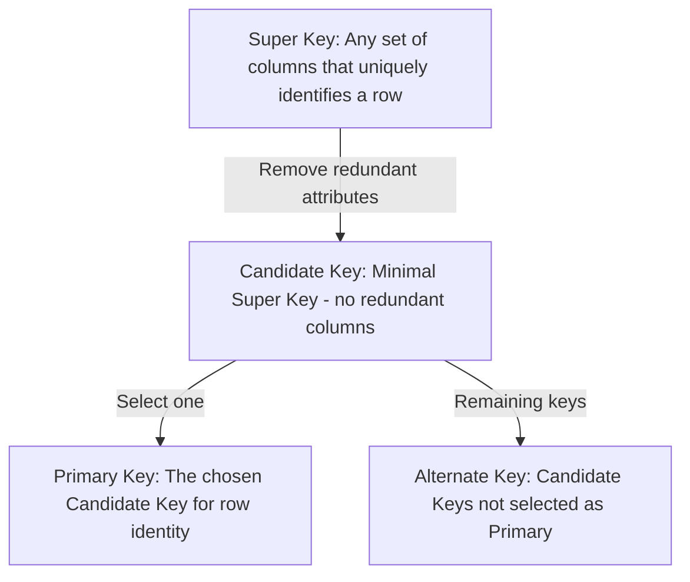
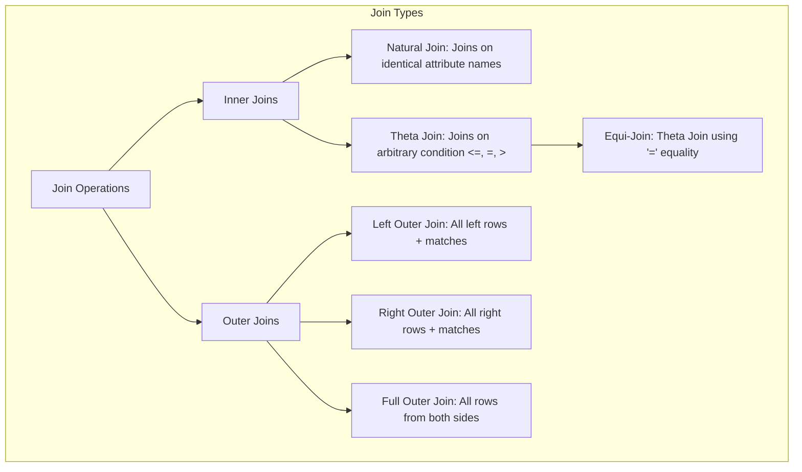

# Relational Model & Keys

The **Relational Model** represents data as a collection of two-dimensional tables (called *relations*). Designed by Edgar F. Codd in 1970, it is the theoretical foundation of Relational Databases (RDBMS).

---

## 🔤 Core Terminology

In database theory, formal terms are mapped directly to common database concepts:

| Formal Relational Term | Common SQL Term | Meaning |
| :--- | :--- | :--- |
| **Relation** | Table | A two-dimensional grid of rows and columns. |
| **Attribute** | Column / Field | A named header of a column in a relation. |
| **Tuple** | Row / Record | A single data row representing a specific entity instance. |
| **Cardinality** | Number of Rows | Total number of tuples in a relation. |
| **Degree** | Number of Columns | Total number of attributes in a relation. |
| **Domain** | Data Type + Range | The set of allowable values for a specific attribute (e.g., integers > 0). |

---

## 🔑 The Keys Hierarchy

Keys are attributes (or sets of attributes) that uniquely identify tuples in a relation and establish relationships between tables.

### 1. Super Key
Any attribute or combination of attributes that uniquely identifies a tuple within a relation. A table can have many super keys, and they may contain redundant attributes.
* *Example:* In a `Users(id, email, name, age)` table, `{id}`, `{id, name}`, `{email}`, and `{id, email, age}` are all super keys.

### 2. Candidate Key
A minimal super key. It is a super key with no redundant attributes (if you remove any attribute from it, it loses its uniqueness property).
* *Example:* In `Users(id, email, name, age)`, `{id}` and `{email}` are candidate keys. `{id, email}` is not a candidate key because it is not minimal (either `{id}` or `{email}` alone is sufficient).

### 3. Primary Key
The specific candidate key selected by the database designer to uniquely identify tuples in the relation. It **cannot contain NULL values**.

### 4. Alternate Key (Secondary Key)
Candidate keys that were not chosen as the primary key.
* *Example:* If `{id}` is chosen as the primary key, `{email}` becomes the alternate key.

### 5. Composite Key
A primary key consisting of two or more attributes.
* *Example:* In a `CourseEnrollment(student_id, course_id, enrollment_date)` table, neither `student_id` nor `course_id` alone is unique. The composite key is `{student_id, course_id}`.

### 6. Foreign Key (Referential Key)
An attribute in a relation that matches the candidate key (usually primary key) of another relation. It creates a parent-child relationship.
* *Example:* `Orders.user_id` is a foreign key referencing `Users.id`.

---

## 🛡️ Integrity Constraints

Constraints ensure that data entering the database remains accurate, consistent, and valid.

1. **Domain Constraint**: Values of an attribute must belong to the defined domain/data type. (e.g., `Age` must be an integer, `Phone` must match a specific regex).
2. **Entity Integrity Constraint**: The primary key of a relation **cannot be NULL**. If the primary key could be NULL, we could not uniquely identify that row.
3. **Referential Integrity Constraint**: If a foreign key exists in a relation, its value must either:
   - Match a valid primary key value in the referenced relation, or
   - Be completely `NULL` (if the relationship is optional).
   
#### Foreign Key Actions on Parent Delete/Update:
- `ON DELETE CASCADE`: If parent row is deleted, automatically delete all matching child rows.
- `ON DELETE SET NULL`: If parent row is deleted, set child foreign key columns to NULL.
- `ON DELETE RESTRICT / NO ACTION`: Prevent deletion of the parent row if child rows depend on it (default).

---

## 📐 Relational Algebra

Relational Algebra is a formal, procedural query language that takes one or more relations as input and produces a new relation as output. SQL queries are internally parsed and converted into relational algebra expressions for query optimization.

### 1. Selection ($\sigma$)
Selects a subset of tuples from a relation that satisfy a specific condition. (Equivalent to SQL `WHERE`).
$$\sigma_{\text{age} > 25}(\text{Users})$$

### 2. Projection ($\pi$)
Selects specific attributes (columns) from a relation and discards the rest. Automatically removes duplicate tuples. (Equivalent to SQL `SELECT column_name`).
$$\pi_{\text{name, email}}(\text{Users})$$

### 3. Cartesian Product ($\times$)
Combines all tuples of one relation with all tuples of another. (Equivalent to SQL `CROSS JOIN`).
$$\text{Users} \times \text{Orders}$$

### 4. Joins ($\bowtie$)
Combines matching tuples from two relations based on a join condition.
- **Natural Join** ($\bowtie$): Joins relations on common attributes (same name and domain) and removes duplicate columns.
- **Theta Join** ($\bowtie_\theta$): Joins relations based on an arbitrary comparison operator ($<, >, \le, \ge, =, \neq$).
- **Outer Joins** ($\text{Left Outer } ⟕ \text{, Right Outer } ⟖ \text{, Full Outer } ⟗$): Keeps tuples even if there are no matching tuples in the other relation, padding missing attributes with `NULL`.

