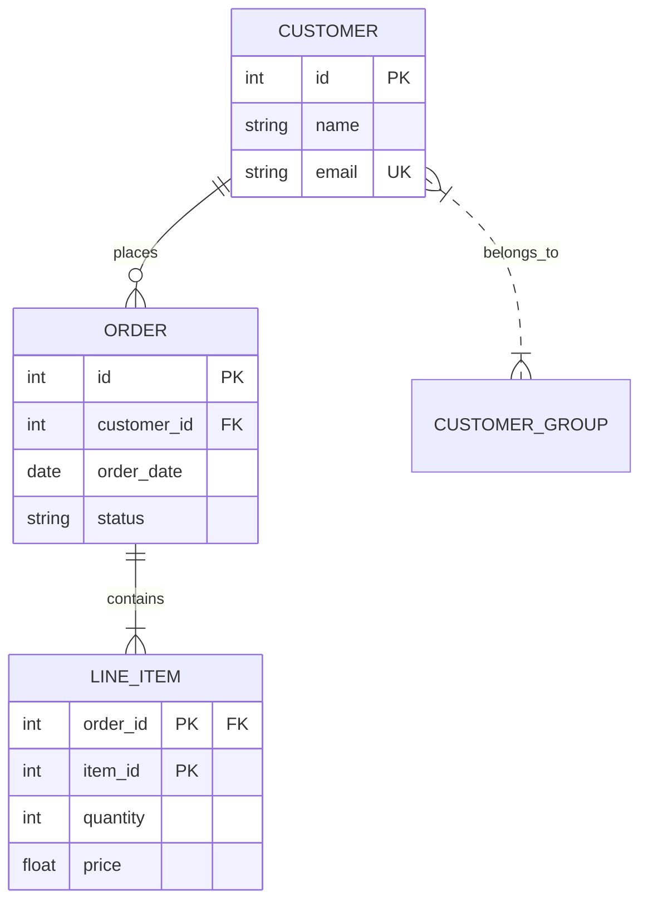

# Entity-Relationship (ER) Diagrams

The **Entity-Relationship (ER) Model** is a high-level conceptual data model used to design database schemas. It describes data as real-world *entities*, their *attributes*, and the *relationships* between them.

---

## 🏢 Core Concepts

### 1. Entities and Entity Sets
* **Entity**: A distinguishable real-world object (e.g., a specific employee, "John Doe").
* **Entity Set**: A collection of similar entities (e.g., all `Employees`).
* **Strong Entity**: An entity that can exist independently of other entities in the database. It contains a primary key.
* **Weak Entity**: An entity whose existence depends on a parent (identifying) entity. It does not have its own primary key; it is identified using a combination of the parent's primary key and its own **partial key (discriminator)**.

### 2. Attributes
Properties that describe entities.
* **Simple (Atomic)**: Cannot be divided further (e.g., `Age`, `Salary`).
* **Composite**: Can be subdivided into sub-attributes (e.g., `Name` $\rightarrow$ `First_Name`, `Last_Name`).
* **Single-valued**: Holds only one value for an entity (e.g., `Date_of_Birth`).
* **Multi-valued**: Can hold multiple values for a single entity (e.g., `Phone_Numbers`, `Skills`). Represented by double-ovals in Chen notation.
* **Derived**: Values computed from other attributes (e.g., `Age` derived from `Date_of_Birth`). Represented by dashed ovals.

### 3. Relationships and Cardinality
A relationship is an association among two or more entities.
* **Cardinality Ratio**: Specifies the number of relationship instances an entity can participate in:
  - **One-to-One (1:1)**: An employee manages at most one department.
  - **One-to-Many (1:N)**: A department employs many employees, but an employee belongs to one department.
  - **Many-to-Many (M:N)**: An employee works on multiple projects, and a project has multiple employees.
* **Participation Constraints**:
  - **Total Participation (Double Line)**: Every entity in the set must participate in the relationship (e.g., every `Employee` *must* work for a `Department`).
  - **Partial Participation (Single Line)**: Entities can exist without participating in the relationship (e.g., not every `Employee` manages a `Department`).

---

## 📊 Chen vs. Crow's Foot vs. Mermaid Notation

Modern software engineering heavily uses **Crow's Foot notation** or **Mermaid** syntax to represent relationships in code repositories.

Here is a standard relational mapping using Mermaid's built-in ER syntax:

---

## 🗺️ Mapping ER Diagrams to Relational Schemas

Translating a conceptual ER diagram into physical tables is governed by strict mapping rules:

### 1. Strong Entities
* Map each strong entity to a table.
* Attributes map to table columns. The key attribute becomes the **Primary Key**.

### 2. Composite Attributes
* Flatten the composite attribute: create columns for each of its component attributes directly in the table. Do not create a separate table.
* *Example:* `Address(Street, City, ZipCode)` on `Users` maps to columns `street`, `city`, and `zipcode` inside the `Users` table.

### 3. Multi-valued Attributes
* Create a **separate table** for the multi-valued attribute.
* The new table contains the attribute itself, plus the primary key of the parent entity as a **Foreign Key**.
* The primary key of this new table is a composite of the foreign key and the multi-valued attribute.
* *Example:* For `User(id, name)` with multi-valued attribute `phones`, create table `User_Phones(user_id FK, phone_number)` with PK `{user_id, phone_number}`.

### 4. Weak Entities
* Create a separate table for the weak entity.
* Include the primary key of the identifying parent table as a **Foreign Key** in the weak entity's table.
* The primary key of the weak entity table is a **Composite Key** made of `{Parent_PK, Partial_Key}`.
* Set deletion rules to `ON DELETE CASCADE`.

### 5. Binary Relationships (1:1, 1:N, M:N)

#### Mapping One-to-One (1:1)
- **Approach A (Foreign Key)**: Place the primary key of one table (typically the one with total participation) as a foreign key in the other table.
- **Approach B (Merged Relation)**: If both participate totally, merge them into a single table.

#### Mapping One-to-Many (1:N)
- Place the primary key of the "One" side table as a **Foreign Key** in the "Many" side table.
- *Example:* Add `department_id` to the `Employees` table.

#### Mapping Many-to-Many (M:N)
- Create a **Cross-Reference / Junction Table** (also called a relational bridge).
- The junction table contains the primary keys of both entities as Foreign Keys.
- The primary key of the junction table is the composite of `{EntityA_PK, EntityB_PK}`.
- Any attributes associated with the relationship itself are placed as columns in this junction table.
