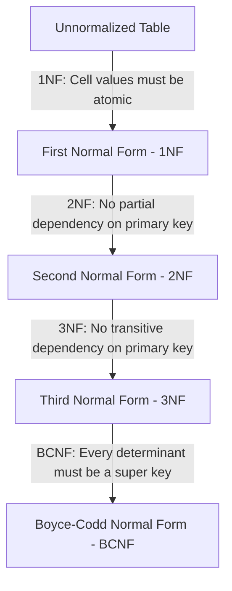

# Database Normalization

Database normalization is the systematic process of organizing fields and tables of a relational database to minimize **data redundancy** and avoid **update anomalies**.

---

## ⚠️ Database Anomalies

An unnormalized database schema can suffer from three main database anomalies, which compromise data integrity:

1. **Insertion Anomaly**: Inability to insert certain data because other data is missing.
   * *Example:* You cannot insert a new course into the database until at least one student registers for it, because the composite primary key contains `student_id`.
2. **Update Anomaly**: Redundant data requires updating multiple rows for a single logical change. If some rows are missed, the database enters an inconsistent state.
   * *Example:* If a department changes its name, you must update the name for every employee in that department.
3. **Deletion Anomaly**: Deleting a record unintentionally deletes other related logical data.
   * *Example:* Deleting the last student enrolled in a course deletes the course's code, description, and instructor information.

---

## 🔗 Functional Dependencies (FDs)

A Functional Dependency ($X \rightarrow Y$) is a constraint between two sets of attributes in a relation. It states that the value of attribute set $X$ uniquely determines the value of attribute set $Y$.
* **Determinant**: The left-hand side ($X$).
* **Dependent**: The right-hand side ($Y$).

### Armstrong's Axioms (Inference Rules)
These rules generate the complete closure of functional dependencies ($F^+$):

1. **Reflexivity**: If $Y \subseteq X$, then $X \rightarrow Y$ (Trivial dependency).
2. **Augmentation**: If $X \rightarrow Y$, then $XZ \rightarrow YZ$ for any $Z$.
3. **Transitivity**: If $X \rightarrow Y$ and $Y \rightarrow Z$, then $X \rightarrow Z$.

#### Secondary Rules:
- **Decomposition**: If $X \rightarrow YZ$, then $X \rightarrow Y$ and $X \rightarrow Z$.
- **Union**: If $X \rightarrow Y$ and $X \rightarrow Z$, then $X \rightarrow YZ$.
- **Pseudo-transitivity**: If $X \rightarrow Y$ and $WY \rightarrow Z$, then $WX \rightarrow Z$.

---

## 📈 Normal Forms Hierarchy

Each normal form represents a stricter set of rules. An RDBMS is considered normalized if it satisfies Boyce-Codd Normal Form (BCNF) or at least Third Normal Form (3NF).

### 1. First Normal Form (1NF)
* **Rule**: All attribute values must be **atomic** (no multi-valued attributes, nested tables, or repeating groups).
* **Fix**: Split multi-valued fields into separate rows or separate tables.

### 2. Second Normal Form (2NF)
* **Rule**: Must be in **1NF**, and have **no partial dependencies**. 
  * A partial dependency occurs when a non-prime attribute depends on only a part of a composite primary key.
  * *Note:* If a table's primary key is a single attribute (not composite), the table is automatically in 2NF.
* **Fix**: Move the partially dependent attributes and the subset of the primary key they depend on to a new table.

### 3. Third Normal Form (3NF)
* **Rule**: Must be in **2NF**, and have **no transitive dependencies**.
  * A transitive dependency occurs when a non-prime attribute depends on another non-prime attribute (which in turn depends on the primary key): $PK \rightarrow X \rightarrow Y$.
  * *Formal Condition:* For any non-trivial dependency $X \rightarrow Y$, either:
    1. $X$ is a super key, or
    2. $Y$ is a prime attribute (part of a candidate key).
* **Fix**: Move the transitively dependent attributes ($X$ and $Y$) to a new table where $X$ is the primary key.

### 4. Boyce-Codd Normal Form (BCNF / 3.5NF)
* **Rule**: A stricter version of 3NF. For every non-trivial functional dependency $X \rightarrow Y$, **$X$ must be a super key**. 
  * In BCNF, unlike 3NF, a prime attribute cannot be transitively dependent on a non-key attribute.
* **Fix**: Break the relation into two, ensuring the determinant ($X$) becomes the primary key of the new relation.

---

## ⚔️ 3NF vs. BCNF Summary

When decomposing a table to resolve anomalies, we aim for two properties:
1. **Lossless Decomposition**: Rejoining the decomposed tables via natural join recovers the exact original data without introducing spurious rows. (Always achievable for both 3NF and BCNF).
2. **Dependency Preservation**: All functional dependencies of the original table can be enforced directly on the individual decomposed tables.

| Metric | Third Normal Form (3NF) | Boyce-Codd Normal Form (BCNF) |
| :--- | :--- | :--- |
| **Anomalies** | May still contain minor redundancy anomalies. | Resolves all redundancy anomalies. |
| **Strictness** | Moderate. Determinant does not have to be a key if dependent is prime. | Strict. Determinant **must** be a super key. |
| **Dependency Preservation** | **Always guaranteed**. | **Not always guaranteed**. |

> [!TIP]
> If a BCNF decomposition breaks dependency preservation, database designers often compromise and settle for **3NF**, validating the remaining dependencies via application logic or triggers.
