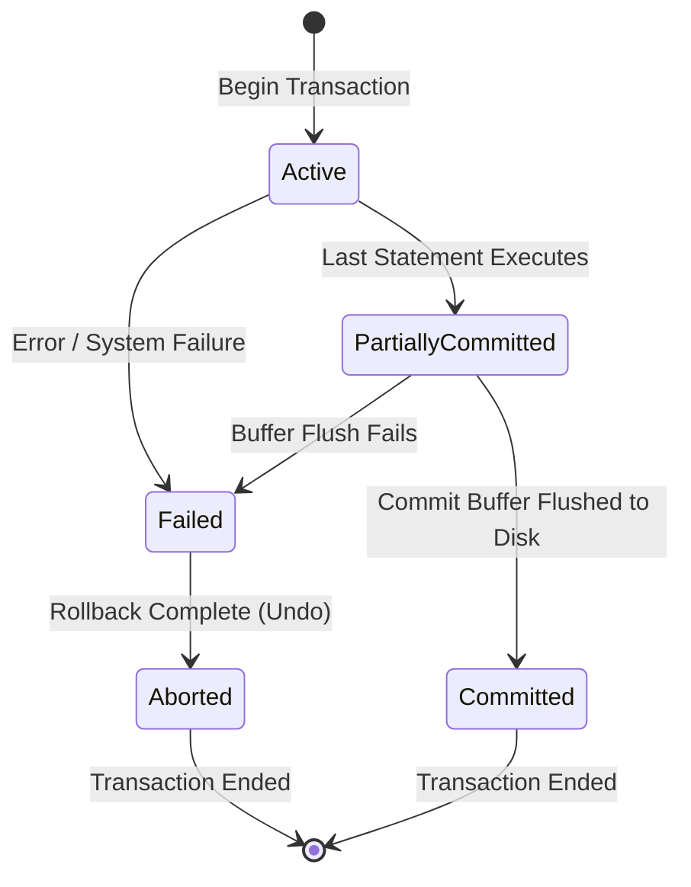
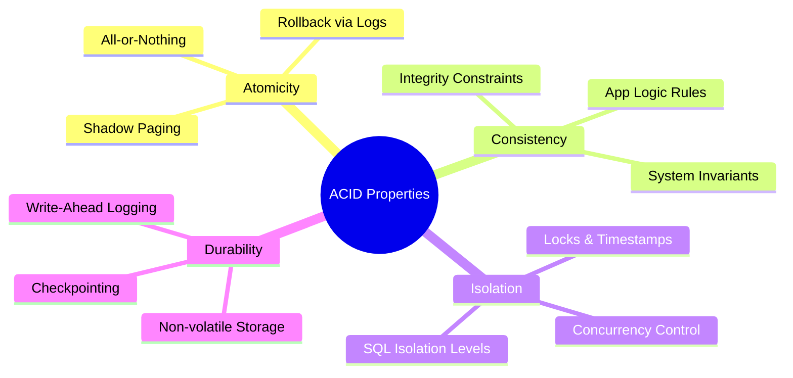

# ACID Properties

A **Transaction** is a logical unit of database processing that includes one or more database access operations (read, write, update, delete). To maintain data integrity, a database engine must guarantee the **ACID** properties.

---

## 🔁 Transaction States

A transaction undergoes several state transitions during its execution lifecycle:

1. **Active**: The initial state. The transaction executes its read/write operations in volatile memory buffers.
2. **Partially Committed**: The state after the final read/write statement has executed. Changes are in RAM buffers but not permanently written to non-volatile disk storage.
3. **Committed**: The state after the database engine successfully writes the log records and modified buffers to persistent disk storage. The transaction is complete.
4. **Failed**: The state when the transaction encounters a run-time error (e.g., division by zero, deadlock, or crash) and cannot continue execution.
5. **Aborted**: The state after the database engine rolls back all modifications (Undos) performed by the failed transaction, restoring the database to its pre-transaction state.

---

## 🔒 ACID Properties Explained

### 1. Atomicity ("All-or-Nothing")
* **Concept**: Either all operations of the transaction succeed and commit to the database, or none do, and any partial changes are completely rolled back.
* **Mechanism**: 
  - Managed by the **Recovery Manager** using the database transaction logs (specifically the `UNDO` logs).
  - If a crash occurs mid-transaction, the recovery system reads the log and reverses any uncommitted writes.

### 2. Consistency
* **Concept**: A transaction must transform the database from one valid state (satisfying all structural and business integrity constraints) to another valid state.
* **Mechanism**:
  - Enforced by both the DBMS (checking keys, unique bounds, not nulls, data types) and the application developer (enforcing logical invariants, like "total balance across account A and B must remain constant during a transfer").

### 3. Isolation
* **Concept**: Concurrent execution of multiple transactions should produce the same database state as if they were executed sequentially (one after another). No transaction should see the uncommitted, temporary state of another.
* **Mechanism**:
  - Managed by the **Concurrency Control Manager** using locking protocols (like Two-Phase Locking), timestamp ordering, or Multi-Version Concurrency Control (MVCC).

### 4. Durability
* **Concept**: Once a transaction commits, its changes are permanently written to non-volatile storage (disk/SSD) and will survive any subsequent system crash or power outage.
* **Mechanism**:
  - Managed by the **Recovery Manager** using Write-Ahead Logging (WAL) and checkpoints.
  - The transaction is not acknowledged as "committed" to the client until the log entry for the commit is safely flushed to non-volatile disk.
