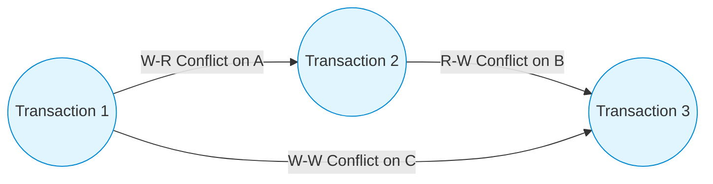
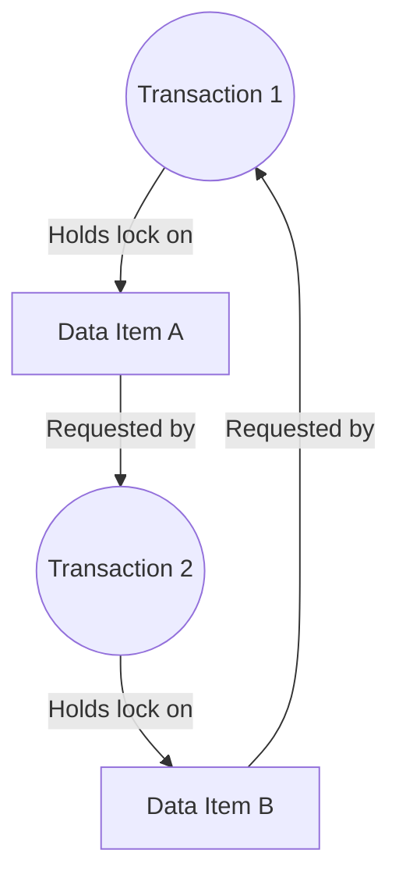

# Database Concurrency Control

Concurrency control manages simultaneous operations on a database without conflict, preventing data corruption when multiple transactions access the same records.

---

## 🛑 Concurrency Anomalies

When transactions execute concurrently without proper isolation, several anomalies can occur:

| Anomaly | Conflict Type | Description |
| :--- | :--- | :--- |
| **Dirty Read** | Write-Read (WR) | Transaction $T_1$ modifies a row. Transaction $T_2$ reads the modified row before $T_1$ commits. $T_1$ aborts (rolls back). $T_2$ now has read data that "never existed". |
| **Non-Repeatable Read** | Read-Write (RW) | Transaction $T_1$ reads a row. Transaction $T_2$ modifies or deletes that row and commits. $T_1$ reads the same row again and finds its values have changed. |
| **Phantom Read** | Read-Write (RW) | Transaction $T_1$ queries a range of rows matching a condition. Transaction $T_2$ inserts a new row matching that condition and commits. $T_1$ runs the query again and sees a new "phantom" row. |
| **Lost Update** | Write-Write (WW) | Transaction $T_1$ reads a value. Transaction $T_2$ reads the same value. Both calculate updates. $T_1$ writes its update, then $T_2$ writes its update, overwriting and erasing $T_1$'s changes. |

---

## 🛡️ SQL Isolation Levels

SQL standard defines four transaction isolation levels to trade off performance for consistency:

| Isolation Level | Dirty Read | Non-Repeatable Read | Phantom Read | Mechanism (Typically) |
| :--- | :--- | :--- | :--- | :--- |
| **Read Uncommitted** | Allowed | Allowed | Allowed | No read locks; uses short-lived write locks. |
| **Read Committed** | ❌ Prevented | Allowed | Allowed | Short-lived read locks; long-lived write locks (or MVCC snapshots). |
| **Repeatable Read** | ❌ Prevented | ❌ Prevented | Allowed | Long-lived read and write locks (or MVCC). |
| **Serializable** | ❌ Prevented | ❌ Prevented | ❌ Prevented | Range/Predicate locking or Strict 2PL. |

---

## 📈 Schedules & Serializability

A **Schedule** is the chronological order of execution of operations belonging to concurrent transactions.
* **Serial Schedule**: Transactions execute sequentially, one after another, with no interleaving of operations. Always consistent, but highly inefficient.
* **Serializable Schedule**: A concurrent interleaved schedule that is equivalent in effect to some serial schedule.

### Conflict Serializability
A schedule is conflict-serializable if it is conflict-equivalent to a serial schedule. Two operations conflict if they:
1. Belong to different transactions.
2. Access the same data item.
3. At least one of them is a write operation (`W`).

#### Precedence Graph (Conflict Graph)
We construct a directed graph where:
* Nodes represent Transactions ($T_1, T_2, ...$).
* A directed edge $T_i \rightarrow T_j$ exists if there is an operation of $T_i$ that conflicts with a subsequent operation of $T_j$.
* **Rule**: If the Precedence Graph has **no cycles**, the schedule is conflict-serializable.

*Note: Since the above graph is acyclic, it is conflict-serializable (serial order: $T_1 \rightarrow T_2 \rightarrow T_3$).*

---

## 🔒 Lock-Based Protocols

Locks prevent other transactions from accessing data items in conflicting ways.

* **Shared Lock (S)**: Requested for read-only access. Multiple transactions can hold shared locks on the same item.
* **Exclusive Lock (X)**: Requested for write access. Only one transaction can hold an exclusive lock; no other locks are allowed.

### Two-Phase Locking (2PL)
2PL guarantees serializability by requiring that a transaction acquire locks and release locks in two distinct phases:

```mermaid
gantt
    title Two-Phase Locking (2PL) Lifecycle
    dateFormat  X
    axisFormat %s
    
    section Growing Phase
    Acquire Shared Lock on A     :active, lock1, 0, 2
    Acquire Exclusive Lock on B  :active, lock2, 2, 4
    section Lock Point
    Peak (All locks held)       :milestone, peak, 4, 4
    section Shrinking Phase
    Release Lock on A           :crit, lock3, 4, 6
    Release Lock on B           :crit, lock4, 6, 8
```

1. **Growing Phase**: The transaction may acquire locks, but cannot release any locks.
2. **Shrinking Phase**: The transaction may release locks, but cannot acquire any new ones.
* **Lock Point**: The moment the transaction acquires its final lock (the end of the growing phase).

#### Variants of 2PL:
- **Strict 2PL**: The transaction must hold all its **Exclusive (X) locks** until it commits or aborts. Prevents cascading rollbacks.
- **Rigorous 2PL**: The transaction must hold **all locks (S and X)** until it commits or aborts.

---

## 💀 Deadlocks

A deadlock occurs when two or more transactions are in a circular wait state, each holding a lock that the other needs to proceed.

### Deadlock Handling Strategies

#### 1. Deadlock Prevention (Schemes check timestamps before locking)
Uses transaction timestamps ($TS$) to decide actions. Older transactions have smaller timestamps:
* **Wait-Die Scheme (Non-preemptive)**: If older $T_o$ requests lock held by younger $T_y$, $T_o$ is allowed to wait. If younger $T_y$ requests lock held by older $T_o$, $T_y$ dies (aborts and restarts).
* **Wound-Wait Scheme (Preemptive)**: If older $T_o$ requests lock held by younger $T_y$, $T_o$ wounds $T_y$ (forces $T_y$ to abort and release lock). If younger $T_y$ requests lock held by older $T_o$, $T_y$ is allowed to wait.

#### 2. Deadlock Detection & Recovery
- **Wait-For Graph**: The database engine constructs a graph where nodes are transactions and edges $T_1 \rightarrow T_2$ mean $T_1$ is waiting for $T_2$ to release a lock.
- **Recovery**: If a cycle is detected, the engine aborts a **victim** transaction (based on cost, age, or progress) and rolls back its changes.
