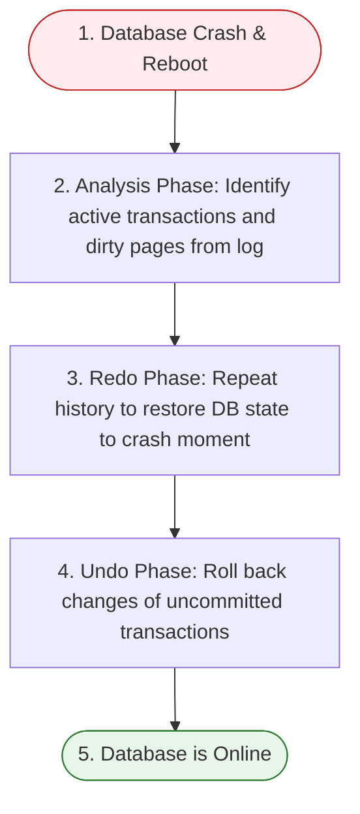

# Database Recovery & Logging

Database recovery systems ensure that database transactions maintain **Atomicity** and **Durability** despite system crashes, power failures, or software crashes.

---

## 📝 Write-Ahead Logging (WAL)

The fundamental paradigm of database recovery is the **Write-Ahead Logging (WAL)** protocol. 

> [!IMPORTANT]
> **The WAL Rule**: Log records representing a database update must be flushed and written to non-volatile disk storage *before* the actual modified database pages (dirty pages in buffer cache) are allowed to be written to disk.

If the database writes modified data to disk before the log record, and the system crashes immediately, the database cannot undo the change (violating Atomicity).

### Log Record Contents:
Each log record contains:
* **LSN (Log Sequence Number)**: A unique, monotonically increasing integer identifying the log record.
* **PrevLSN**: The LSN of the previous log record written by the same transaction (creates a backward-linked list of transaction updates).
* **TxID**: The transaction identifier.
* **Type**: `START`, `COMMIT`, `ABORT`, or `UPDATE`.
* **PageID**: The database page modified (for updates).
* **Undo Data (Before-Image)**: Old value of data (used to rollback / undo).
* **Redo Data (After-Image)**: New value of data (used to re-apply / redo).

---

## 🔄 Recovery Techniques

### 1. Deferred Update (No-Undo / Redo)
* **Strategy**: A transaction does not modify the physical database on disk until it has committed. During execution, updates are only recorded in the log and local cache.
* **At Commit**: The log is flushed to disk, and then changes are written to the database.
* **Recovery**: 
  - If a transaction crashes *before* committing, we do nothing (no undo needed because the database was never touched).
  - If it crashes *after* committing but before cache was fully written, we **Redo** its operations.

### 2. Immediate Update (Undo / Redo)
* **Strategy**: The database can be modified on disk while the transaction is still active (prior to commit), provided WAL is followed.
* **Recovery**:
  - If a transaction crashes *before* committing, we must **Undo** its changes to restore the old values.
  - If a transaction crashes *after* committing, we **Redo** its changes to guarantee Durability.

---

## 🏁 Checkpointing

In a live database, log files grow continuously. Processing the entire log from the beginning of time during a crash recovery is highly inefficient.

A **Checkpoint** is an operation that periodically flushes dirty pages and transaction states to disk, creating a point beyond which the database recovery system does not need to search the logs.

### Steps in a Fuzzy Checkpoint:
1. Write a `checkpoint_begin` record to the log.
2. Collect the current state of active transactions (Transaction Table) and dirty cache pages (Dirty Page Table) in memory.
3. Write a `checkpoint_end` record containing this state.
4. Flush all log pages to disk.
5. In the background, the DB continues flushing dirty blocks. Recovery only needs to scan back to the oldest active transaction at the checkpoint.

---

## ⚡ The ARIES Recovery Algorithm

**ARIES** (Algorithms for Recovery and Isolation Exploiting Semantics) is the gold standard recovery algorithm used in modern relational databases.

When a database boots up after a crash, ARIES executes in three distinct phases:

### 1. Analysis Phase
* **Goal**: Determine the state of the database at the exact moment of the crash.
* **Process**:
  - Scans the log *forward* starting from the last checkpoint.
  - Reconstructs the **Transaction Table** (identifying active transactions that were interrupted) and the **Dirty Page Table** (identifying pages in memory that were not written to disk).

### 2. Redo Phase ("Repeating History")
* **Goal**: Reapply all logged updates to the database, including those of transactions that eventually aborted. This restores the database to the exact physical state it was in at the time of the crash.
* **Process**:
  - Scans *forward* from the smallest `RecLSN` in the Dirty Page Table.
  - Re-executes the write operations of all updates.

### 3. Undo Phase
* **Goal**: Roll back all changes made by transactions that were active (uncommitted) at the time of the crash.
* **Process**:
  - Scans the log *backward* from the end.
  - Reverses the write operations of uncommitted transactions.
  - Writes **Compensation Log Records (CLRs)** for each undone operation to prevent repeating the undo if the system crashes again during recovery.
