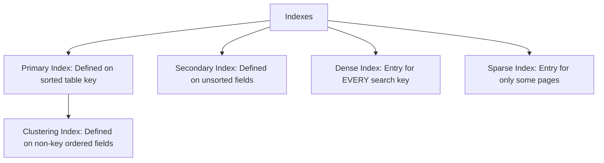
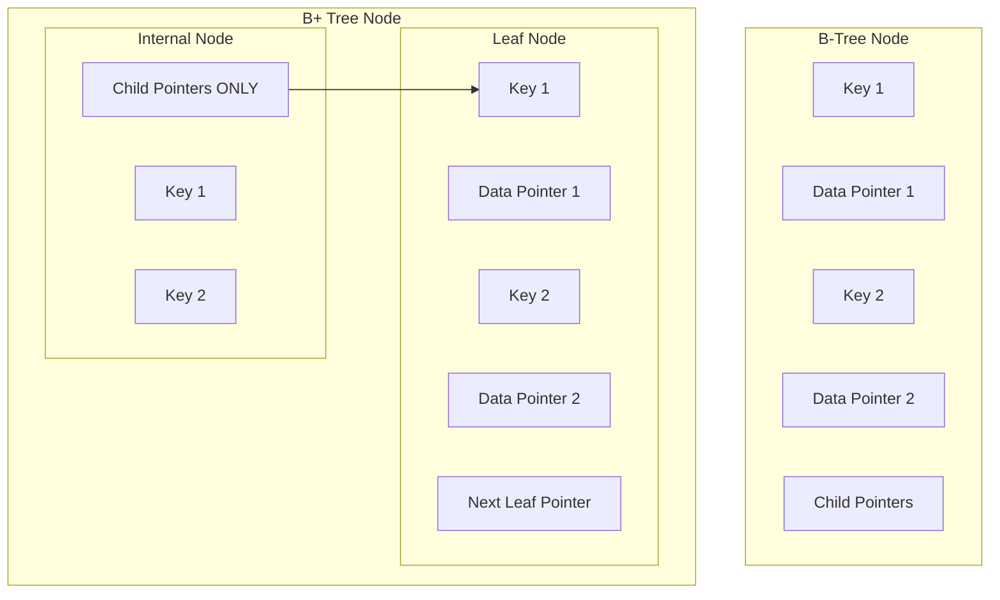

# Database Indexing

Indexing is a physical database design technique used to speed up the retrieval of records from a database table. An index is a data structure that points to the physical location of rows, reducing the number of disk block accesses (I/O) needed to satisfy a query.

---

## 🗂️ File Organization & Storage

Databases store tables as collections of files on disk. These files are split into fixed-size chunks called **pages** or **blocks** (typically 4KB to 8KB).

1. **Heap File Organization**: Records are placed in the file in no particular order. Any free space is utilized.
   - *Search Complexity*: $O(N)$ (requires a full table scan).
2. **Sequential File Organization (Ordered)**: Records are stored in a sorted order based on a search key.
   - *Search Complexity*: $O(\log N)$ (binary search can be used if blocks are contiguous).
   - *Insert/Delete*: Very expensive (requires shifting records).
3. **Hash File Organization**: A hash function determines the page address for a record based on a key.
   - *Search Complexity*: $O(1)$ (direct lookup).

---

## 🔍 Index Classification

An index stores pairs of `(search_key, pointer_to_record)` in a sorted structure.

### 1. Dense Index vs. Sparse Index
* **Dense Index**: Has an index record for **every single search key value** in the data file.
  - *Fast lookup* but requires substantial memory/disk space for the index.
* **Sparse Index**: Has index records for only **some** of the search keys (usually one entry per database block/page).
  - *Slower lookup* (requires scanning the page once located) but occupies much less memory. Can only be built if the underlying data file is sorted on the index key.

### 2. Primary Index vs. Secondary Index
* **Primary (Clustered) Index**: Created on a data file sorted on the search key.
  - A table can have **only one** clustered index because physical rows can only be sorted on disk in one order.
* **Secondary (Non-Clustered) Index**: Created on an unsorted data file.
  - The index file is sorted, but it contains pointers to arbitrary locations in the unsorted data file.
  - A table can have **multiple** secondary indexes.

---

## 🌳 B-Trees vs. B+ Trees

Modern databases use **B+ Trees** as their default indexing structure. They are self-balancing search trees optimized for reading and writing large blocks of data.

### Structural Differences

| Feature | B-Tree | B+ Tree |
| :--- | :--- | :--- |
| **Data Pointers** | Stored in **both** internal nodes and leaf nodes. | Stored **only** in the leaf nodes. |
| **Internal Nodes** | Contain keys, child pointers, and actual data pointers. | Contain keys and child pointers **only** (no data). |
| **Leaf Nodes Links** | Leaf nodes are independent and not linked. | Leaf nodes are linked together via a **doubly linked list**. |
| **Search Performance**| Variable. Can find keys quickly if they are near the root. | Constant. Every search must traverse down to a leaf node. |
| **Range Queries** | Slow. Requires traversing up and down the tree structure. | **Extremely Fast**. Find the starting key, then traverse the leaf linked list. |

### Why B+ Trees are Ideal for Disk I/O:
1. **High Fan-Out**: Since internal nodes do not store data pointers, they can store many more keys per node. A single node block can point to hundreds of children. This makes the tree very "flat" (typically height of 3 or 4 even for millions of records).
2. **Fewer Disk Accesses**: A flat tree means fewer disk block reads to find any record.
3. **Sequential Scans**: The linked list at the bottom allows $O(N)$ sequential table scans and range queries without tree traversals.

---

## ⚡ Indexing Trade-offs

While indexes speed up read performance, they come with system costs:
* **Storage Overhead**: Indexes require disk space and memory cache.
* **Write Overhead**: Every `INSERT`, `UPDATE`, or `DELETE` operation must also update all affected indexes, which slows down write performance.
