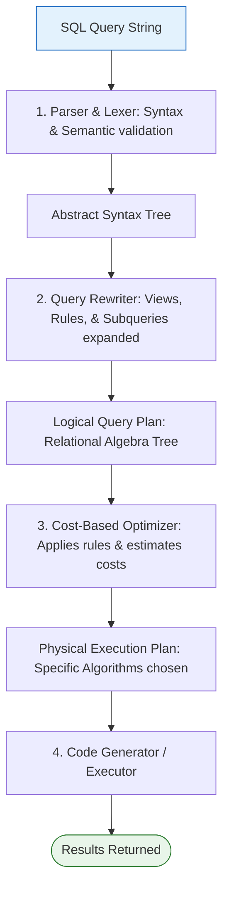

# Query Optimization

Query Optimization is the process of selecting the most efficient query plan (minimum execution time and resource utilization) from many equivalent execution strategies for a given SQL query.

---

## ⚙️ Query Execution Pipeline

A database engine compiles and executes a declarative SQL query through several sequential stages:



1. **Parser & Lexer**: Checks SQL syntax and matches tables/columns against the database catalog. Converts the query string into an AST.
2. **Query Rewriter**: Rewrites query rules (e.g., expanding views into base tables, flattening subqueries, replacing constant expressions).
3. **Cost-Based Optimizer (CBO)**: Generates multiple equivalent physical plans and estimates their cost (I/O operations, CPU cycles) using database statistics. Selects the plan with the lowest estimated cost.
4. **Execution Engine**: Executes the chosen physical plan and retrieves the data.

---

## 📐 Logical Optimization (Query Rewriting)

Logical optimization applies equivalence rules of Relational Algebra to restructure query trees.

### Predicate Pushdown (Filter Early)
Always execute selections ($\sigma$) as early as possible in the query plan. This reduces the number of tuples passed up to join and project operations, minimizing memory buffer usage.

* *Before Optimization:* Join two tables containing 1,000,000 rows each, and *then* filter out records where `age = 21`. (Joins 1M rows).
* *After Optimization:* Filter both tables for `age = 21` first, and *then* join the resulting small subsets. (Joins maybe 100 rows).

---

## ⚡ Physical Optimization (Access Methods & Joins)

Physical optimization selects specific algorithms to execute logical operations:

### 1. Table Access Paths
- **Sequential Scan (Seq Scan)**: Scans the entire table block-by-block. Used if no index is available or the query returns a large percentage of the table.
- **Index Scan**: Searches the B+ Tree index to find row pointers, then fetches corresponding pages from the heap table.
- **Index-Only Scan**: Fetches data directly from the index nodes without accessing the heap table. (Only possible if all selected columns are part of the index).
- **Bitmap Index Scan**: Scans the index to build a bitmap of matching row locations in memory, then accesses the heap table in physical page order (minimizing random disk seeks).

### 2. Join Algorithms
- **Nested Loop Join**: For every outer table row, scan the inner table. Best for small datasets or when the inner join key is indexed.
- **Hash Join**: Build an in-memory hash table of the smaller relation on the join key, then scan the larger relation to find matches. Best for large, unsorted datasets.
- **Merge Join**: Sort both relations on the join key, then scan them in parallel to merge matches. Best if the datasets are already sorted or indexed on the join key.

---

## 📊 Reading Execution Plans (`EXPLAIN`)

Developers use the `EXPLAIN` command to analyze how the database query optimizer plans to execute a query.

### SQL Syntax:
```sql
EXPLAIN ANALYZE
SELECT e.name, d.dept_name
FROM employees e
JOIN departments d ON e.dept_id = d.id
WHERE e.salary > 80000;
```

* `EXPLAIN`: Shows the optimizer's execution plan and cost estimates.
* `EXPLAIN ANALYZE`: Actually executes the query and shows real timing, loops, and row counts alongside estimates.

### Understanding Plan Nodes (PostgreSQL Style):
```text
Hash Join  (cost=12.20..35.40 rows=15 width=42) (actual time=0.082..0.211 rows=12 loops=1)
  Hash Cond: (e.dept_id = d.id)
  ->  Seq Scan on employees e  (cost=0.00..20.00 rows=30 width=20) (actual time=0.010..0.080 rows=30 loops=1)
        Filter: (salary > 80000)
        Rows Removed by Filter: 970
  ->  Hash  (cost=10.50..10.50 rows=10 width=26) (actual time=0.045..0.045 rows=10 loops=1)
        Buckets: 1024  Batches: 1  Memory Usage: 9kB
        ->  Seq Scan on departments d  (cost=0.00..10.50 rows=10 width=26) (actual time=0.005..0.022 rows=10 loops=1)
```

#### Key Metrics to Analyze:
- **cost=12.20..35.40**: `12.20` is the startup cost to fetch the first row. `35.40` is the estimated total cost to fetch all rows (measured in arbitrary page-cost units).
- **rows=15**: Estimated number of rows output by this step.
- **actual time=0.082..0.211**: The real elapsed time in milliseconds.
- **Filter**: Shows rows filtered out. If a `Seq Scan` is removing 90%+ of rows, it suggests adding an index on that column.
