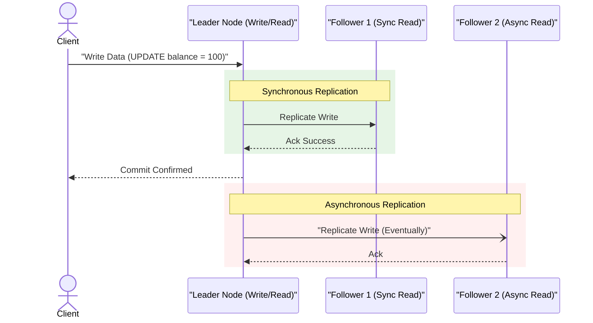
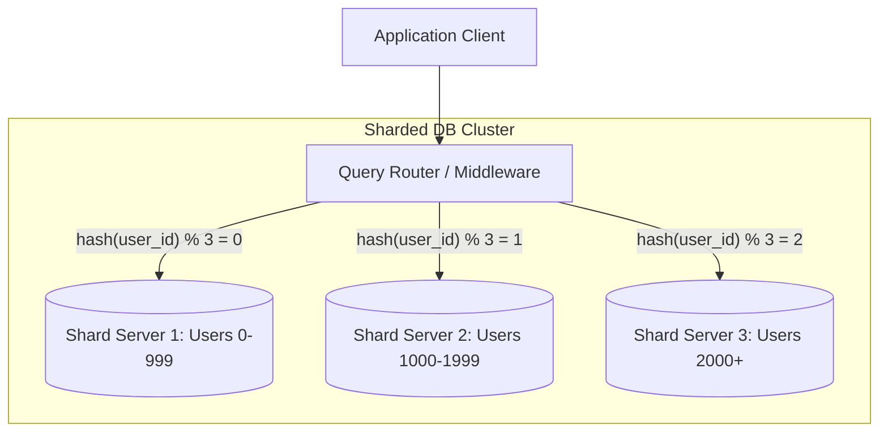
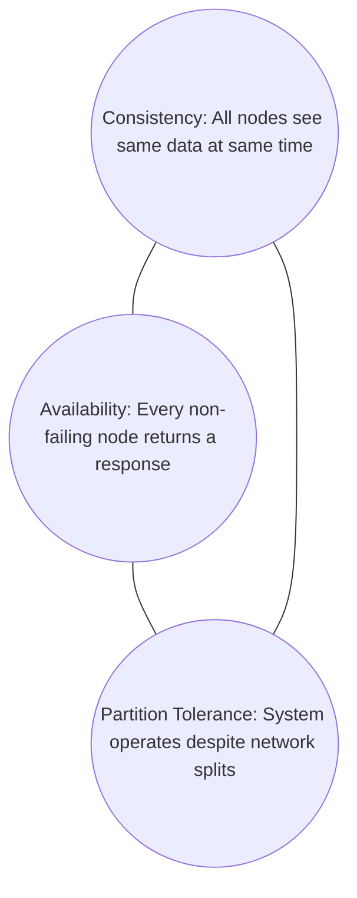

# Sharding, Replication & Partitioning

As application traffic and data volumes grow beyond the limits of a single database server (vertical scaling), databases must scale out horizontally using replication, partitioning, and sharding.

---

## 🔄 Database Replication

Replication means keeping a copy of the same data on multiple database nodes connected via a network. This provides **high availability** (fault tolerance) and **read scalability**.

### 1. Replication Architectures
* **Single-Leader (Master-Slave)**: All writes are sent to a single designated "leader" node. The leader replicates updates to "followers". Read queries can be served by any node.
  - *Pros:* Easy to implement, no write conflicts.
  - *Cons:* Leader is a single point of failure for writes.
* **Multi-Leader (Multi-Master)**: Multiple nodes can accept writes. Leaders act as followers to each other to synchronize data.
  - *Pros:* Survives data center failures, offline writes.
  - *Cons:* Write conflicts must be resolved (e.g., Last-Write-Wins, CRDTs).
* **Leaderless (Peer-to-Peer)**: Any node can accept writes and reads. Popularized by DynamoDB and Cassandra. Writes and reads use **quorum consensus** ($W + R > N$).

### 2. Synchronous vs. Asynchronous Replication
* **Synchronous**: The leader waits for confirmations from followers before confirming success to the client.
  - *Trade-off:* Guarantees consistency (no data lost on leader crash) but blocks writes if a follower is down.
* **Asynchronous**: The leader logs the write locally and immediately confirms success to the client, replicating to followers in the background.
  - *Trade-off:* High write availability and low latency, but data can be lost if the leader crashes before replication completes (**Replication Lag**).

### 3. Replication Lag Consistency Guarantees
* **Read-After-Write Consistency**: Guarantees a client will always see updates they submitted themselves, even if read from a follower. (Prevented by routing reads of self-modified data to the leader).
* **Monotonic Reads**: Guarantees that a user, after reading a certain data state, will not see older states subsequently (reading from a lagging follower after a fresh follower).

---

## ⚡ Partitioning

Partitioning is the process of breaking a single database table into smaller, independent logical subsets. The database engine executes queries on specific partitions rather than scanning the entire table.

### 1. Directional Partitioning
* **Horizontal Partitioning (Sharding)**: Splitting table **rows** across partitions. All partitions share the same schema.
* **Vertical Partitioning**: Splitting table **columns** into separate tables. (e.g., moving large binary blobs or rarely accessed profile details to a secondary table).

### 2. Horizontal Partitioning Strategies
* **Range-Based Partitioning**: Rows are assigned to partitions based on whether a key falls within a continuous range (e.g., partition by `Year`).
  - *Cons:* Can create hotspots (e.g., all new writes go to the current year's partition).
* **Hash-Based Partitioning**: Apply a hash function to the partition key modulo the number of partitions: `Partition = Hash(Key) % N`.
  - *Pros:* Uniformly distributes writes.
  - *Cons:* Range queries require scanning all partitions.
* **List-Based Partitioning**: Rows are assigned based on a predefined list of values (e.g., partition by `CountryCode` $\rightarrow$ US, CA, IN).

### 3. Secondary Index Partitioning
* **Local Index (Partition-Scoped)**: Each partition stores its own secondary index. A query filtering by an unindexed column requires **scatter-gather** querying across all partitions.
* **Global Index (Table-Scoped)**: A single index covers all partitions. Makes reads fast but complicates writes since updating a partition requires updating the global index.

---

## 🗄️ Sharding

While partitioning splits data logically *within* a database server, **Sharding** distributes those partitions across **multiple physical database servers**.

### 1. Choosing a Sharding Key
The sharding key is the column used to determine which shard stores a given row.
- **Goal**: Even distribution of data and queries.
- **Hotspot Avoidance**: Avoid keys like `Timestamp` or `Status` (e.g., "Active") which route all current writes to a single shard. A good key has high cardinality and uniform access patterns (e.g., `user_id`).

### 2. Drawbacks of Sharding:
- **Resharding / Rebalancing**: As shards fill up, you must split them. This requires consistent hashing to avoid moving all database records during rebalancing.
- **Distributed Joins**: Joining tables located on different physical shards is highly inefficient. Often resolved by **De-normalization** (replicating lookup tables onto all shards).
- **Distributed Transactions**: Ensuring atomic commits across shards requires complex consensus protocols like **Two-Phase Commit (2PC)**.

---

## 🏛️ Theoretical Foundations

### The CAP Theorem
In a distributed database system, you can guarantee at most two of the following three properties:

*Note: In the event of a network partition (P), you MUST choose between Consistency (C) and Availability (A).*

### The PACELC Theorem
An extension of CAP. If there is a Partition (P), trade off Availability (A) or Consistency (C); Else (E), trade off Latency (L) or Consistency (C).
* *Example:* MongoDB chooses Consistency under partition (PC), and Consistency under normal operation (EC). ScyllaDB chooses Availability under partition (PA), and Latency under normal operation (EL).
