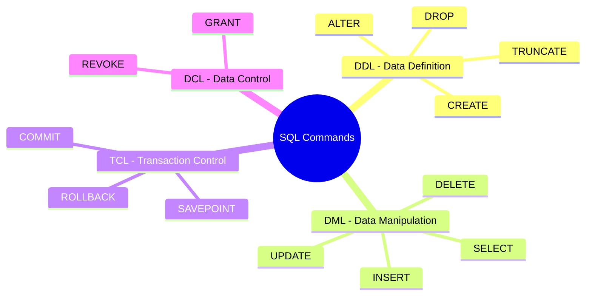

# SQL: DDL, DML, TCL & Constraints

Structured Query Language (SQL) is the standard declarative language used to manage and query relational databases. SQL commands are classified into sub-languages based on their functional scope.

---

## 🗺️ SQL Command Taxonomy



---

## 🛠️ Data Definition Language (DDL)

DDL commands define, modify, and destroy the structural schema of database objects (tables, views, indexes, schemas). DDL changes are metadata operations and are **auto-committed** in most databases (like MySQL/Oracle), though some (like PostgreSQL) support transactional DDL.

### 1. CREATE
Creates a new table, database, view, or index.
```sql
CREATE TABLE employees (
    id SERIAL PRIMARY KEY,
    name VARCHAR(100) NOT NULL,
    salary NUMERIC(10, 2),
    created_at TIMESTAMP DEFAULT CURRENT_TIMESTAMP
);
```

### 2. ALTER
Modifies the structure of an existing database object.
```sql
-- Add a new column
ALTER TABLE employees ADD COLUMN email VARCHAR(150) UNIQUE;

-- Modify an existing column's data type
ALTER TABLE employees ALTER COLUMN name TYPE VARCHAR(150);

-- Drop a column
ALTER TABLE employees DROP COLUMN created_at;
```

### 3. DROP
Deletes a table, view, or index from the database, removing its structure, definitions, and all its data permanently.
```sql
DROP TABLE employees;
```

### 4. TRUNCATE
Removes all rows from a table, reclaiming the physical storage space. It is faster than `DELETE` because it bypasses transaction logging for individual rows.
```sql
TRUNCATE TABLE employees;
```

---

## ✍️ Data Manipulation Language (DML)

DML commands manage the actual data records stored within database tables.

### 1. INSERT
Adds new rows of data to a table.
```sql
INSERT INTO employees (name, salary, email) 
VALUES ('John Doe', 75000.00, 'john.doe@company.com');
```

### 2. UPDATE
Modifies existing records in a table. Always use a `WHERE` clause to avoid updating all rows.
```sql
UPDATE employees 
SET salary = salary * 1.10 
WHERE email = 'john.doe@company.com';
```

### 3. DELETE
Removes specific rows from a table.
```sql
DELETE FROM employees 
WHERE salary < 30000.00;
```

---

## 🔄 Transaction Control Language (TCL)

TCL commands manage changes made by DML statements, grouping them into logical transactions to ensure ACID compliance.

```sql
BEGIN TRANSACTION; -- Or START TRANSACTION;

INSERT INTO employees (name, salary) VALUES ('Alice Smith', 90000);
SAVEPOINT sp1; -- Create a checkpoint in the transaction

UPDATE employees SET salary = 95000 WHERE name = 'Alice Smith';
-- If an error occurs here, we can roll back only to the savepoint
ROLLBACK TO sp1; 

-- Commit finishes the transaction, writing updates permanently
COMMIT;
```
- `COMMIT`: Saves all transaction changes permanently to disk.
- `ROLLBACK`: Reverts all modifications made during the transaction.
- `SAVEPOINT`: Creates a temporary checkpoint within a transaction to allow partial rollbacks.

---

## 🔒 SQL Constraints

Constraints enforce data integrity rules at the table level.

* **NOT NULL**: Prevents a column from accepting NULL values.
* **UNIQUE**: Ensures all values in a column are distinct.
* **PRIMARY KEY**: Uniquely identifies each row in a table. (Implicitly combines `NOT NULL` and `UNIQUE`).
* **FOREIGN KEY**: Prevents actions that would destroy links between tables (Referential Integrity).
* **CHECK**: Ensures that values in a column satisfy a specific boolean condition.
  ```sql
  ALTER TABLE employees ADD CONSTRAINT chk_salary CHECK (salary > 0);
  ```
* **DEFAULT**: Provides a default value for a column if none is specified during an insert.

---

## ⚔️ DROP vs. TRUNCATE vs. DELETE

Understanding the differences between these structural and data removal commands is a common technical interview topic:

| Property | DROP | TRUNCATE | DELETE |
| :--- | :--- | :--- | :--- |
| **Command Category** | DDL | DDL | DML |
| **Scope** | Deletes table structure + all data. | Deletes all rows; keeps table structure. | Deletes specific rows matching `WHERE`. |
| **Speed** | Instant metadata change. | Extremely Fast (Deallocates data blocks). | Slow (Scans and deletes row-by-row). |
| **Transaction Logs** | Logs structural deletion. | Logs page deallocations. | Logs individual row deletions (generates UNDO). |
| **Rollback Support** | Cannot rollback (in most systems). | Cannot rollback (in most systems). | Can be rolled back inside a transaction. |
| **Triggers** | Does not fire triggers. | Does not fire delete triggers. | Fires row-level delete triggers. |
