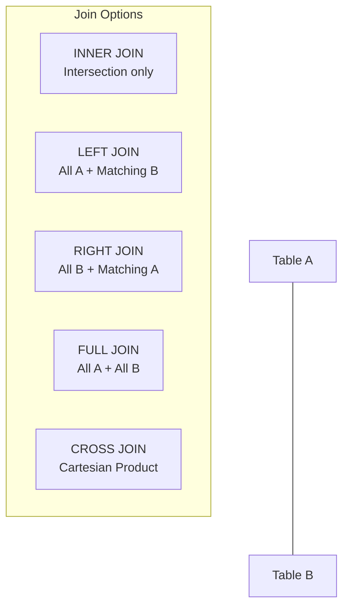

# SQL Joins, Subqueries & CTEs

Writing efficient SQL requires mastering how to combine tables, filter aggregated groupings, and construct modular query logic using subqueries and Common Table Expressions (CTEs).

---

## 🤝 SQL Joins

Joins combine columns from two or more tables based on a related column between them.



### 1. INNER JOIN
Returns records that have matching values in both tables.
```sql
SELECT e.name, d.dept_name
FROM employees e
INNER JOIN departments d ON e.dept_id = d.id;
```

### 2. LEFT OUTER JOIN
Returns all records from the left table, and the matched records from the right table. If no match is found, NULL values are returned for the right table columns.
```sql
SELECT e.name, d.dept_name
FROM employees e
LEFT JOIN departments d ON e.dept_id = d.id;
```

### 3. RIGHT OUTER JOIN
Returns all records from the right table, and the matched records from the left table.
```sql
SELECT e.name, d.dept_name
FROM employees e
RIGHT JOIN departments d ON e.dept_id = d.id;
```

### 4. FULL OUTER JOIN
Returns all records when there is a match in either left or right table. Unmatched fields are padded with NULL.
```sql
SELECT e.name, d.dept_name
FROM employees e
FULL OUTER JOIN departments d ON e.dept_id = d.id;
```

### 5. CROSS JOIN (Cartesian Product)
Combines every row of the left table with every row of the right table. Do not use an `ON` clause.
```sql
SELECT p.product_name, c.color
FROM products p
CROSS JOIN colors c;
```

### 6. SELF JOIN
A table joined with itself, useful for comparing rows within the same table or querying hierarchical relationships (e.g., finding an employee's manager).
```sql
SELECT e.name AS Employee, m.name AS Manager
FROM employees e
LEFT JOIN employees m ON e.manager_id = m.id;
```

---

## 📊 Grouping & Aggregations

Aggregations summarize rows into single values (e.g., average, count, sum).

* **GROUP BY**: Groups rows that have the same values into summary rows.
* **HAVING**: Filters groups based on an aggregate condition.

```sql
SELECT dept_id, COUNT(*) as employee_count, AVG(salary) as avg_salary
FROM employees
WHERE salary > 40000 -- Filters individual rows BEFORE grouping
GROUP BY dept_id
HAVING AVG(salary) > 60000; -- Filters aggregated groups AFTER grouping
```

### Key Difference: `WHERE` vs. `HAVING`
* `WHERE` filters records *before* any groupings are made. It cannot contain aggregate functions (e.g., `WHERE SUM(sales) > 100` is invalid).
* `HAVING` filters groups *after* `GROUP BY` is applied. It is used specifically with aggregate functions.

---

## 🔍 Subqueries

A subquery is a query nested inside another SQL statement.

### 1. Scalar Subquery
Returns exactly one row and one column (a single value).
```sql
-- Find employees who earn more than the company average
SELECT name, salary
FROM employees
WHERE salary > (SELECT AVG(salary) FROM employees);
```

### 2. Nested Subquery (Multi-row)
Returns a single column with multiple rows. Evaluated once for the entire query. Used with operators like `IN`, `ANY`, or `ALL`.
```sql
-- Find employees working in active departments
SELECT name
FROM employees
WHERE dept_id IN (SELECT id FROM departments WHERE status = 'Active');
```

### 3. Correlated Subquery
A subquery that references columns from the outer query. It is evaluated once **for each row** processed by the outer query, which can make it slow.
```sql
-- Find employees who earn more than the average salary of their specific department
SELECT e1.name, e1.salary, e1.dept_id
FROM employees e1
WHERE e1.salary > (
    SELECT AVG(e2.salary) 
    FROM employees e2 
    WHERE e2.dept_id = e1.dept_id
);
```

---

## 📄 Common Table Expressions (CTEs)

A CTE is a temporary named result set that you can reference within a `SELECT`, `INSERT`, `UPDATE`, or `DELETE` statement. CTEs improve code readability and maintainability compared to nested subqueries.

### Standard CTE:
```sql
WITH DeptAverage AS (
    SELECT dept_id, AVG(salary) AS avg_sal
    FROM employees
    GROUP BY dept_id
)
SELECT e.name, e.salary, da.avg_sal
FROM employees e
JOIN DeptAverage da ON e.dept_id = da.dept_id
WHERE e.salary > da.avg_sal;
```

### Recursive CTE:
Used to query hierarchical or graph-like data structures (e.g., organizational charts, category trees).
```sql
WITH RECURSIVE OrgChart AS (
    -- Anchor member: Start with the top-level CEO (no manager)
    SELECT id, name, manager_id, 1 AS level
    FROM employees
    WHERE manager_id IS NULL
    
    UNION ALL
    
    -- Recursive member: Find employees who report to managers in OrgChart
    SELECT e.id, e.name, e.manager_id, o.level + 1
    FROM employees e
    INNER JOIN OrgChart o ON e.manager_id = o.id
)
SELECT * FROM OrgChart;
```
