# 🚀 Scaling from Zero to Millions of Users

> Based on *System Design Interview* by Alex Xu — Chapter 1

---

## 1. Single Server Setup

Everything runs on one server: web app, database, cache, etc.

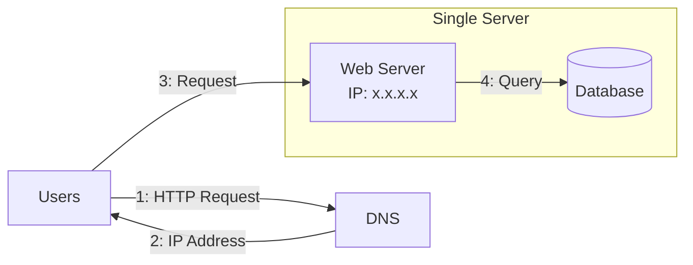

**Flow:**
1. User enters domain → DNS returns IP address
2. Browser sends HTTP request to the web server
3. Web server returns HTML/JSON response

---

## 2. Database Separation

Separate the **web/mobile traffic tier** from the **data tier** so they can scale independently.

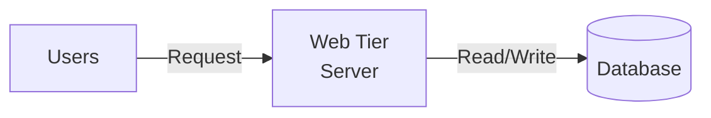

### Which Database to Choose?

| Relational (SQL) | Non-Relational (NoSQL) |
|---|---|
| MySQL, PostgreSQL, Oracle | MongoDB, CouchDB, Cassandra, HBase |
| Structured data, ACID | Unstructured, flexible schema |
| Joins, relationships | Super-low latency, massive data |

**Choose NoSQL when:**
- Need super-low latency
- Data is unstructured or no relational data
- Only need to serialize/deserialize (JSON, XML, YAML)
- Need to store massive amounts of data

---

## 3. Vertical Scaling vs Horizontal Scaling

| Vertical Scaling (Scale Up) | Horizontal Scaling (Scale Out) |
|---|---|
| Add more CPU/RAM to existing server | Add more servers |
| Simple, but has hard limits | No hard limit, more complex |
| Single point of failure | Better fault tolerance |
| ❌ Not ideal for large-scale apps | ✅ Preferred for large-scale apps |

---

## 4. Load Balancer

Distributes incoming traffic across multiple web servers.

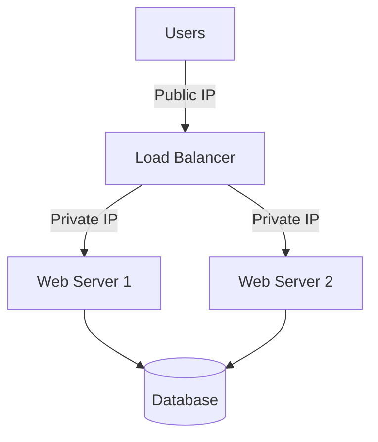

**Benefits:**
- If Server 1 goes down → traffic routed to Server 2
- If traffic grows → just add more servers
- Servers use **private IPs** (not reachable from internet directly)
- Load balancer has the **public IP**

**Failover:** With this setup, the web tier has **no single point of failure**.

---

## 5. Database Replication (Master-Slave)

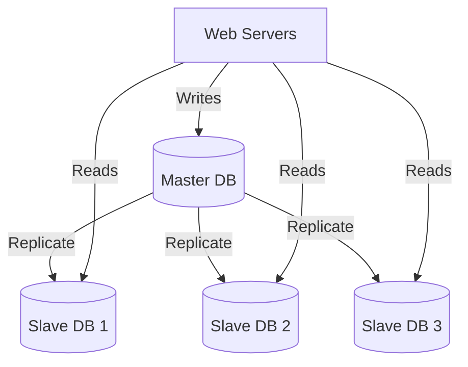

| Master | Slave |
|---|---|
| Supports **write** operations (INSERT, UPDATE, DELETE) | Supports **read** operations only |
| Usually 1 master | Multiple slaves |

**Advantages:**
- **Better performance** — reads distributed across slaves (most apps have way more reads than writes)
- **Reliability** — data replicated across locations; no data loss if one DB destroyed
- **High availability** — site still operational if one DB goes offline

**Failover scenarios:**
- If **only one slave** & it goes offline → reads directed to master temporarily
- If **master** goes offline → a slave is promoted to master

---

## 6. Cache

A temporary storage layer that stores frequently accessed data in memory (much faster than DB).

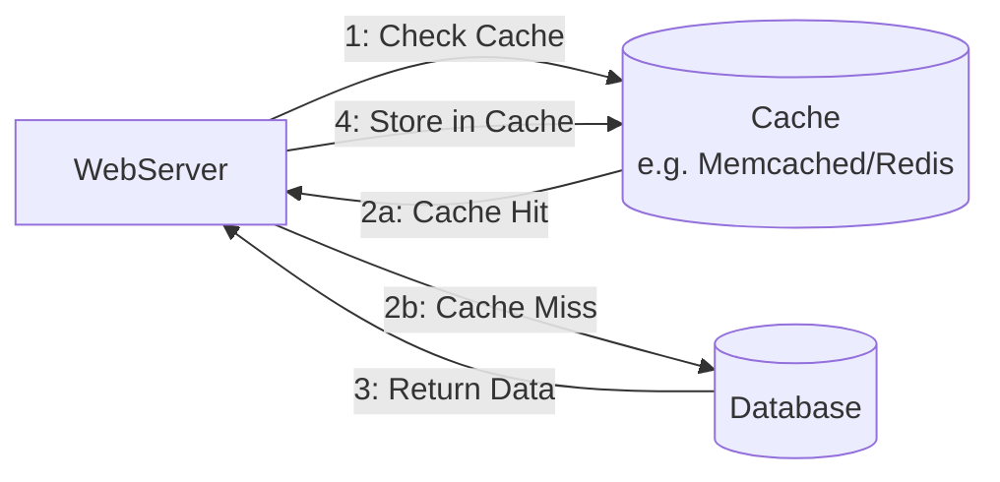

### Read-Through Cache Strategy
1. Web server checks cache first
2. **Cache hit** → return data from cache
3. **Cache miss** → query DB, store result in cache, return to client

### Cache Considerations

| Consideration | Guideline |
|---|---|
| **When to use** | Frequent reads, infrequent writes |
| **Expiration** | Too short = too many DB hits; Too long = stale data |
| **Consistency** | Keep data store & cache in sync (hard at scale) |
| **Eviction policy** | LRU (Least Recently Used) is most popular; also LFU, FIFO |
| **Single point of failure** | Use multiple cache servers across data centers |
| **Memory** | Don't overload; evict old data when full |

---

## 7. Content Delivery Network (CDN)

A geographically distributed network of servers that cache **static content** (images, CSS, JS, videos).

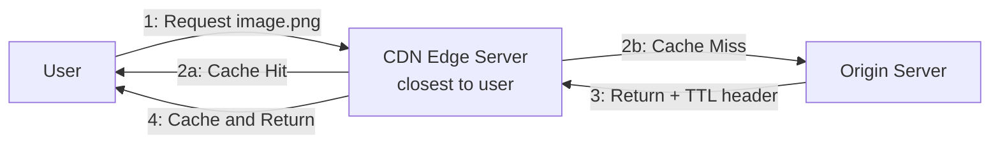

**How it works:**
1. User requests a static asset
2. CDN edge server (nearest) checks if it has the asset
3. If not → fetches from origin, caches it with TTL
4. Subsequent requests served from CDN directly

### CDN Considerations
- **Cost** — CDNs are third-party; charged for data transfer. Don't cache infrequently used assets
- **Expiry (TTL)** — Too long = stale; Too short = too many origin hits
- **CDN fallback** — If CDN is down, client should be able to hit origin directly
- **Invalidation** — Use APIs provided by CDN vendors, or use object versioning (e.g., `image_v2.png`)

---

## 8. Stateless Web Tier

To scale horizontally, move **state** (e.g., session data) out of web servers.

### Stateful Architecture (❌ Problem)

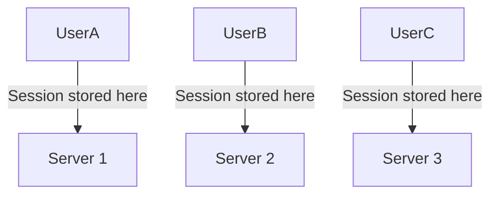

- Each user's session is tied to a specific server
- Load balancer must use **sticky sessions** → harder to scale, harder to handle failures

### Stateless Architecture (✅ Solution)

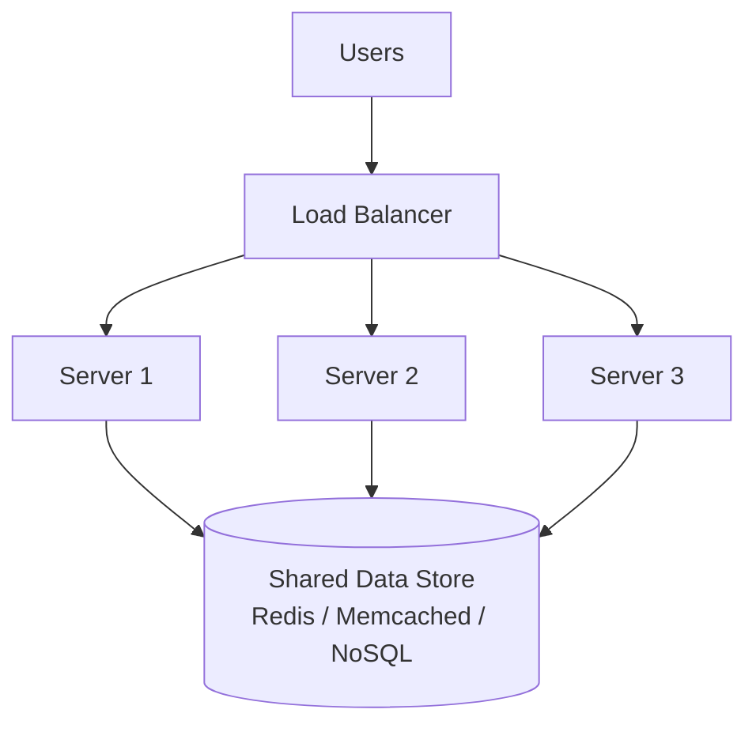

- Session data stored in a **shared data store** (Redis, Memcached, or NoSQL DB)
- Any server can handle any request
- **Simpler, more robust, scalable**
- Auto-scaling becomes easy — just add/remove servers

---

## 9. Data Centers (Geo-Routing)

For high availability and better user experience across geographies.

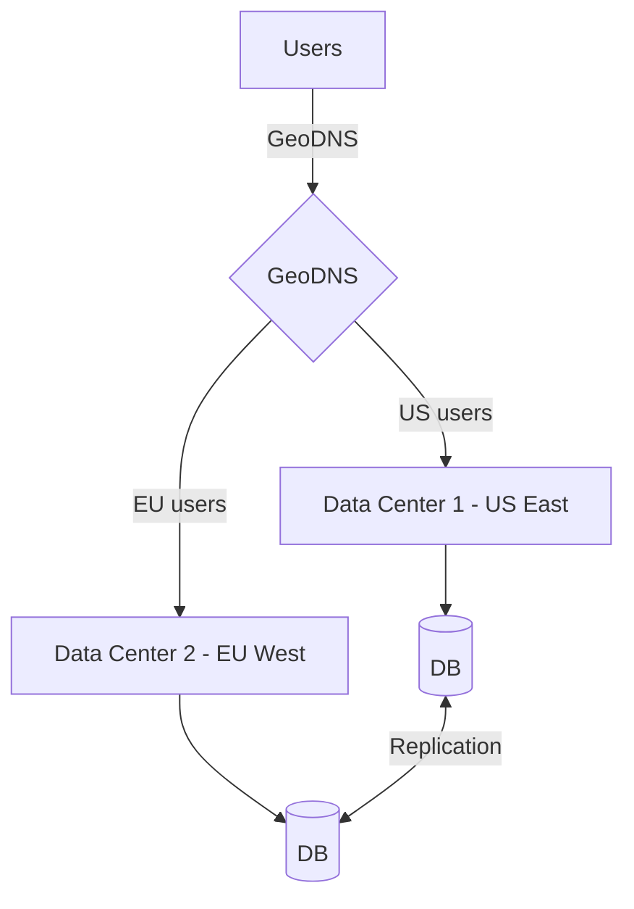

**GeoDNS** routes users to the nearest data center based on IP location.

### Multi-Data Center Challenges:
- **Traffic redirection** — GeoDNS to direct to correct DC
- **Data synchronization** — replicate data across DCs
- **Test & deployment** — test at different locations; automated deployments across DCs

**Failover:** If DC1 goes offline → all traffic redirected to DC2.

---

## 10. Message Queue (Decoupling)

A durable component that supports **asynchronous communication**.

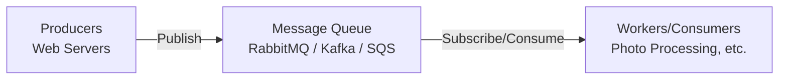

**How it works:**
- **Producers** publish messages to the queue
- **Consumers/Workers** pick up and process messages
- Producer and consumer can scale **independently**

**Example:** Photo customization (crop, sharpen, blur)
- Web server publishes photo processing tasks to queue
- Workers pick up tasks asynchronously
- If queue grows → add more workers

**Benefits:**
- Decouples components → each can fail independently
- Producer doesn't wait for consumer
- Can buffer spikes in traffic

---

## 11. Logging, Metrics & Automation

Essential at large scale:

| Tool | Purpose |
|---|---|
| **Logging** | Monitor errors, aggregate logs (ELK stack, Splunk) |
| **Metrics** | Host-level (CPU, Memory, Disk), Aggregated (DB tier perf), Business (DAU, retention) |
| **Automation** | CI/CD, automated testing, build automation |

---

## 12. Database Scaling

### Vertical Scaling (Scale Up)
- Add more CPU, RAM, disk to existing DB
- e.g., Amazon RDS: up to 24 TB RAM
- ❌ Single point of failure, hardware limits, expensive

### Horizontal Scaling (Sharding)

Split data across multiple databases (shards).

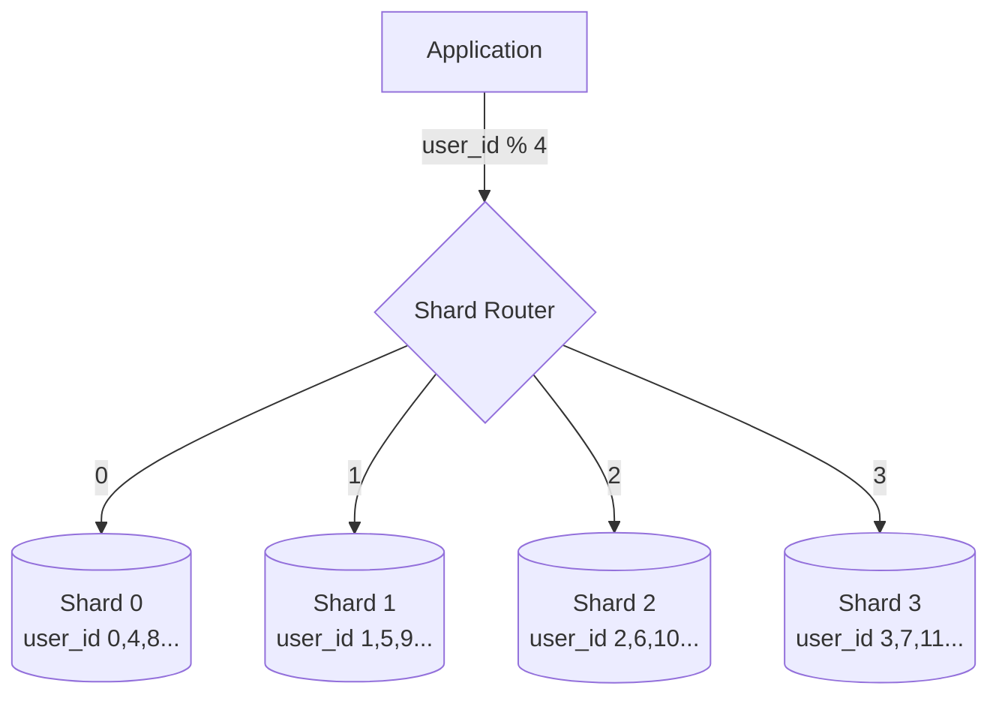

**Sharding Key (Partition Key):** Determines how data is distributed. e.g., `user_id % num_shards`

### Sharding Challenges

| Challenge | Description |
|---|---|
| **Resharding** | Needed when a shard is full or uneven distribution. Use consistent hashing |
| **Celebrity problem (Hotspot)** | Excessive reads on one shard (e.g., celebrity user). May need further partition or dedicated shard |
| **Joins & Denormalization** | Cross-shard joins are hard. Solution: denormalize data |

---

## 13. Final Architecture — Millions of Users

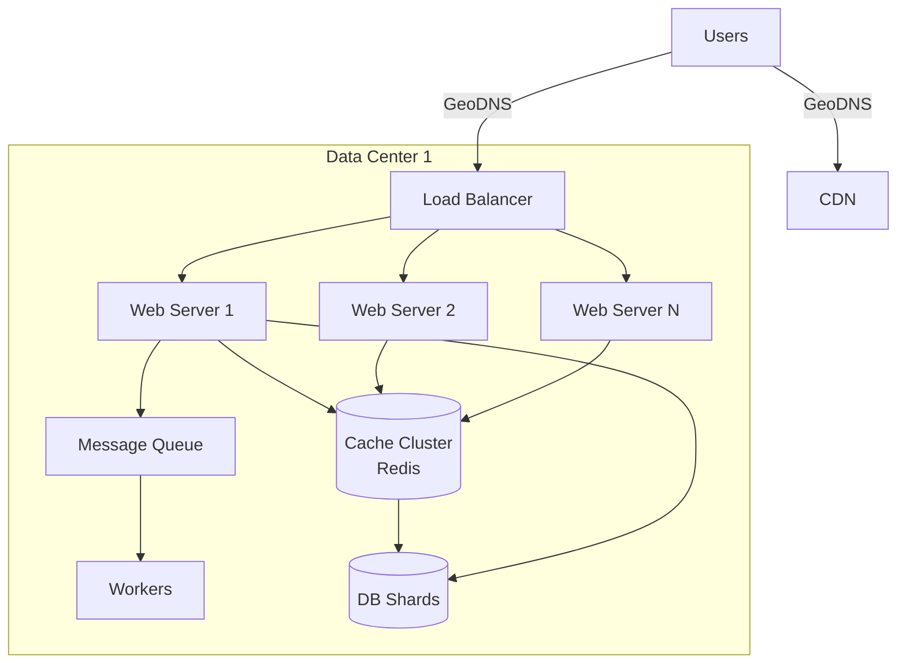

---

## 📋 Summary — Scale Step by Step

| Users | What to Add |
|---|---|
| **1** | Single server (web + DB on same machine) |
| **~100** | Separate web server & database |
| **~1,000** | Load balancer + multiple web servers |
| **~10,000** | Database replication (master/slave) |
| **~100,000** | Cache layer (Redis/Memcached) |
| **~500,000** | CDN for static assets |
| **~1,000,000** | Stateless web tier + session store |
| **~5,000,000** | Multiple data centers + GeoDNS |
| **~10,000,000+** | Message queues + sharding + logging/metrics/automation |

---

## 🔑 Key Takeaways

- Keep web tier **stateless**
- Build **redundancy** at every tier
- **Cache** as much data as possible
- Support **multiple data centers**
- Host **static assets** on CDN
- Scale data tier by **sharding**
- Split tiers into **individual services** (microservices)
- **Monitor** the system and use **automation** tools