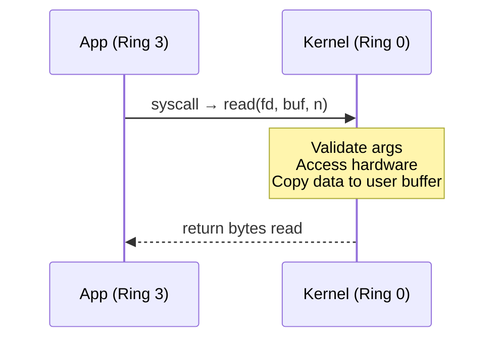

---

## 1️. The Two Worlds

Every modern CPU operates in (at least) two privilege levels:

| | User Mode (Ring 3) | Kernel Mode (Ring 0) |
| :--- | :--- | :--- |
| **Who runs here** | Applications (browser, Node.js, Python) | OS kernel, device drivers |
| **Hardware access** | ❌ No direct access | ✅ Full access to all hardware |
| **Memory access** | Only its own virtual address space | Entire physical memory |
| **Privileged instructions** | ❌ Cannot execute (`hlt`, `lgdt`, I/O ports) | ✅ Can execute any instruction |
| **Crash impact** | Only the process dies (segfault) | Full system crash (kernel panic / BSOD) |
| **The gate** | Must use **system calls** to request kernel services | — |

> User mode is a **jail**. The CPU physically prevents user programs from touching hardware, other processes' memory, or privileged instructions.

---

## 2️. The Ring Protection Model

x86 CPUs define **4 privilege rings** (0–3), but modern OSs only use two:

```
         Ring 0 (Kernel Mode)
        ┌───────────────────┐
        │     OS Kernel     │  ← Full hardware control
        │   Device Drivers  │
        ├───────────────────┤
        │                   │
        │   Ring 1 & 2      │  ← Unused by most OSs
        │   (historically   │
        │    for drivers)   │
        │                   │
        ├───────────────────┤
        │  Ring 3 (User)    │  ← Applications run here
        │  [ App ] [ App ]  │
        └───────────────────┘
```

### Why Only Ring 0 and Ring 3?

- **Simplicity**: Managing 4 levels of privilege is complex and error-prone
- **Portability**: ARM, RISC-V, and other architectures only have 2 levels (EL0/EL1 on ARM)
- **Performance**: Fewer transitions = fewer TLB flushes

### How the CPU Enforces Rings

The CPU has a **Current Privilege Level (CPL)** stored in the `CS` (Code Segment) register:
- `CPL = 0` → Kernel mode
- `CPL = 3` → User mode

If a Ring 3 process tries to execute a privileged instruction (like writing to a hardware port), the CPU raises a **General Protection Fault (#GP)** → the OS kills the process.

---

## 3️. System Calls — The Only Legal Gate

A user-space program **cannot** directly access hardware. It must ask the kernel via a **system call (syscall)**.



### Common System Calls

| Category | Syscalls | What They Do |
| :--- | :--- | :--- |
| **File I/O** | `open()`, `read()`, `write()`, `close()` | Access files on disk |
| **Process** | `fork()`, `exec()`, `exit()`, `wait()` | Create/manage processes |
| **Memory** | `mmap()`, `brk()`, `munmap()` | Allocate/map memory |
| **Network** | `socket()`, `bind()`, `listen()`, `accept()` | Network communication |
| **System** | `ioctl()`, `sysinfo()`, `uname()` | Device control, system info |

---

## 4️. Why Syscalls Are Expensive

A syscall is **not** a regular function call. It's a **privilege transition** that involves multiple costly steps.

### Regular Function Call (~1–2 ns)

```
call myFunction    →  push return address, jump
                   →  execute
ret                →  pop return address, jump back
```

### System Call (~100–300 ns) — 100x More Expensive

Here's what happens step by step when you call `read()`:

```
Step 1: User Space Setup
   ├── libc wrapper puts syscall number in RAX (e.g., 0 = read)
   ├── Arguments go into registers (RDI, RSI, RDX...)
   └── Execute: syscall instruction (or int 0x80 on older x86)

Step 2: CPU Hardware Transition (Ring 3 → Ring 0)
   ├── CPU checks CPL, switches to Ring 0
   ├── Swaps to kernel stack (RSP → kernel stack pointer)
   ├── Saves user registers (RIP, RSP, RFLAGS) to kernel stack
   ├── Loads kernel's GDT/IDT entries
   └── Jumps to syscall entry point (stored in MSR_LSTAR)

Step 3: Kernel Execution
   ├── Validate syscall number (bounds check)
   ├── Look up handler in sys_call_table[RAX]
   ├── Validate user pointers (copy_from_user / copy_to_user)
   ├── Execute the actual operation (e.g., read from disk)
   └── Store return value in RAX

Step 4: Return to User Space (Ring 0 → Ring 3)
   ├── Restore user registers from kernel stack
   ├── Switch back to user stack
   ├── CPU changes CPL back to 3
   └── sysret instruction → resume user code at saved RIP
```

### Where the Cost Comes From

| Cost Source | Why It's Expensive |
| :--- | :--- |
| **Stack switch** | Swap from user stack to kernel stack and back |
| **Register save/restore** | All general-purpose registers must be preserved |
| **TLB/Cache pollution** | Kernel code evicts user code from L1/L2 cache |
| **Spectre mitigations (KPTI)** | Kernel Page Table Isolation flushes TLB on every transition |
| **Security checks** | Validate pointers, permissions, bounds |
| **Pipeline flush** | `syscall` instruction flushes the CPU pipeline |

> **KPTI (Kernel Page Table Isolation)** was introduced after Meltdown (2018). It **unmaps kernel memory** from user-space page tables, adding a full TLB flush on every syscall. This made syscalls ~30-50% more expensive on affected Intel CPUs.

---

## 5️. How the CPU Switches Privileges

### The `syscall` / `sysret` Fast Path (x86-64)

Modern x86-64 uses dedicated instructions instead of the old slow `int 0x80` software interrupt:

| Instruction | Direction | What It Does |
| :--- | :--- | :--- |
| `syscall` | Ring 3 → Ring 0 | Saves RIP/RFLAGS to RCX/R11, loads kernel entry from MSR |
| `sysret` | Ring 0 → Ring 3 | Restores RIP/RFLAGS from RCX/R11, sets CPL=3 |

### Old vs New Path

```
Legacy (slow):    int 0x80 → IDT lookup → interrupt handler → iret
Modern (fast):    syscall  → MSR_LSTAR → direct jump       → sysret
```

`syscall`/`sysret` skip the IDT lookup and are **~5x faster** than `int 0x80`.

### ARM Equivalent

| x86-64 | ARM (AArch64) |
| :--- | :--- |
| Ring 0 / Ring 3 | EL1 (Kernel) / EL0 (User) |
| `syscall` | `svc` (Supervisor Call) |
| `sysret` | `eret` (Exception Return) |

---

## 6️. Minimizing Syscall Overhead

Since syscalls are expensive, high-performance systems try to **avoid or batch** them:

| Technique | How It Works |
| :--- | :--- |
| **`vDSO` (Virtual Dynamic Shared Object)** | Kernel maps read-only data into user space. `gettimeofday()` reads directly — no syscall needed |
| **`io_uring`** | Shared ring buffer between user/kernel. Submit batches of I/O ops with zero or one syscall |
| **`mmap()`** | Map file into memory. Read/write via pointers — no `read()`/`write()` syscalls per access |
| **Buffered I/O (libc)** | `printf()` buffers in user space, flushes with a single `write()` instead of many |
| **`sendfile()`** | Copy file → socket entirely in kernel space, avoiding user-space copy |
| **`epoll` / `kqueue`** | Monitor thousands of sockets with one syscall instead of one per socket |

### Example: `vDSO` in Action

```c
// This does NOT trigger a syscall on modern Linux
#include <time.h>
struct timespec ts;
clock_gettime(CLOCK_MONOTONIC, &ts);  // reads from vDSO page mapped in user space
```

### Example: `io_uring` Batching

```
Traditional:  open() + read() + write() + close()  =  4 syscalls
io_uring:     submit_batch([open, read, write, close])  =  1 syscall (or 0 with polling)
```

---

## 7️. Interview Angles

### "Why can't user programs access hardware directly?"

> The CPU enforces **hardware-level isolation** via privilege rings. User code runs in Ring 3 where privileged instructions trigger a fault. This prevents a buggy app from corrupting disk, accessing other processes' memory, or halting the CPU. The **only** path to hardware is through syscalls, which the kernel validates.

### "Why are syscalls expensive?"

> A syscall requires a **privilege level switch** (Ring 3 → Ring 0 → Ring 3), which involves swapping stacks, saving/restoring registers, flushing the CPU pipeline, and potentially flushing the TLB (due to KPTI/Meltdown mitigations). This costs ~100–300ns vs ~1–2ns for a regular function call.

### "How does this affect application design?"

> High-performance applications minimize syscalls by:
> - **Batching I/O** (`io_uring`, buffered writes)
> - **Memory-mapping files** (`mmap`) instead of `read()`/`write()`
> - **Using `epoll`** to monitor many sockets with one call
> - Leveraging **`vDSO`** for frequently called operations like `gettimeofday()`

### "What's the connection to containers/Docker?"

> Containers share the **host kernel**. Every syscall from a container goes to the same Ring 0 kernel. This is why syscall filtering (**seccomp**) is critical for container security — it restricts which syscalls a container can make, reducing the kernel's attack surface.

---

## 8️. Quick Reference

```
User Mode (Ring 3)                          Kernel Mode (Ring 0)
┌────────────────────┐    syscall     ┌────────────────────────┐
│  Applications      │ ────────────►  │  OS Kernel             │
│  - No HW access    │               │  - Full HW access      │
│  - Own memory only │  ◄────────────  │  - All memory          │
│  - Crash = segfault│    sysret      │  - Crash = kernel panic│
└────────────────────┘                └────────────────────────┘

Cost of crossing:
  Function call:    ~1-2 ns     (same ring, same stack)
  syscall:          ~100-300 ns (ring switch + stack swap + TLB flush)
  syscall + KPTI:   ~150-400 ns (+ page table swap for Meltdown fix)
```
