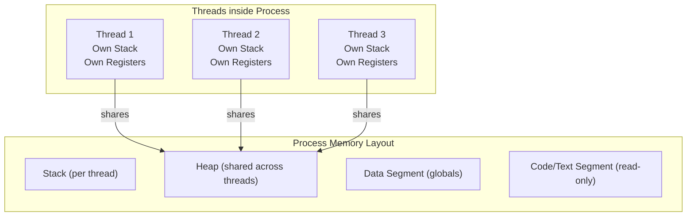
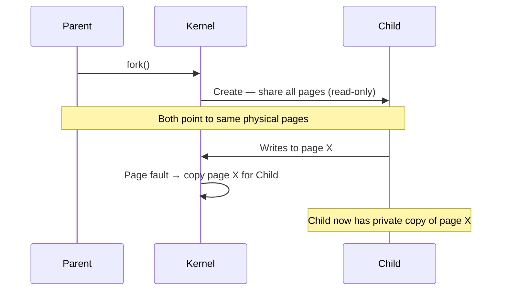

---

## 1️. Process vs Thread

| | Process | Thread |
| :--- | :--- | :--- |
| **Definition** | Independent execution unit with its own memory | Lightweight unit within a process, shares memory |
| **Memory** | Own virtual address space (heap, stack, code, data) | Shares heap, code, data — **own stack only** |
| **Creation cost** | Heavy (~10ms) — needs new page tables, file descriptors | Light (~100μs) — just a new stack + register set |
| **Context switch** | Expensive — full TLB flush + page table swap | Cheaper — same address space, no TLB flush |
| **Communication** | IPC required (pipes, sockets, shared mem) | Direct — shared heap, global variables |
| **Crash isolation** | ✅ One crash doesn't affect others | ❌ One thread crash kills the entire process |
| **Parallelism** | True parallelism across CPUs | True parallelism (if kernel threads) |

---

## 2️. Memory Layout



**Key insight**: Threads share the **heap** (dynamic allocations) but each has a **private stack** (local variables, return addresses).

---

## 3️. Linux Implementation

In Linux, **there is no fundamental difference** between a process and a thread at the kernel level. Both are **tasks** created by `clone()`.

| Call | What It Does | Shares Memory? |
| :--- | :--- | :--- |
| `fork()` | Creates a new process (copy-on-write) | ❌ Separate address space |
| `pthread_create()` | Creates a thread via `clone(CLONE_VM \| CLONE_FS \| ...)` | ✅ Same address space |
| `clone()` | Low-level — you pick what to share | Configurable via flags |

### `clone()` Flags

```
CLONE_VM     → Share virtual memory (makes it a thread)
CLONE_FS     → Share filesystem info (cwd, root)
CLONE_FILES  → Share file descriptor table
CLONE_SIGHAND → Share signal handlers
```

> `fork()` = `clone()` with no sharing flags
> `pthread_create()` = `clone()` with all sharing flags

---

## 4️. Practical Linux Commands

```bash
# View all processes
ps aux

# View threads of a specific process (PID 1234)
ps -T -p 1234

# View threads with top (press H to toggle thread view)
top -H -p 1234

# Count threads of a process
ls /proc/1234/task | wc -l

# See memory map of a process
cat /proc/1234/maps

# See process tree
pstree -p

# Trace process/thread creation
strace -f -e clone,fork,execve ./my_program

# Monitor context switches per process
pidstat -w -p 1234 1

# See shared vs private memory
pmap -x 1234
```

---

## 5️. Fork vs Thread — When to Use

| Use Case | Process (`fork`) | Thread (`pthread`) |
| :--- | :--- | :--- |
| **Isolation needed** | ✅ Crash-safe (Chrome tabs, Nginx workers) | ❌ |
| **Shared state needed** | ❌ Needs IPC | ✅ Direct memory access |
| **CPU-bound parallelism** | ✅ No GIL issues (Python) | ✅ (C/C++/Java/Go) |
| **Low-latency creation** | ❌ Slower | ✅ ~100x faster |
| **Security boundary** | ✅ Separate privileges possible | ❌ Same privileges |

---

## 6️. Copy-on-Write (CoW)

`fork()` doesn't actually copy all memory immediately. It marks pages as **read-only** and shares them. A copy is made **only when a page is written to**.



This makes `fork()` fast — most pages are never written, so they're never copied.

---

## 7️. Interview Angles

### "Process vs Thread — when would you choose one over the other?"

> Use **processes** when you need crash isolation (e.g., Chrome runs each tab as a separate process — one tab crash doesn't kill the browser). Use **threads** when you need low-latency shared-state communication (e.g., a web server handling concurrent requests accessing a shared cache).

### "What happens in memory when you call fork()?"

> The kernel creates a new process with **copy-on-write** semantics. Both parent and child initially share the same physical pages marked read-only. When either writes to a page, the kernel traps the write (page fault), copies that page, and gives the writer a private copy. This makes fork fast — only modified pages are ever duplicated.
