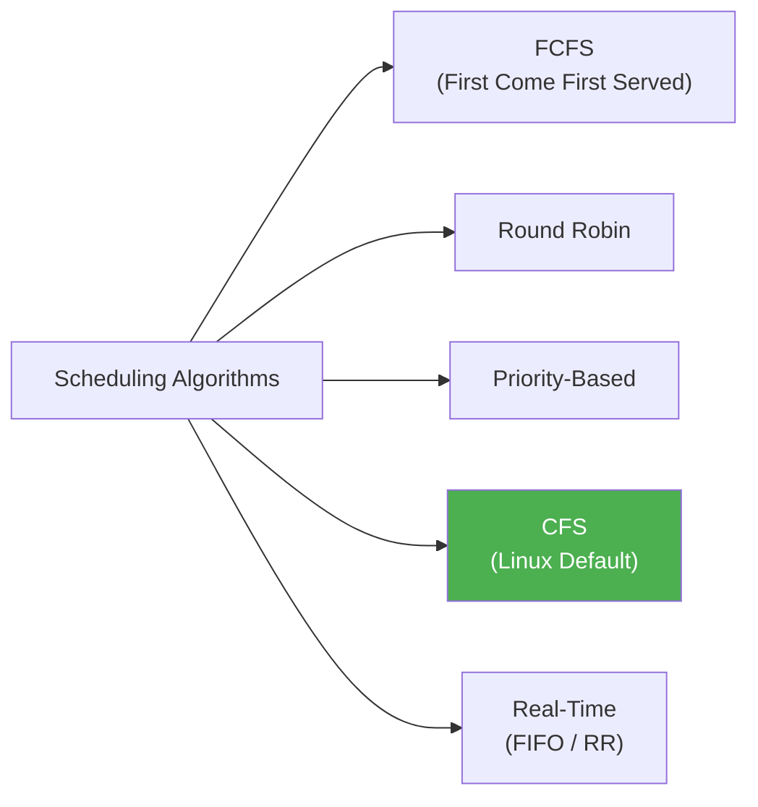
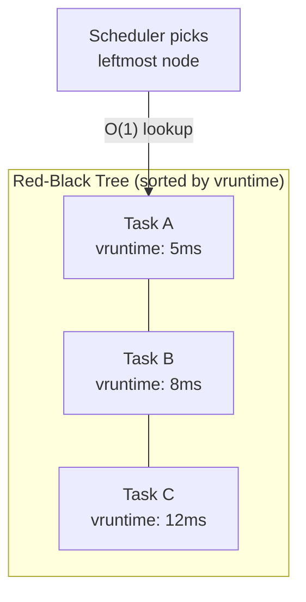
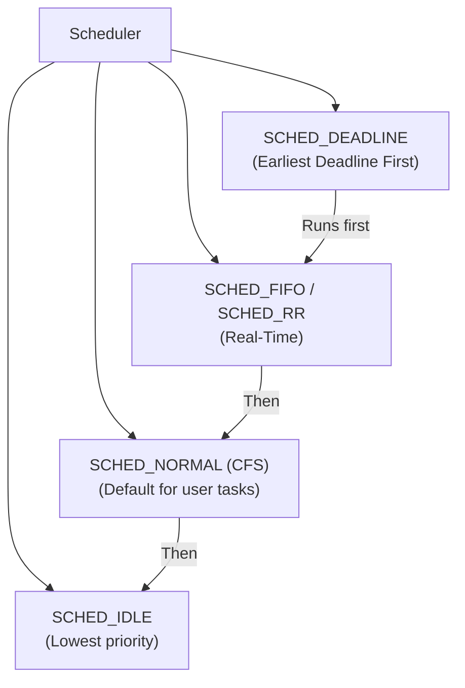
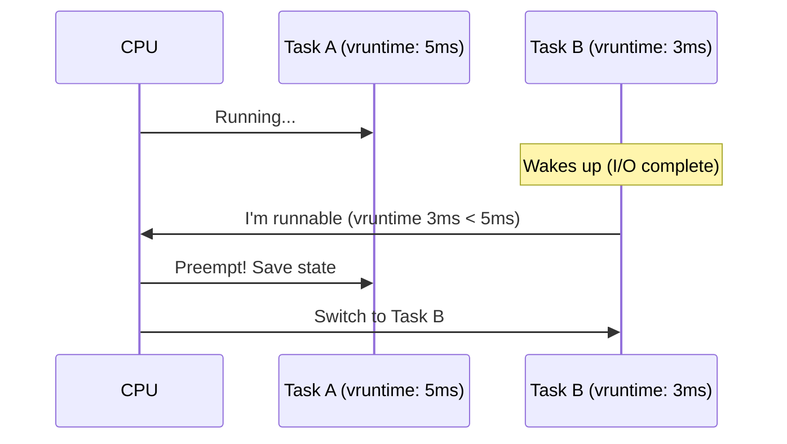

---

## 1️. What is a Scheduler?

The scheduler decides **which task runs on which CPU core and for how long**. It's the traffic controller of the OS.

| Goal | Description |
| :--- | :--- |
| **Fairness** | Every process gets a fair share of CPU |
| **Throughput** | Maximize total work done per unit time |
| **Latency** | Minimize response time for interactive tasks |
| **Starvation-free** | No process waits forever |

---

## 2️. Scheduling Algorithms



| Algorithm | How It Works | Problem |
| :--- | :--- | :--- |
| **FCFS** | Run in arrival order | Convoy effect — one long job blocks all |
| **Round Robin** | Fixed time quantum, rotate | Poor for mixed workloads (quantum too big = bad latency, too small = thrashing) |
| **Priority** | Highest priority runs first | Starvation of low-priority tasks |
| **CFS** | Weighted fair share using virtual runtime | Slightly higher overhead (red-black tree) |

---

## 3️. Completely Fair Scheduler (CFS) — Linux Default

CFS doesn't use fixed time slices. It tracks **virtual runtime** (`vruntime`) — how much CPU time each task has consumed relative to its weight.

### Core Idea

> The task with the **lowest `vruntime`** runs next. This ensures every task gets a **fair share** proportional to its priority (nice value).



### How `vruntime` Works

$$vruntime = \text{actual\_runtime} \times \frac{\text{weight of nice 0}}{\text{weight of this task}}$$

- **High priority** (low nice) → weight is large → `vruntime` grows **slowly** → gets more CPU
- **Low priority** (high nice) → weight is small → `vruntime` grows **fast** → gets less CPU

### Nice Values

| Nice | Priority | CPU Share |
| :--- | :--- | :--- |
| -20 | Highest | Most CPU time |
| 0 | Default | Normal |
| +19 | Lowest | Least CPU time |

Each nice level ≈ **10% more/less CPU** than the adjacent level.

---

## 4️. CFS Data Structure

CFS uses a **red-black tree** (self-balancing BST) keyed by `vruntime`:

| Operation | Complexity | Description |
| :--- | :--- | :--- |
| Pick next task | $O(1)$ | Cached leftmost node |
| Insert/Remove | $O(\log n)$ | Red-black tree operations |

> The leftmost node (lowest `vruntime`) is cached, so picking the next task is always $O(1)$.

---

## 5️. Scheduling Classes in Linux

Linux doesn't just have CFS. It has a **hierarchy** of schedulers:



| Class | Policy | Used For |
| :--- | :--- | :--- |
| `SCHED_DEADLINE` | Earliest deadline first | Hard real-time tasks |
| `SCHED_FIFO` | Run until done or preempted by higher priority | Soft real-time (audio, video) |
| `SCHED_RR` | Round-robin within same priority | Soft real-time |
| `SCHED_NORMAL` | CFS | Regular user processes |
| `SCHED_IDLE` | Only runs when CPU is idle | Background tasks |

> Real-time tasks **always preempt** CFS tasks. A runaway `SCHED_FIFO` task can starve the entire system.

---

## 6️. Practical Linux Commands

```bash
# View scheduling policy and priority of a process
chrt -p 1234

# Run a process with real-time FIFO priority 50
sudo chrt -f 50 ./my_program

# Run with round-robin real-time
sudo chrt -r 10 ./my_program

# Change nice value (lower = higher priority)
nice -n -10 ./my_program      # start with nice -10
renice -n 5 -p 1234           # change running process to nice 5

# See all processes with their nice values and scheduling policy
ps -eo pid,ni,cls,pri,comm --sort=-pri | head -20
#   NI = nice value
#   CLS = scheduling class (TS=normal, FF=FIFO, RR=round-robin)
#   PRI = priority

# View CFS stats for a specific task
cat /proc/1234/sched | grep -E "vruntime|nr_switches|sum_exec"

# See per-CPU run queue length
cat /proc/schedstat

# Watch scheduler latency in real-time
sudo perf sched latency

# Record and replay scheduler activity
sudo perf sched record -- sleep 5
sudo perf sched map

# View CPU affinity (which cores a process can run on)
taskset -p 1234

# Pin a process to cores 0 and 1
taskset -c 0,1 ./my_program
```

---

## 7️. Preemption

Linux CFS is **preemptive** — a running task can be interrupted if:

1. A higher-priority task becomes runnable
2. The current task's time slice (calculated dynamically) expires
3. The task voluntarily yields (`sched_yield()`)



---

## 8️. Interview Angles

### "How does Linux CFS work?"

> CFS tracks each task's **virtual runtime** — how much CPU it has consumed weighted by priority. It stores all runnable tasks in a **red-black tree** sorted by vruntime. The task with the lowest vruntime runs next ($O(1)$ via cached leftmost node). Higher-priority tasks accumulate vruntime slower, so they naturally get more CPU time.

### "Round Robin vs CFS — why is CFS better?"

> Round Robin uses a **fixed time quantum** which is a compromise — too large hurts latency, too small causes excessive context switching. CFS dynamically calculates time slices based on the number of runnable tasks and their weights. It guarantees **proportional fairness** regardless of workload.

### "Can a user process starve the system?"

> A normal CFS process cannot — CFS guarantees fairness. But a `SCHED_FIFO` real-time process **can** starve everything, including the shell. That's why real-time scheduling requires root and why the kernel has `sched_rt_runtime_us` (default: 950ms/1s) to reserve 5% CPU for non-RT tasks.
