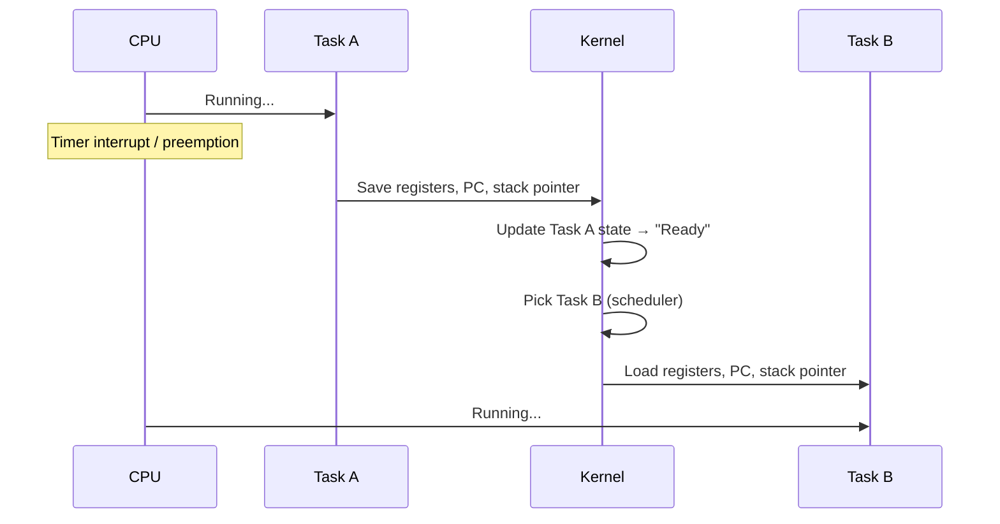
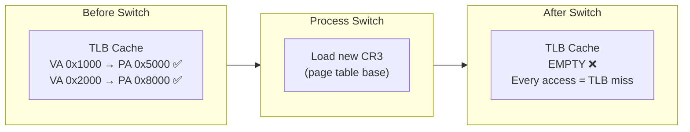

---

## 1️. What is a Context Switch?

A context switch is the OS **saving the state of one task and loading the state of another** so the CPU can run a different task.



---

## 2️. What Gets Saved/Restored

| Saved State | Description |
| :--- | :--- |
| **General-purpose registers** | RAX, RBX, RCX, ... R15 (x86-64) |
| **Program Counter (RIP)** | Where to resume execution |
| **Stack Pointer (RSP)** | Top of the task's stack |
| **RFLAGS** | CPU status flags (carry, zero, interrupt enable) |
| **FPU / SSE / AVX state** | Floating-point and SIMD registers (large — 512+ bytes) |
| **Kernel stack pointer** | Saved in the task's `task_struct` |

> The full register save is stored in the `thread_struct` inside Linux's `task_struct`.

---

## 3️. Thread Switch vs Process Switch

| | Thread Switch | Process Switch |
| :--- | :--- | :--- |
| **Registers** | ✅ Save/restore | ✅ Save/restore |
| **Page tables** | ❌ Same address space | ✅ Swap CR3 (page table base) |
| **TLB** | ❌ No flush needed | ✅ Full TLB flush |
| **Cache impact** | Minimal | Heavy — cold cache |
| **Cost** | ~1–2 μs | ~3–5 μs |

> Thread switches within the same process are cheaper because they skip the page table swap and TLB flush.

---

## 4️. TLB Flush — The Hidden Killer

The **TLB (Translation Lookaside Buffer)** caches virtual → physical address translations. On a process switch, the TLB entries become invalid because the new process has a different address space.



### TLB Miss Cost

| Access Type | Latency |
| :--- | :--- |
| TLB hit | ~1 ns |
| TLB miss (page table walk) | ~10–100 ns |
| Page fault (not in RAM) | ~1–10 ms (disk access) |

After a flush, every memory access causes a TLB miss until the cache warms up — this is **cache pollution**.

### Mitigation: PCID (Process Context ID)

Modern CPUs tag TLB entries with a **PCID** — a process identifier. This avoids flushing the TLB on switch; old entries remain but are ignored because the PCID doesn't match.

```bash
# Check if PCID is supported on your CPU
grep pcid /proc/cpuinfo
```

---

## 5️. What Triggers a Context Switch

| Trigger | Type | Example |
| :--- | :--- | :--- |
| **Timer interrupt** | Involuntary | Time slice expired (CFS preemption) |
| **I/O wait** | Voluntary | `read()` blocks waiting for disk |
| **Higher priority task** | Involuntary | Real-time task wakes up |
| **`sched_yield()`** | Voluntary | Task explicitly yields CPU |
| **Mutex/semaphore** | Voluntary | Task blocks on a lock |
| **Signal delivery** | Involuntary | Kernel delivers signal to another task |

---

## 6️. Practical Linux Commands

```bash
# Count context switches system-wide
vmstat 1
#   cs column = context switches per second

# Context switches for a specific process
cat /proc/1234/status | grep ctxt
#   voluntary_ctxt_switches: task blocked (I/O, lock)
#   nonvoluntary_ctxt_switches: preempted by scheduler

# Per-process context switch monitoring (every 1 second)
pidstat -w -p 1234 1
#   cswch/s = voluntary switches/sec
#   nvcswch/s = involuntary switches/sec

# Trace context switches with perf
sudo perf stat -e context-switches ./my_program

# Detailed scheduler stats
sudo perf sched record -- sleep 5
sudo perf sched latency
# Shows min/max/avg scheduling latency per task

# See TLB misses
sudo perf stat -e dTLB-load-misses,dTLB-store-misses ./my_program

# See cache misses (related to context switch pollution)
sudo perf stat -e cache-misses,cache-references ./my_program

# Check PCID support
grep pcid /proc/cpuinfo

# See how many context switches happened since boot
cat /proc/stat | grep ctxt
```

---

## 7️. Cost Breakdown

A typical context switch on modern Linux x86-64:

```
Register save/restore:     ~0.5 μs
Page table swap (CR3):     ~0.1 μs
TLB flush:                 ~0.5–2 μs  (without PCID)
Pipeline flush:            ~0.1 μs
Cache warmup penalty:      ~1–5 μs    (indirect, over next 100s of instructions)
─────────────────────────────────────
Total direct cost:         ~1–3 μs
Total effective cost:      ~3–10 μs   (including cache cold-start)
```

> On a system doing **10,000 context switches/sec**, that's ~30–100ms of CPU time lost per second — **3–10% overhead** just from switching.

---

## 8️. Interview Angles

### "What is a context switch and why is it expensive?"

> A context switch saves the CPU state (registers, program counter, stack pointer) of the current task and loads the state of the next task. The direct cost (~1–3μs) comes from register save/restore, page table swap, and TLB flush. The indirect cost is **cache pollution** — after the switch, L1/L2/TLB caches are cold, causing misses on subsequent memory accesses.

### "Thread switch vs process switch — what's the difference?"

> A thread switch only saves/restores registers because threads share the same address space. A process switch additionally swaps the page table base register (CR3) and flushes the TLB, making it ~2–3x more expensive. Modern CPUs mitigate this with **PCID** to avoid full TLB flushes.

### "How do you detect excessive context switching in production?"

> Use `vmstat 1` to see system-wide switches per second, `pidstat -w` for per-process breakdown, and check `/proc/PID/status` for voluntary vs involuntary counts. High involuntary switches suggest CPU contention. High voluntary switches suggest excessive I/O or lock contention. Use `perf sched latency` for detailed analysis.
