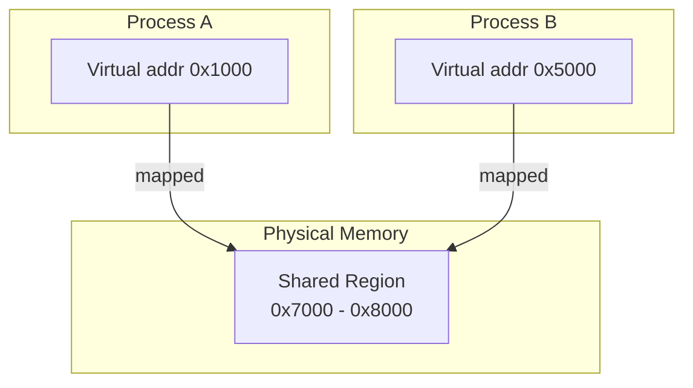

---

## 1️. Why IPC?

Processes have **isolated address spaces** — they cannot read each other's memory. IPC mechanisms let processes exchange data.


---

## 2️. IPC Mechanisms — Comparison

| Mechanism | Speed | Direction | Use Case | Complexity |
| :--- | :--- | :--- | :--- | :--- |
| **Pipe** | Medium | Unidirectional | Parent ↔ child | Simple |
| **Named Pipe (FIFO)** | Medium | Unidirectional | Unrelated processes | Simple |
| **Socket (Unix Domain)** | Medium | Bidirectional | Any processes, also network | Moderate |
| **Shared Memory** | ⚡ Fastest | Bidirectional | High-throughput data sharing | Complex (needs sync) |
| **Message Queue** | Medium | Bidirectional | Structured messages, decoupled | Moderate |
| **Signal** | Fast | Unidirectional | Notifications only (no data) | Simple |

---

## 3️. Pipes

One-way data channel between **related processes** (parent-child via `fork()`).


```bash
# Pipes in the shell — stdout of ls goes to stdin of grep
ls -la | grep ".md"

# See pipe usage of a process
ls -la /proc/1234/fd
# Shows pipe file descriptors as symlinks
```

**Named Pipes (FIFOs)** — work between **unrelated** processes via a file path:

```bash
# Create a named pipe
mkfifo /tmp/my_pipe

# Terminal 1: writer
echo "hello from A" > /tmp/my_pipe

# Terminal 2: reader
cat < /tmp/my_pipe
# Output: hello from A

# Clean up
rm /tmp/my_pipe
```

---

## 4️. Unix Domain Sockets

Bidirectional, work between any processes on the same host. Faster than TCP sockets (no network stack).


```bash
# Many services use Unix sockets
ls -la /var/run/*.sock

# Docker uses a Unix socket
ls -la /var/run/docker.sock

# Check active Unix domain sockets
ss -x | head -20

# Send data via socat (useful for testing)
# Terminal 1: listener
socat UNIX-LISTEN:/tmp/test.sock -

# Terminal 2: sender
echo "hello" | socat - UNIX-CONNECT:/tmp/test.sock
```

---

## 5️. Shared Memory — The Fastest IPC

Processes map the **same physical memory** into their address spaces. No kernel involvement after setup — reads/writes go directly to RAM.



> **Why fastest**: After `mmap`/`shmat`, data transfer is just a memory read/write — no syscalls, no kernel copies.

> **The catch**: You **must** synchronize access with mutexes/semaphores. Two processes writing simultaneously = **data corruption**.

```bash
# List active shared memory segments (System V)
ipcs -m

# Show shared memory details
ipcs -m -i <shmid>

# Remove a shared memory segment
ipcrm -m <shmid>

# List POSIX shared memory objects
ls -la /dev/shm/

# Monitor shared memory usage
df -h /dev/shm

# Check what shared mappings a process has
cat /proc/1234/maps | grep "shared"
pmap 1234 | grep "shared"
```

---

## 6️. Message Queues

Structured message passing — processes send/receive discrete messages, decoupled in time.


Two APIs in Linux:

| | System V (`msgget`) | POSIX (`mq_open`) |
| :--- | :--- | :--- |
| **API** | `msgget`, `msgsnd`, `msgrcv` | `mq_open`, `mq_send`, `mq_receive` |
| **Namespace** | Integer keys | File-like paths (`/my_queue`) |
| **Modern?** | Legacy | Preferred |

```bash
# List System V message queues
ipcs -q

# List POSIX message queues
ls -la /dev/mqueue/

# Remove a System V message queue
ipcrm -q <msqid>
```

---

## 7️. Signals

Lightweight **notifications** — no data payload, just an event.

| Signal | Number | Default Action | Use Case |
| :--- | :--- | :--- | :--- |
| `SIGTERM` | 15 | Terminate (graceful) | `kill 1234` |
| `SIGKILL` | 9 | Terminate (forced) | `kill -9 1234` |
| `SIGINT` | 2 | Terminate | Ctrl+C |
| `SIGSTOP` | 19 | Pause | Cannot be caught |
| `SIGCONT` | 18 | Resume | Continue paused process |
| `SIGUSR1` | 10 | User-defined | Custom app signals |
| `SIGHUP` | 1 | Terminate / Reload | Config reload (Nginx) |

```bash
# Send a signal
kill -SIGTERM 1234     # graceful shutdown
kill -9 1234           # force kill (cannot be caught)
kill -SIGUSR1 1234     # trigger custom handler

# List all signals
kill -l

# Send signal to all processes by name
killall -SIGHUP nginx

# Trace signals received by a process
strace -e signal -p 1234
```

---

## 8️. Performance Comparison

| Mechanism | Latency (per msg) | Throughput | Kernel Copies |
| :--- | :--- | :--- | :--- |
| **Shared Memory** | ~10 ns | ⚡ Highest | 0 |
| **Pipe** | ~1–5 μs | High | 2 (write → kernel buf → read) |
| **Unix Socket** | ~2–5 μs | High | 2 |
| **Message Queue** | ~5–10 μs | Medium | 2 |
| **TCP Socket (loopback)** | ~10–30 μs | Medium | 4+ (full network stack) |
| **Signal** | ~1–2 μs | N/A (notification only) | 0 |

---

## 9️. Interview Angles

### "What's the fastest IPC and why?"

> **Shared memory**. After initial setup (`shmat`/`mmap`), data transfer is a direct memory read/write — zero syscalls, zero kernel copies. The trade-off is you must handle synchronization yourself (mutexes, semaphores) to avoid race conditions.

### "When would you use pipes vs sockets vs shared memory?"

> **Pipes** for simple parent-child streaming (shell pipelines). **Unix sockets** for bidirectional communication between unrelated processes (Docker daemon, database connections). **Shared memory** when you need maximum throughput and can handle synchronization (e.g., shared caches, ring buffers between producer/consumer).

### "How does IPC relate to microservices?"

> Microservices on the same host can use Unix domain sockets or shared memory for high-performance IPC instead of TCP. However, most microservice architectures use TCP/HTTP for network transparency — the ability to move services across hosts without code changes. This trades latency (~10–30μs vs ~1–5μs) for deployment flexibility.
