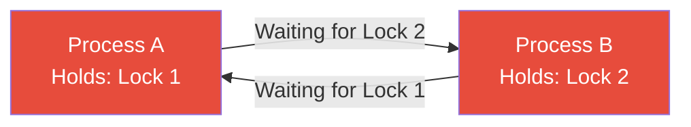
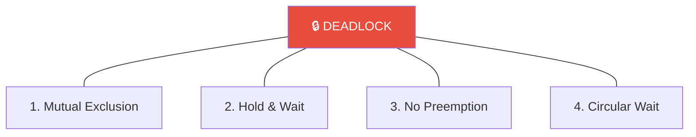
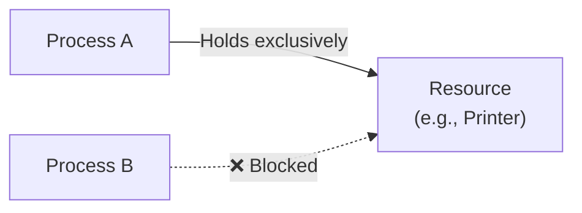
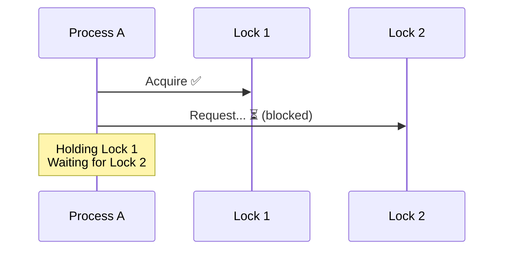
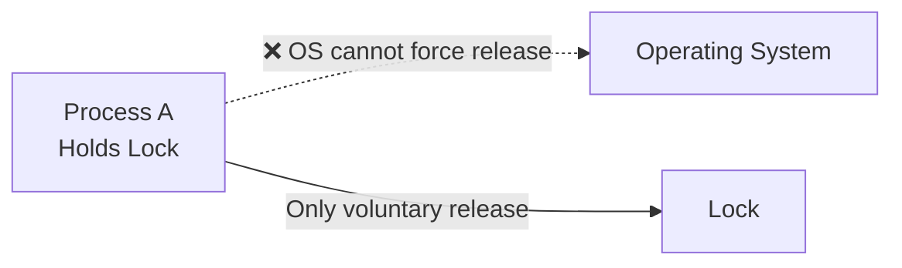
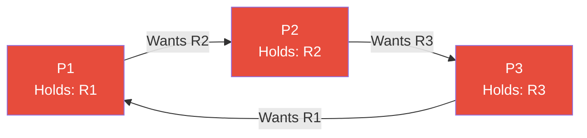
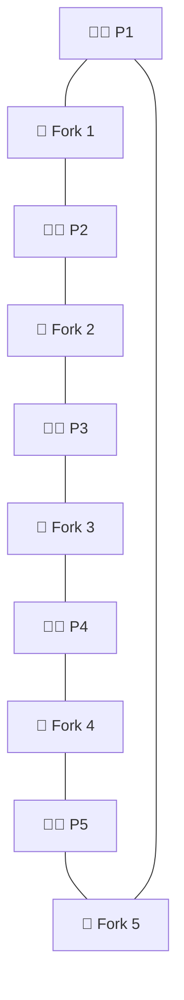
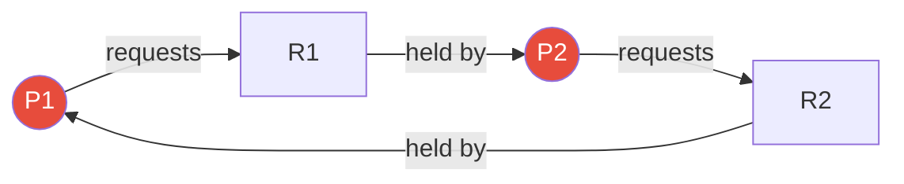

---

## 1️. What is a Deadlock?

A deadlock occurs when **two or more tasks are permanently blocked**, each waiting for a resource held by another.



> Neither can proceed. Neither will release. The system is **stuck forever**.

---

## 2️. The 4 Coffman Conditions

A deadlock can occur **only if all four conditions hold simultaneously**. Break any one → deadlock is impossible.



---

### Condition 1: Mutual Exclusion

A resource can be held by **only one process** at a time.



- A printer can only serve one job at a time
- A mutex lock can only be held by one thread
- **Cannot always be broken** — some resources are inherently non-sharable

---

### Condition 2: Hold & Wait

A process **holds at least one resource** while **waiting** to acquire another.



---

### Condition 3: No Preemption

Resources **cannot be forcibly taken** from a process. Only the holder can release.



---

### Condition 4: Circular Wait

A **closed chain** of processes exists where each waits for a resource held by the next.

$$P_1 \rightarrow P_2 \rightarrow P_3 \rightarrow P_1$$



---

## 3️. Classic Example: Dining Philosophers

5 philosophers sit around a table. Each needs **2 forks** to eat. Each fork is shared between two neighbors.



**Deadlock**: If all 5 pick up their left fork simultaneously → all wait for the right fork → circular wait → **deadlock**.

---

## 4️. Resource Allocation Graph (RAG)

Used to **detect deadlocks** visually.

| Edge | Meaning |
| :--- | :--- |
| $P \rightarrow R$ | Process **requests** resource |
| $R \rightarrow P$ | Resource **assigned to** process |

**Deadlock** = a **cycle** in the RAG (for single-instance resources).



> Cycle detected → **Deadlock confirmed** (for single-instance resources).

---

## 5️. Practical Linux Commands

```bash
# Detect deadlocked threads in a Java process
jstack 1234 | grep -A 5 "deadlock"

# Find processes waiting on locks
cat /proc/1234/wchan
# Shows the kernel function the process is sleeping in

# Check for D-state (uninterruptible sleep) processes — often lock-related
ps aux | awk '$8 ~ /D/'

# Trace lock contention with perf
sudo perf lock record ./my_program
sudo perf lock report

# Trace futex (userspace mutex) calls
strace -e futex -p 1234

# Check mutex contention in pthread programs
valgrind --tool=helgrind ./my_program

# See all threads and what they're waiting on
cat /proc/1234/task/*/wchan

# GDB: detect deadlock in a running process
sudo gdb -p 1234
# Inside GDB:
# (gdb) info threads
# (gdb) thread apply all bt
```

---

## 6️. Interview Angles

### "What are the 4 conditions for deadlock?"

> **Mutual Exclusion** (resource held exclusively), **Hold & Wait** (holding one, waiting for another), **No Preemption** (can't force release), **Circular Wait** (closed dependency chain). All four must hold simultaneously for a deadlock. Breaking any one prevents it.

### "How do you detect a deadlock?"

> Build a **Resource Allocation Graph** and check for cycles. For single-instance resources, a cycle = deadlock. For multi-instance, use the **Banker's Algorithm** to check if the system is in an unsafe state. In production, use tools like `jstack` (Java), `pstack`/`gdb` (C/C++), or `perf lock` to find blocked threads.
