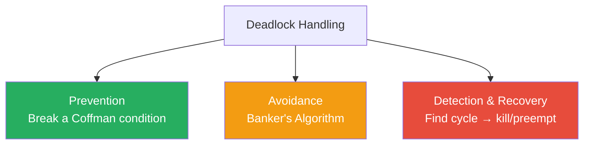
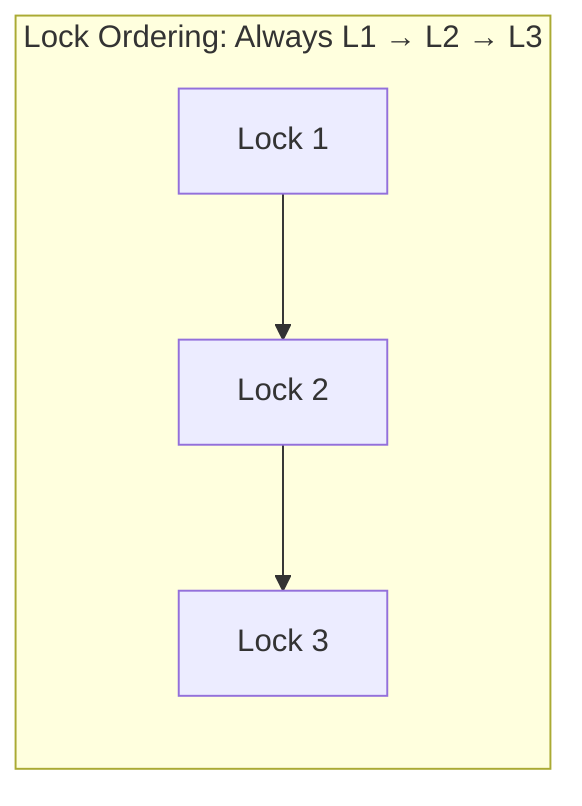
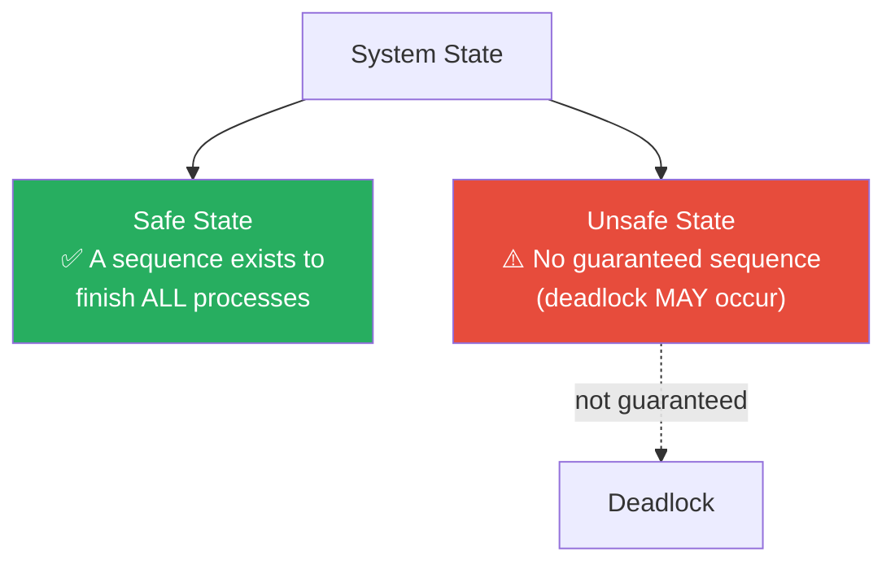
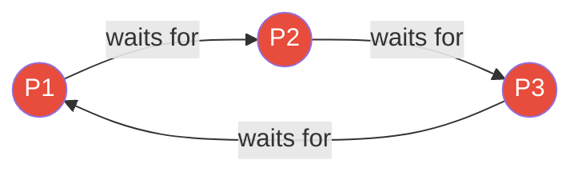

---

## 1️. Three Strategies



---

## 2️. Prevention — Break a Coffman Condition

| Condition | How to Break It | Trade-off |
| :--- | :--- | :--- |
| **Mutual Exclusion** | Use sharable resources (read-only files, spooling) | Not always possible |
| **Hold & Wait** | Request **all resources at once** before starting | Low resource utilization, possible starvation |
| **No Preemption** | If a request fails, **release all** held resources and retry | Wasted work, complex rollback |
| **Circular Wait** | Impose a **global ordering** on resources — always acquire in order | Must enforce discipline across all code |

### Breaking Circular Wait (Most Practical)

Assign a **number** to every lock. Always acquire in **ascending order**.



```
✅ Thread A: lock(1) → lock(2)
✅ Thread B: lock(1) → lock(2)
❌ Thread B: lock(2) → lock(1)   ← violates ordering → FIX THIS
```

> This is the **most widely used** prevention strategy in practice (Linux kernel, databases, Java `ReentrantLock`).

---

## 3️. Avoidance — Banker's Algorithm

Don't prevent deadlock statically — **dynamically check** if granting a request would leave the system in a **safe state**.

### Safe vs Unsafe State



> **Unsafe ≠ Deadlock**. It means the system *could* deadlock. Banker's Algorithm refuses any request that leads to an unsafe state.

### Banker's Algorithm — Step by Step

**Given:**
- $n$ processes, $m$ resource types
- `Available[m]` — free resources
- `Max[n][m]` — max demand of each process
- `Allocation[n][m]` — currently allocated
- `Need[n][m]` = `Max - Allocation`

**Algorithm:**

```
1. Find a process Pi where Need[i] ≤ Available
2. If found:
   - Pretend Pi finishes → Available += Allocation[i]
   - Mark Pi as done
   - Repeat from step 1
3. If ALL processes marked done → SAFE STATE ✅
4. If no such Pi found and processes remain → UNSAFE ❌
```

### Example

| Process | Allocation (A,B,C) | Max (A,B,C) | Need (A,B,C) |
| :--- | :--- | :--- | :--- |
| P0 | 0, 1, 0 | 7, 5, 3 | 7, 4, 3 |
| P1 | 2, 0, 0 | 3, 2, 2 | 1, 2, 2 |
| P2 | 3, 0, 2 | 9, 0, 2 | 6, 0, 0 |
| P3 | 2, 1, 1 | 2, 2, 2 | 0, 1, 1 |
| P4 | 0, 0, 2 | 4, 3, 3 | 4, 3, 1 |

**Available: (3, 3, 2)**

```
Step 1: P1 Need(1,2,2) ≤ Available(3,3,2) ✅ → Available = (5,3,2)
Step 2: P3 Need(0,1,1) ≤ Available(5,3,2) ✅ → Available = (7,4,3)
Step 3: P0 Need(7,4,3) ≤ Available(7,4,3) ✅ → Available = (7,5,3)
Step 4: P2 Need(6,0,0) ≤ Available(7,5,3) ✅ → Available = (10,5,5)
Step 5: P4 Need(4,3,1) ≤ Available(10,5,5) ✅

Safe sequence: P1 → P3 → P0 → P2 → P4 ✅
```

---

## 4️. Detection & Recovery

Let deadlocks happen, then **detect and fix** them.

### Detection

Run a cycle-detection algorithm periodically on the **wait-for graph**:



> Cycle in wait-for graph → **Deadlock detected**.

### Recovery Options

| Method | How | Risk |
| :--- | :--- | :--- |
| **Kill a process** | Terminate one process in the cycle to break it | Lost work |
| **Kill all deadlocked** | Terminate all processes in the cycle | Maximum data loss |
| **Resource preemption** | Forcibly take a resource from one process | Process must handle rollback |
| **Rollback** | Roll back a process to a checkpoint | Requires checkpoint support |

### Which process to kill?

Pick the **victim** with the least cost:
- Least CPU time consumed
- Fewest resources held
- Furthest from completion
- Lowest priority

---

## 5️. Comparison

| Strategy | Overhead | Resource Utilization | When Used |
| :--- | :--- | :--- | :--- |
| **Prevention** | Low runtime, restricts design | Can be low (hold & wait) | Lock ordering in codebases |
| **Avoidance** | $O(n^2 \cdot m)$ per request | Good | Databases, real-time systems |
| **Detection** | Periodic cycle check $O(n^2)$ | Best (no restrictions) | Databases (deadlock detector) |
| **Ignore (Ostrich)** | Zero | Best | Linux, Windows (for user processes) |

> **Linux and most general-purpose OSs use the Ostrich Algorithm** for user processes — they ignore deadlocks and let the user kill stuck processes. The overhead of prevention/detection isn't worth it for general computing.

---

## 6️. Practical Linux Commands

```bash
# Detect D-state (uninterruptible sleep) processes — deadlock suspects
ps aux | awk '$8 ~ /D/'

# See what lock a process is waiting on
cat /proc/1234/wchan

# All threads and their wait channels
cat /proc/1234/task/*/wchan

# Java deadlock detection
jstack 1234 | grep -i "deadlock" -A 20

# PostgreSQL deadlock detection
psql -c "SELECT * FROM pg_locks WHERE NOT granted;"
# Postgres auto-detects deadlocks and kills one transaction

# MySQL deadlock info
mysql -e "SHOW ENGINE INNODB STATUS\G" | grep -A 30 "LATEST DETECTED DEADLOCK"

# Trace lock contention
sudo perf lock record ./my_program
sudo perf lock report

# GDB: backtrace all threads to find who's stuck
sudo gdb -p 1234 -batch -ex "thread apply all bt"
```

---

## 7️. Interview Angles

### "How do you handle deadlocks in practice?"

> In application code: **prevention via lock ordering** — assign a global order to all locks and always acquire in that order. In databases: **detection and recovery** — the DB engine periodically checks for deadlock cycles and kills the youngest transaction. In general-purpose OSs: **ignore** (Ostrich) — it's too expensive to prevent/detect for all user processes.

### "Walk me through Banker's Algorithm."

> It's a **deadlock avoidance** algorithm. Before granting a resource request, it simulates what would happen if the request is granted. It checks if a **safe sequence** exists — an order in which all processes can finish using Available resources. If yes → grant. If no (unsafe state) → deny and make the process wait.

### "Prevention vs Detection — when to use which?"

> **Prevention** when you control the codebase and can enforce lock ordering (application code, kernel development). **Detection** when deadlocks are rare and the recovery cost is acceptable (databases — kill one transaction and retry). Detection gives better resource utilization but requires a recovery mechanism.
