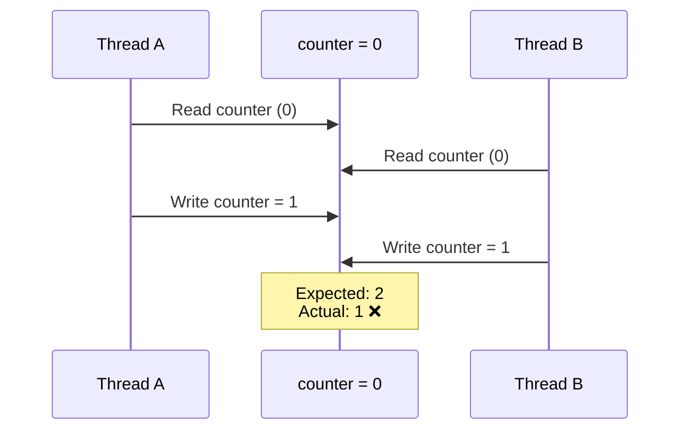
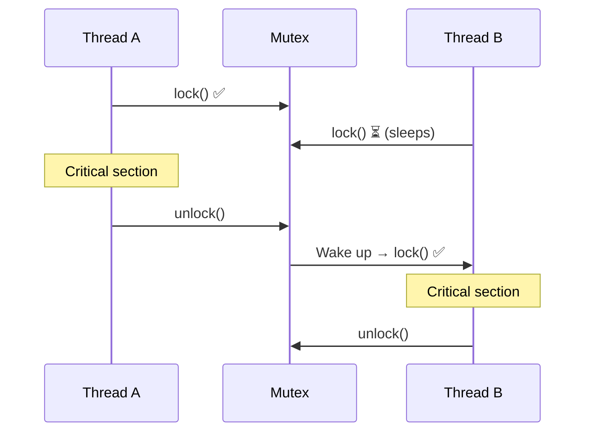
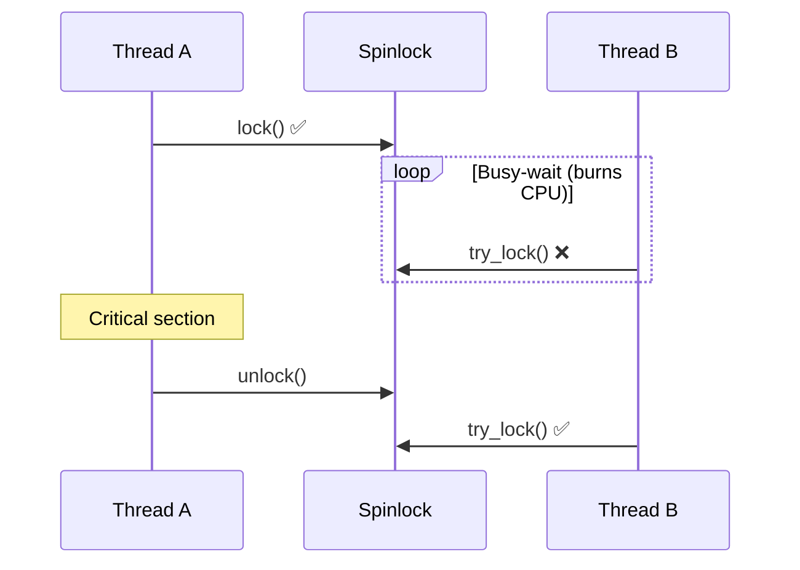
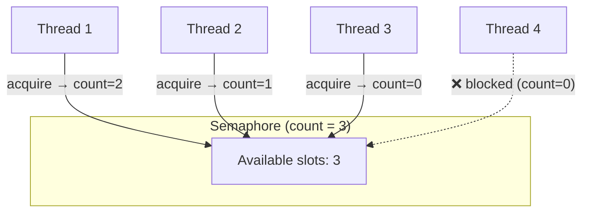
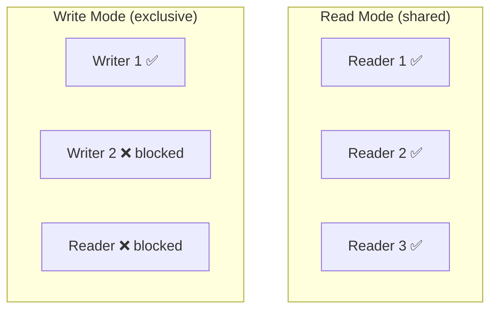
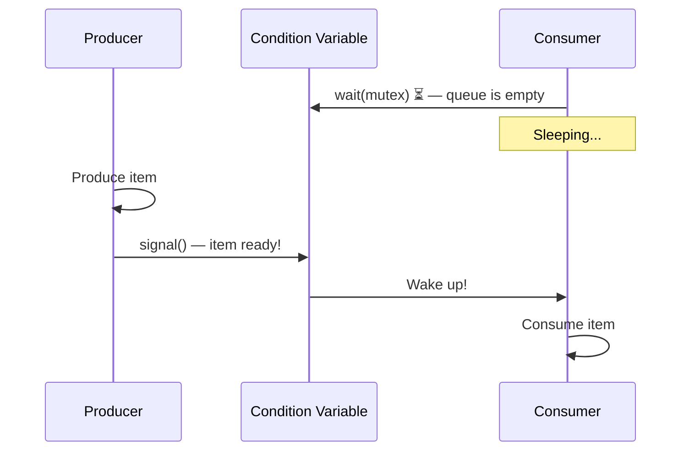

---

## 1️. Why Synchronization?

When multiple threads access **shared data** concurrently, you get **race conditions** — the result depends on the order of execution.



> Both threads read 0, both write 1. One increment is **lost**. This is a **race condition**.

---

## 2️. Primitives Comparison

| Primitive | Type | Contention Behavior | Best For |
| :--- | :--- | :--- | :--- |
| **Mutex** | Binary lock | Sleep (yield CPU) | Protecting critical sections (general purpose) |
| **Spinlock** | Binary lock | Busy-wait (spin on CPU) | Very short critical sections (kernel, lock-free queues) |
| **Semaphore** | Counting lock | Sleep | Limiting concurrent access (connection pools) |
| **Read-Write Lock** | Shared/Exclusive | Sleep | Read-heavy workloads |
| **Condition Variable** | Wait/Signal | Sleep | Producer-consumer, event notification |

---

## 3️. Mutex (Mutual Exclusion)

Only **one thread** can hold the mutex at a time. Others **sleep** until it's released.



### Key Properties

- **Ownership**: Only the thread that locked can unlock
- **Non-recursive** (by default): Locking twice from the same thread = deadlock
- **Sleep-based**: Blocked threads yield CPU → good for long critical sections

```bash
# Trace mutex/futex operations of a running process
strace -e futex -p 1234

# Detect mutex errors (double lock, unlock from wrong thread)
valgrind --tool=helgrind ./my_program

# Detect data races
valgrind --tool=drd ./my_program
```

---

## 4️. Spinlock

Same as mutex but the blocked thread **busy-waits** (loops on the CPU) instead of sleeping.



### When to Spin vs When to Sleep

| Spin (Spinlock) | Sleep (Mutex) |
| :--- | :--- |
| Critical section < ~1 μs | Critical section > ~1 μs |
| Multi-core CPU (spinning on one core while other runs) | Any CPU configuration |
| Kernel code, interrupt handlers | User-space applications |
| Cannot sleep (interrupt context) | Can afford to sleep |
| **Wastes CPU** if held too long | **Context switch overhead** on every lock/unlock |

> **Rule of thumb**: If the lock hold time < context switch cost (~1–5 μs), spin. Otherwise, sleep.

### Adaptive Spinning (Linux)

Linux mutexes use **adaptive spinning** — they spin briefly hoping the lock holder finishes fast. If the holder is not running on any CPU (sleeping/blocked), they immediately sleep instead.

```bash
# Check spinlock contention in kernel
sudo perf lock record -a -- sleep 5
sudo perf lock report

# See kernel lock stats (if enabled)
cat /proc/lock_stat | head -40
```

---

## 5️. Semaphore

A **counter-based** lock. Allows up to `N` threads to enter concurrently.



### Binary Semaphore vs Mutex

| | Mutex | Binary Semaphore (count=1) |
| :--- | :--- | :--- |
| **Ownership** | ✅ Only locker can unlock | ❌ Any thread can signal |
| **Purpose** | Protect critical section | Signaling between threads |
| **Priority inheritance** | ✅ Supported | ❌ Not supported |

> **Mutex** = "I'm using this resource." **Semaphore** = "N slots are available."

### Common Uses

| Use Case | Semaphore Count |
| :--- | :--- |
| Database connection pool (max 10) | 10 |
| Rate limiting (max 5 concurrent requests) | 5 |
| Producer-consumer buffer (capacity N) | N |
| Binary lock (1 at a time) | 1 |

```bash
# List System V semaphores
ipcs -s

# Remove a semaphore
ipcrm -s <semid>

# See semaphore operations
strace -e semop,semget,semctl -p 1234
```

---

## 6️. Read-Write Lock (RWLock)

Optimized for **read-heavy** workloads. Multiple readers OR one writer — never both.



| State | Readers | Writers |
| :--- | :--- | :--- |
| **Read lock held** | ✅ Multiple allowed | ❌ Blocked |
| **Write lock held** | ❌ Blocked | ❌ Blocked |
| **Unlocked** | ✅ | ✅ |

> **Writer starvation risk**: If readers keep arriving, the writer never gets the lock. Solution: **writer-preference** RWLock — once a writer is waiting, block new readers.

---

## 7️. Condition Variable

Used for **thread signaling** — "wait until a condition is true."



Always used **with a mutex** to protect the shared state:

```
// Producer-Consumer pattern
mutex.lock()
while (queue.empty())       // always use WHILE, not IF (spurious wakeups)
    cond.wait(mutex)        // atomically releases mutex + sleeps
item = queue.pop()
mutex.unlock()
```

> **Spurious wakeups** are real — the OS can wake a thread without a signal. Always check the condition in a **`while` loop**, never `if`.

---

## 8️. Practical Linux Commands

```bash
# Detect race conditions and lock errors
valgrind --tool=helgrind ./my_program

# Detect data races (alternative)
valgrind --tool=drd ./my_program

# ThreadSanitizer (compile-time, faster)
gcc -fsanitize=thread -g my_program.c -o my_program -lpthread
./my_program

# Trace all futex (mutex/condvar) syscalls
strace -e futex -c -p 1234
# Shows count and time spent in futex operations

# Lock contention profiling
sudo perf lock record ./my_program
sudo perf lock report
# Shows which locks are most contended

# Monitor mutex contention in real-time (eBPF)
sudo bpftrace -e 'tracepoint:syscalls:sys_enter_futex { @[comm] = count(); }'

# List System V semaphores and shared memory
ipcs -a

# Check for threads stuck in futex_wait
cat /proc/1234/task/*/wchan | sort | uniq -c | sort -rn
```

---

## 9️. Interview Angles

### "Mutex vs Spinlock — when to use which?"

> **Spinlock** when the critical section is very short (< 1μs) and you're on a multi-core system — the cost of spinning is less than a context switch. **Mutex** for everything else — sleeping yields the CPU to other threads. Linux kernel uses spinlocks in interrupt handlers where sleeping is illegal. User-space code should almost always use mutexes.

### "Mutex vs Semaphore?"

> A **mutex** has ownership — only the locker can unlock. It protects a critical section. A **semaphore** is a counter — any thread can signal it. It limits concurrency to N (connection pools, rate limiters). Use mutex for mutual exclusion, semaphore for resource counting.

### "What's the Producer-Consumer problem?"

> A producer adds items to a bounded buffer, a consumer removes them. You need: a **mutex** to protect the buffer, a **condition variable** for "buffer not empty" (consumer waits), and one for "buffer not full" (producer waits). Always check conditions in a `while` loop due to spurious wakeups.
