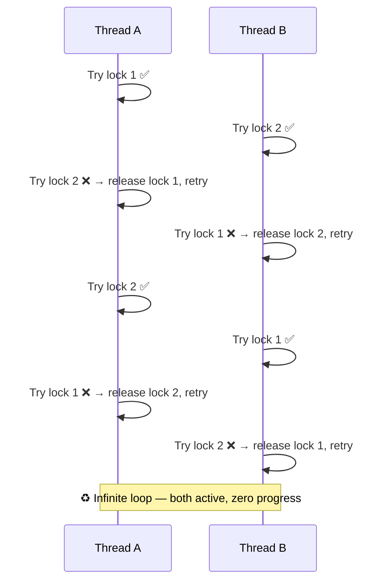
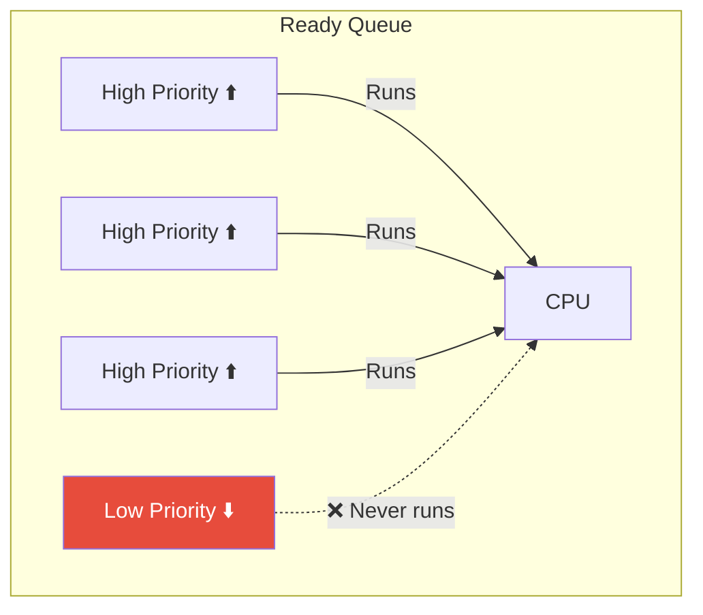
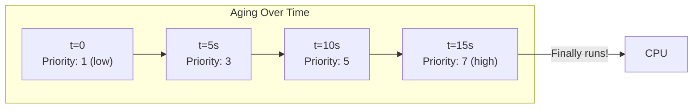
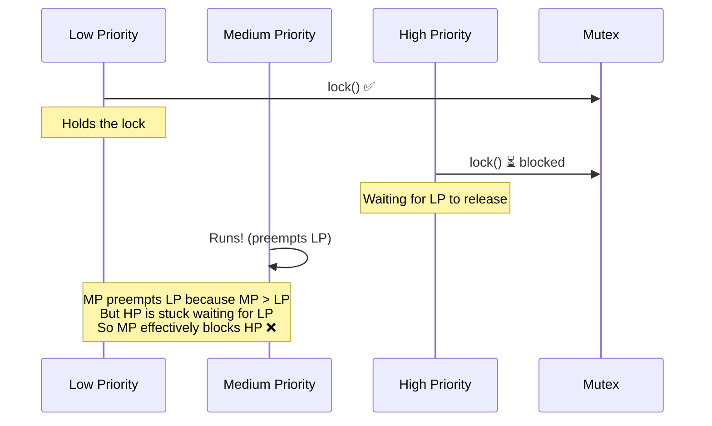
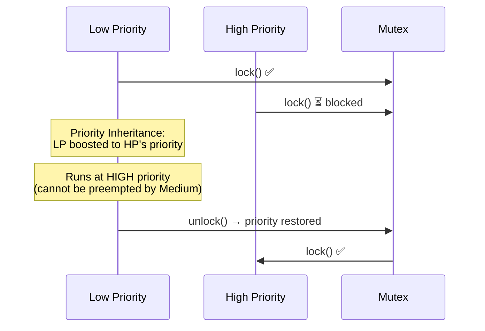

---

## 1️. Livelock vs Deadlock vs Starvation

| | Deadlock | Livelock | Starvation |
| :--- | :--- | :--- | :--- |
| **State** | Blocked (sleeping) | Active (running) | Ready (runnable) |
| **Progress** | ❌ No progress | ❌ No useful progress | ❌ Never gets CPU/resource |
| **CPU usage** | None (sleeping) | High (busy doing nothing) | Low (waiting in queue) |
| **Detection** | Easy (blocked threads) | Hard (threads appear active) | Moderate (check wait times) |

---

## 2️. Livelock

Processes **keep reacting to each other** but never make progress — like two people in a hallway stepping aside in the same direction forever.



### Real-World Example

Ethernet **CSMA/CD** — two devices detect a collision, both back off, both retransmit at the same time, collide again.

### How to Fix Livelock

| Solution | How It Works |
| :--- | :--- |
| **Random backoff** | Each thread waits a random time before retrying (breaks symmetry) |
| **Exponential backoff** | Double the wait time on each retry |
| **Priority-based** | One thread always yields to the other |

```
// Random backoff to break livelock
retry:
    if (!try_lock(lock1)) {
        sleep(random(1, 10) ms)   // break symmetry
        goto retry
    }
```

> Ethernet solved this with **exponential backoff** — wait $2^n \times \text{slot\_time}$ after the $n^{th}$ collision.

---

## 3️. Starvation

A thread is **perpetually denied access** to a resource because other higher-priority threads keep getting it first.



### Common Causes

| Cause | Example |
| :--- | :--- |
| **Priority scheduling** | High-priority tasks always preempt low-priority |
| **Writer preference RWLock** | Continuous writers starve readers (or vice versa) |
| **Unfair lock** | Non-FIFO mutex — same thread keeps reacquiring |
| **Resource hogging** | One process monopolizes I/O or CPU |

---

## 4️. Solving Starvation — Aging

**Aging** gradually **increases the priority** of waiting tasks over time. The longer a task waits, the higher its priority becomes — eventually it runs.



$$\text{effective\_priority} = \text{base\_priority} + \text{wait\_time} \times \text{aging\_factor}$$

### Where Aging Is Used

| System | Implementation |
| :--- | :--- |
| **Linux CFS** | `vruntime` naturally prevents starvation — starved tasks have low vruntime and get scheduled next |
| **Multilevel Feedback Queue** | Promote tasks that have waited too long to a higher-priority queue |
| **Database lock managers** | Increase lock priority based on wait time |

---

## 5️. Priority Inversion

A special form of starvation where a **high-priority task is blocked by a low-priority task**.



> **HP waits for LP, but MP keeps preempting LP** → HP (highest priority) waits for MP (medium priority). Priority is **inverted**.

### The Mars Pathfinder Bug (1997)

NASA's Mars Pathfinder suffered priority inversion — a low-priority task held a mutex needed by a high-priority task, while medium-priority tasks kept preempting the low-priority one. The system watchdog timer kept resetting the spacecraft.

### Solutions

| Solution | How It Works |
| :--- | :--- |
| **Priority Inheritance** | Temporarily boost LP to HP's priority while LP holds the lock HP needs |
| **Priority Ceiling** | Set each mutex's priority to the highest priority of any task that uses it |



```bash
# Check if a process has elevated priority (from inheritance)
chrt -p 1234

# Linux supports priority inheritance for POSIX mutexes
# Set PTHREAD_PRIO_INHERIT attribute on mutex
```

---

## 6️. Practical Linux Commands

```bash
# Find starved processes (long wait times)
ps -eo pid,pri,ni,stat,wchan,comm --sort=ni | tail -20

# Check if any process has been in D-state (uninterruptible) for too long
ps aux | awk '$8 ~ /D/ {print $0}'

# Monitor priority changes
sudo perf sched latency
# Shows max scheduling delay per task

# Check for priority inversion with ftrace
echo 1 | sudo tee /sys/kernel/debug/tracing/events/sched/sched_pi_setprio/enable
sudo cat /sys/kernel/debug/tracing/trace_pipe

# See per-task scheduling stats
cat /proc/1234/sched
# Look for: nr_involuntary_switches (preempted often = potential starvation target)
#           se.statistics.wait_max (max time waiting for CPU)

# View CFS vruntime (starvation detection)
cat /proc/1234/sched | grep vruntime

# Detect threads stuck spinning (livelock — high CPU, no progress)
top -H -p 1234
# Look for threads at 100% CPU with no I/O
```

---

## 7️. Interview Angles

### "What's the difference between deadlock and livelock?"

> In a **deadlock**, threads are blocked (sleeping) and make no progress. In a **livelock**, threads are active (running) but keep reacting to each other without making useful progress — like two people in a hallway stepping aside in the same direction. Livelocks are harder to detect because threads appear busy. Fix with **random/exponential backoff**.

### "How do you prevent starvation?"

> **Aging** — increase a task's priority the longer it waits. Linux CFS does this naturally via `vruntime` — a starved task accumulates the lowest vruntime and gets scheduled next. In priority-based systems, periodically promote long-waiting tasks to prevent indefinite postponement.

### "Explain priority inversion and how to fix it."

> A high-priority task is blocked by a low-priority task holding a needed resource, while medium-priority tasks preempt the low-priority one — effectively making the high-priority task wait for medium-priority tasks. Fix with **priority inheritance** (boost the lock holder to the blocked task's priority) or **priority ceiling** (set mutex priority to the max of all users). The Mars Pathfinder incident in 1997 is the classic real-world example.
