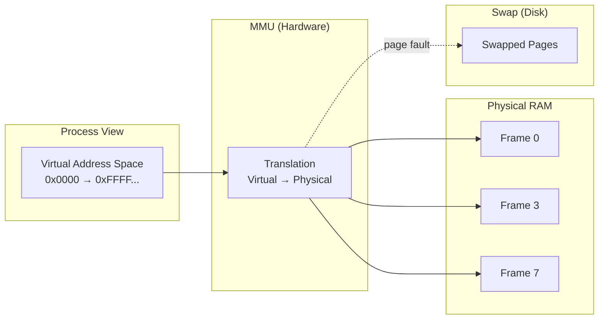
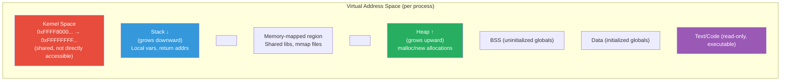
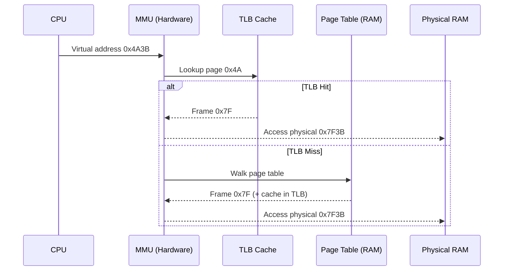
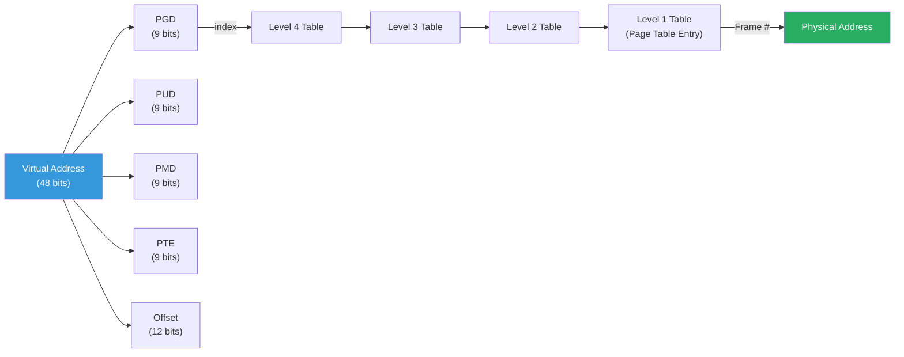
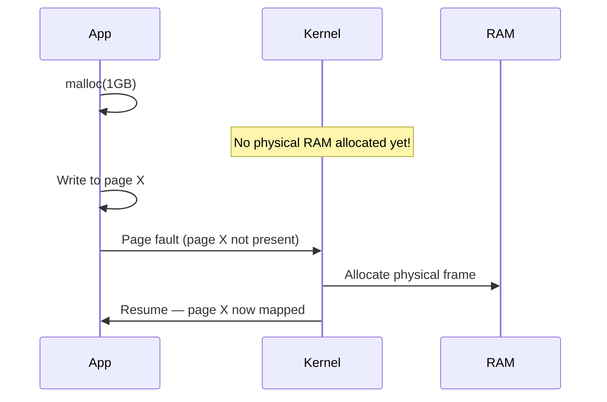

---

## 1️. What is Virtual Memory?

Virtual memory gives each process the **illusion of having its own large, contiguous address space** — even if physical RAM is limited and fragmented.



> Every process thinks it has the entire address space to itself. The kernel + MMU (Memory Management Unit) maps this to scattered physical frames behind the scenes.

---

## 2️. Why Virtual Memory?

| Problem | How Virtual Memory Solves It |
| :--- | :--- |
| **Limited RAM** | Use disk as overflow (swap) — run programs larger than physical RAM |
| **Fragmentation** | Contiguous virtual space maps to scattered physical frames |
| **Isolation** | Each process has its own address space — can't corrupt another |
| **Sharing** | Multiple processes can map the same physical frame (shared libs) |
| **Security** | Pages have permissions (read/write/execute) enforced by hardware |

---

## 3️. Virtual Address Space Layout (Linux x86-64)



### Address Ranges (x86-64 Linux)

| Region | Address Range | Size |
| :--- | :--- | :--- |
| **Kernel space** | `0xFFFF800000000000` → top | 128 TB |
| **User space** | `0x0` → `0x00007FFFFFFFFFFF` | 128 TB |
| **Canonical hole** | Between user/kernel | Unused (hardware limit) |

> 64-bit Linux only uses **48 bits** of the address space (256 TB total). The rest is a "canonical hole."

---

## 4️. How Translation Works



**Virtual Address** = `[Page Number | Offset]`
- **Page Number** → looked up in page table → gives **Frame Number**
- **Offset** → same in both virtual and physical (position within page)

$$\text{Physical Address} = \text{Frame Number} \times \text{Page Size} + \text{Offset}$$

---

## 5️. Page Table Structure (Multi-Level)

A flat page table for 48-bit addresses would be **512 GB** per process. Solution: **multi-level page tables** — only allocate entries for used regions.



Linux x86-64 uses **4-level** (or 5-level with LA57) page tables:
- **PGD** → Page Global Directory
- **PUD** → Page Upper Directory
- **PMD** → Page Middle Directory
- **PTE** → Page Table Entry (final → points to physical frame)

---

## 6️. Page Table Entry (PTE) Flags

Each PTE contains the frame number + control bits:

| Flag | Meaning |
| :--- | :--- |
| **Present (P)** | Page is in physical RAM (1) or swapped out (0) |
| **Read/Write (R/W)** | 0 = read-only, 1 = writable |
| **User/Supervisor (U/S)** | 0 = kernel only, 1 = user accessible |
| **Accessed (A)** | Set by MMU when page is read |
| **Dirty (D)** | Set by MMU when page is written |
| **NX (No Execute)** | Prevents code execution from this page |

> **Dirty bit** is critical — the OS only writes back dirty pages to swap. Clean pages can be discarded (re-read from disk).

---

## 7️. Demand Paging & Copy-on-Write

Not all virtual pages have physical frames immediately. The kernel allocates **lazily**:

| Technique | What Happens |
| :--- | :--- |
| **Demand paging** | Pages allocated only on first access (page fault → allocate frame) |
| **Copy-on-Write** | `fork()` shares pages; copy made only on write |
| **Memory-mapped files** | File pages loaded on demand as accessed |
| **Zero page** | All zero-filled pages map to one shared zero frame until written |



> `malloc(1GB)` returns instantly. Physical RAM is used **only when touched**. This is why `top` shows VSZ (virtual) >> RSS (resident).

---

## 8️. Practical Linux Commands

```bash
# View virtual memory stats
vmstat 1
# si/so = swap in/out (pages/sec)
# free = free RAM

# See memory map of a process
cat /proc/1234/maps
# Shows all mapped regions: code, heap, stack, libs, mmap

# Detailed memory breakdown
pmap -x 1234
# Shows per-region: Address, Kbytes, RSS, Dirty, Mapping

# VSZ vs RSS
ps aux --sort=-rss | head -10
# VSZ = virtual size (allocated), RSS = resident (in RAM)

# System memory overview
free -h
# total, used, free, shared, buff/cache, available

# Page table size per process
grep "VmPTE" /proc/1234/status

# See swap usage per process
awk '/VmSwap/{print $2}' /proc/1234/status

# Kernel memory stats
cat /proc/meminfo | grep -E "MemTotal|MemFree|SwapTotal|SwapFree|PageTables|Mapped"

# Watch page faults in real-time
pidstat -r -p 1234 1
# minflt/s = minor faults (no disk I/O)
# majflt/s = major faults (disk read needed)

# Huge pages (2MB instead of 4KB — reduces TLB misses)
cat /proc/meminfo | grep Huge
echo 512 | sudo tee /proc/sys/vm/nr_hugepages

# Lock pages in RAM (prevent swapping)
# Use mlock() in code or:
sudo sysctl vm.swappiness=10  # reduce swap aggressiveness
```

---

## 9️. Interview Angles

### "What is virtual memory and why do we need it?"

> Virtual memory gives each process an isolated, contiguous address space mapped by the MMU to scattered physical frames. It solves: limited RAM (use disk as overflow), fragmentation (non-contiguous physical allocation), isolation (processes can't corrupt each other), and security (per-page R/W/X permissions enforced in hardware).

### "Why does malloc(1GB) succeed instantly even with 4GB RAM?"

> **Demand paging**. `malloc` only reserves virtual address space — no physical frames are allocated. Physical memory is assigned one page at a time on first access (page fault). If the process never touches most of that 1GB, it never uses physical RAM. This is why VSZ >> RSS.

### "How do page tables scale with 64-bit address spaces?"

> A flat page table for 48-bit addresses would be 512GB per process. Linux uses **4-level hierarchical page tables** — only entries for actually used memory regions are allocated. Sparse address spaces (most programs) use very little page table memory. Each level narrows by 9 bits (512 entries per table).
