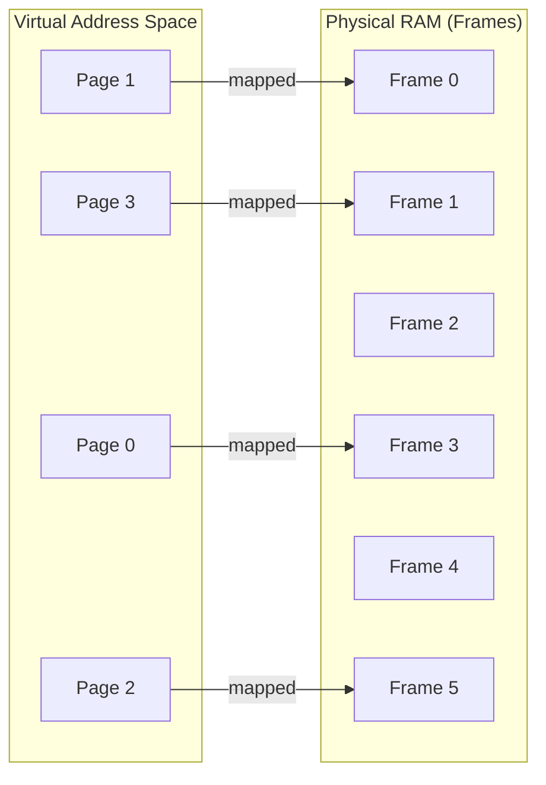
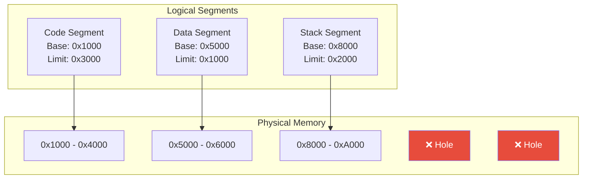
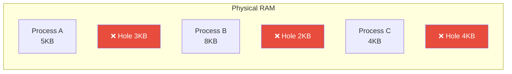
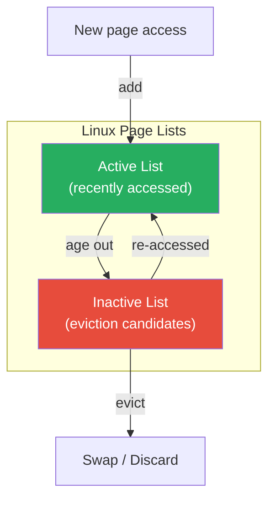

---

## 1️. Two Approaches to Memory Management

| | Paging | Segmentation |
| :--- | :--- | :--- |
| **Unit** | Fixed-size pages (4KB) | Variable-size segments (code, stack, heap) |
| **Fragmentation** | ❌ No external, ✅ internal (last page) | ✅ External fragmentation |
| **Address** | Page number + offset | Segment number + offset |
| **Used by** | All modern OSs (Linux, Windows) | Legacy (x86 real mode), combined with paging |
| **Hardware** | MMU + page tables | Segment registers (CS, DS, SS) |

---

## 2️. Paging

Memory is divided into **fixed-size blocks**:
- **Virtual memory** → Pages (typically 4KB)
- **Physical memory** → Frames (same size as pages)



> Pages map to **any** frame — no need for contiguous physical memory.

### Address Translation

```
Virtual Address (32-bit, 4KB pages):
┌─────────────────────┬──────────────┐
│  Page Number (20b)  │  Offset (12b)│
└─────────────────────┴──────────────┘
         │                    │
         ▼                    │
  ┌─────────────┐             │
  │ Page Table  │             │
  │ [PN] → FN  │              │
  └─────────────┘             │
         │                    │
         ▼                    ▼
┌─────────────────────┬──────────────┐
│  Frame Number (20b) │  Offset (12b)│
└─────────────────────┴──────────────┘
         = Physical Address
```

$$\text{Offset bits} = \log_2(\text{Page Size}) = \log_2(4096) = 12$$

### Page Sizes

| Size | Use Case | Trade-off |
| :--- | :--- | :--- |
| **4 KB** | Default (Linux/Windows) | Fine granularity, more TLB entries needed |
| **2 MB** | Huge pages (databases, VMs) | Fewer TLB misses, more internal fragmentation |
| **1 GB** | Gigantic pages (HPC) | Best TLB efficiency, high waste if underused |

---

## 3️. Segmentation

Memory divided into **logical segments** of variable size — each represents a logical unit.



### Segment Table Entry

| Field | Purpose |
| :--- | :--- |
| **Base** | Starting physical address of segment |
| **Limit** | Length of segment (bounds check) |
| **Permissions** | R/W/X for the segment |

$$\text{Physical Address} = \text{Base}[\text{segment\#}] + \text{offset}$$

If `offset > limit` → **Segmentation Fault** (the origin of the "segfault" name).

### External Fragmentation Problem



> Total free = 9KB, but can't fit a 5KB segment because holes are scattered. This is **external fragmentation** — the fatal flaw of pure segmentation.

---

## 4️. Paging vs Segmentation — Why Paging Won

| Criteria | Paging | Segmentation |
| :--- | :--- | :--- |
| **External fragmentation** | ❌ None | ✅ Severe |
| **Internal fragmentation** | Minimal (avg ½ page = 2KB) | ❌ None |
| **Swap efficiency** | Fixed-size units = simple | Variable-size = complex |
| **Hardware support** | Simple MMU | Complex (variable bounds) |
| **Modern usage** | ✅ All modern OSs | ❌ Essentially dead |

> **Paging won** because external fragmentation is devastating in long-running systems. Fixed-size pages make allocation, swapping, and bookkeeping trivial.

---

## 5️. Segmentation with Paging (x86 Legacy)

x86 historically combined both: **segment → linear address → page → physical address**.


**Modern x86-64**: Segmentation is **effectively disabled**. All segment bases = 0, limits = max. Only paging is used. The `fs`/`gs` segments are still used for thread-local storage.

---

## 6️. Page Replacement Algorithms

When RAM is full and a new page is needed, the OS must **evict** a page. Which one?

| Algorithm | Strategy | Used In |
| :--- | :--- | :--- |
| **Optimal (Bélády)** | Evict the page used farthest in the future | Theoretical (impossible in practice) |
| **LRU (Least Recently Used)** | Evict the page not accessed longest | Approximated in real OSs |
| **FIFO** | Evict the oldest page | Simple, but Bélády's anomaly |
| **Clock (Second Chance)** | Circular FIFO + accessed bit check | Linux (approximation of LRU) |
| **LFU (Least Frequently Used)** | Evict least-accessed page | Rarely used alone |

### Linux: Clock/LRU Approximation



Linux uses **two LRU lists** (active/inactive) with the **accessed bit** to approximate true LRU without the overhead.

---

## 7️. Practical Linux Commands

```bash
# View page size
getconf PAGESIZE
# Output: 4096 (4KB)

# See memory pages mapped per process
cat /proc/1234/maps

# Page table size for a process
grep VmPTE /proc/1234/status

# See which pages are in RAM vs swapped
# (requires root, reads /proc/PID/pagemap)
sudo python3 -c "
import struct
with open('/proc/1234/pagemap', 'rb') as f:
    # Each entry is 8 bytes per page
    entry = struct.unpack('Q', f.read(8))[0]
    present = (entry >> 63) & 1
    swapped = (entry >> 62) & 1
    pfn = entry & ((1<<55)-1)
    print(f'Present: {present}, Swapped: {swapped}, PFN: {pfn}')
"

# Huge pages configuration
cat /proc/meminfo | grep -i huge
# Enable 512 huge pages (512 × 2MB = 1GB reserved)
echo 512 | sudo tee /proc/sys/vm/nr_hugepages

# Transparent Huge Pages status
cat /sys/kernel/mm/transparent_hugepage/enabled

# Memory fragmentation info
cat /proc/buddyinfo
# Shows free blocks by size order per zone

# Page cache stats
cat /proc/meminfo | grep -E "Cached|Buffers|Active|Inactive"

# Force drop page cache (testing only)
echo 3 | sudo tee /proc/sys/vm/drop_caches

# Monitor page-in/page-out activity
vmstat 1
# pgpgin/pgpgout columns

# See segment registers (mostly historical)
cat /proc/1234/status | grep -i seg
```

---

## 8️. Interview Angles

### "Why does Linux use paging instead of segmentation?"

> Paging eliminates **external fragmentation** — the fatal problem of segmentation. Fixed-size pages (4KB) make allocation and swap simple. Segmentation still exists in x86 hardware but Linux sets all segment bases to 0, effectively disabling it. The only remaining segment use is `fs`/`gs` for thread-local storage.

### "What's the trade-off with larger page sizes?"

> Larger pages (2MB huge pages) reduce TLB misses dramatically (one TLB entry covers 2MB instead of 4KB — 512x fewer entries needed). But they increase **internal fragmentation** — if a process only uses 5KB of a 2MB page, 2043KB is wasted. Use huge pages for large, long-lived allocations (databases, JVM heaps).

### "How does Linux decide which pages to evict?"

> Linux maintains **active** and **inactive** LRU lists. Pages start on the active list. If not accessed for a while, they move to inactive. If accessed again from inactive, they're promoted back. Pages on the inactive list with the accessed bit clear are eviction candidates. This approximates LRU without expensive timestamp tracking.
