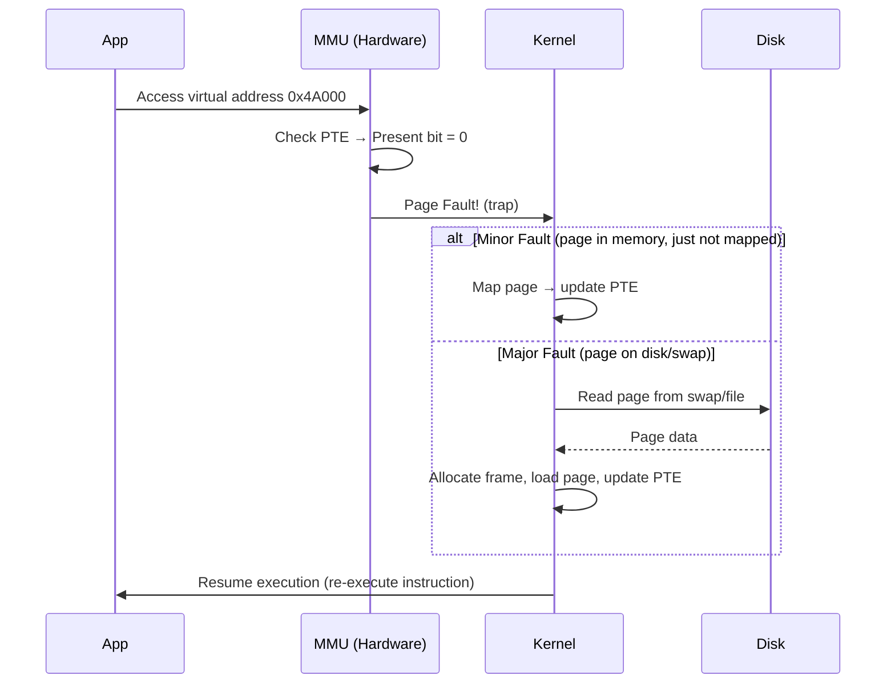
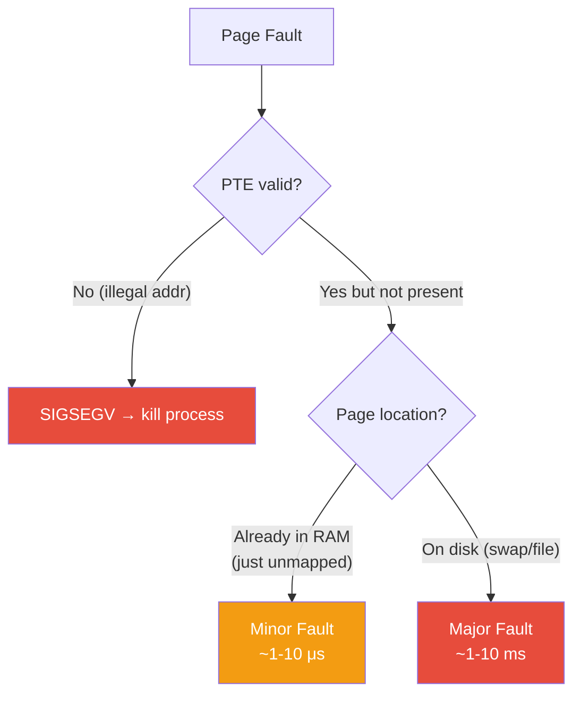
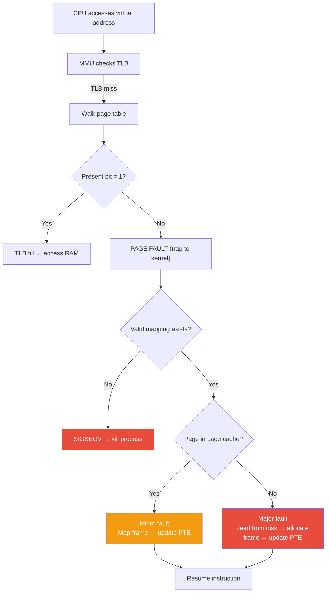
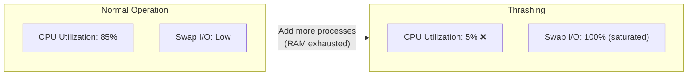
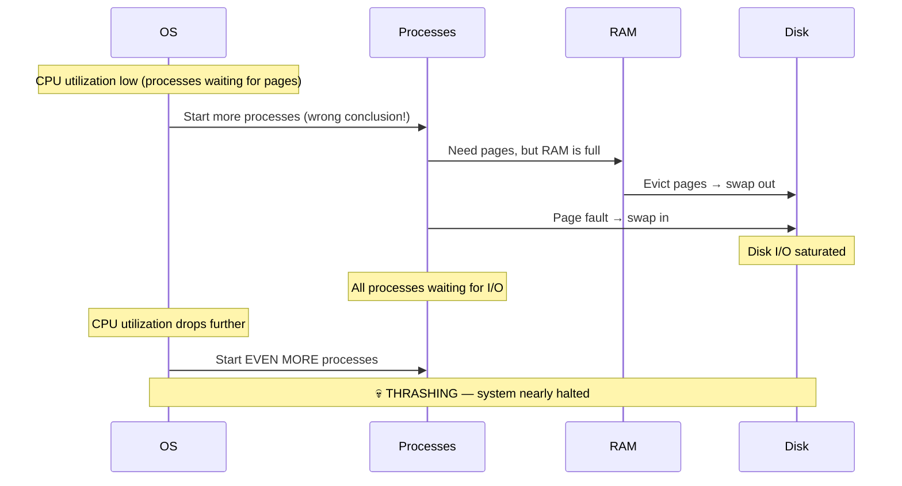
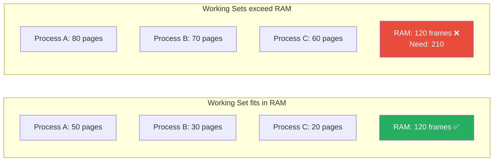
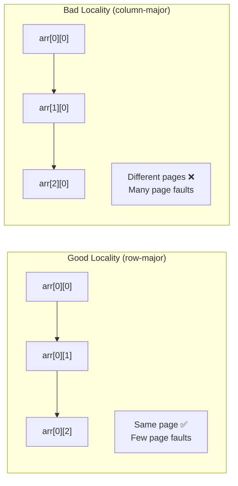

---

## 1️. What is a Page Fault?

A page fault occurs when a process accesses a virtual page that is **not currently in physical RAM**. The MMU traps to the kernel, which must resolve it.



---

## 2️. Types of Page Faults

| Type | What Happened | Cost | Example |
| :--- | :--- | :--- | :--- |
| **Minor (soft)** | Page is in memory but PTE not set up | ~1–10 μs | First access after `malloc`, CoW |
| **Major (hard)** | Page must be read from disk | ~1–10 ms | Accessing swapped-out page |
| **Invalid** | Illegal access (bad pointer) | Process killed | `SIGSEGV` (segfault) |



### Minor Fault Scenarios

- **Demand allocation**: First write to `malloc`'d memory
- **Copy-on-Write**: First write after `fork()`
- **Shared library mapping**: First access to a mapped-but-not-loaded page already in page cache

### Major Fault Scenarios

- **Swap-in**: Page was evicted to swap, must be read from disk
- **Memory-mapped file**: First access to a file page not yet in page cache
- **Executable loading**: First jump to a code page not yet loaded

---

## 3️. Page Fault Handling (Step by Step)



---

## 4️. Thrashing

Thrashing occurs when the system spends **more time swapping pages than doing useful work**. The working set of active processes exceeds physical RAM.



### The Death Spiral



> The OS sees low CPU utilization and starts more processes → more page faults → more swapping → CPU drops further → repeat. The system grinds to a halt.

---

## 5️. Working Set Model

The **working set** $W(t, \Delta)$ is the set of pages accessed by a process in the last $\Delta$ time units.

$$\text{If } \sum W_i > \text{Physical RAM} \Rightarrow \text{Thrashing}$$



### Solutions to Thrashing

| Solution | How It Works |
| :--- | :--- |
| **Add more RAM** | Increase physical memory |
| **Kill/suspend processes** | Reduce multiprogramming degree |
| **`swappiness` tuning** | Control how aggressively Linux swaps |
| **OOM Killer** | Linux kills the biggest memory hog when RAM + swap exhausted |
| **Working set tracking** | Only run processes whose working sets fit in RAM |
| **Better locality** | Access memory sequentially (row-major vs column-major) |

---

## 6️. OOM Killer (Out of Memory)

When Linux runs out of RAM + swap, the **OOM Killer** selects and kills a process.

Scoring: each process gets an `oom_score` (higher = more likely to be killed):
- Based on: RSS, swap usage, nice value, how long running
- Adjustable via `/proc/PID/oom_score_adj` (-1000 to +1000)

```bash
# See OOM score of a process
cat /proc/1234/oom_score

# Protect a critical process from OOM killer
echo -1000 | sudo tee /proc/1234/oom_score_adj

# Make a process the first OOM victim
echo 1000 | sudo tee /proc/1234/oom_score_adj

# Check if OOM killer has been triggered
dmesg | grep -i "oom\|killed"
```

---

## 7️. Practical Linux Commands

```bash
# Monitor page faults per process (every 1 sec)
pidstat -r -p 1234 1
# minflt/s = minor faults/sec
# majflt/s = major faults/sec (disk reads = SLOW)

# Total page faults since process start
cat /proc/1234/stat | awk '{print "minor:", $10, "major:", $12}'

# System-wide swap activity
vmstat 1
# si = swap in (KB/s), so = swap out (KB/s)
# If si/so consistently > 0 → swapping happening

# Detailed swap usage per process
for pid in $(ls /proc | grep -E '^[0-9]+$'); do
    swap=$(awk '/VmSwap/{print $2}' /proc/$pid/status 2>/dev/null)
    if [ "$swap" -gt 0 ] 2>/dev/null; then
        echo "$swap KB - $(cat /proc/$pid/comm)"
    fi
done | sort -rn | head -10

# Check swap pressure
swapon --show
cat /proc/sys/vm/swappiness
# Default: 60 (0=avoid swap, 100=aggressive swap)

# Tune swappiness
sudo sysctl vm.swappiness=10  # less swapping (more RAM pressure before swap)

# See page cache hit rate
sudo perf stat -e cache-misses,cache-references -p 1234 -- sleep 5

# Watch for OOM events
dmesg -w | grep -i oom

# Force a major page fault (for testing)
# Allocate huge memory, write to it, then let it get swapped
stress-ng --vm 4 --vm-bytes 80% --timeout 30s

# See memory pressure (Linux PSI)
cat /proc/pressure/memory
# Shows % time processes stalled due to memory
```

---

## 8️. Locality of Reference

The reason page faults are manageable: programs exhibit **locality**.

| Type | Description | Example |
| :--- | :--- | :--- |
| **Temporal** | Recently accessed pages likely accessed again soon | Loop variables |
| **Spatial** | Pages near recently accessed ones likely accessed next | Array traversal |



> A row-major array traversal in C can be **100x faster** than column-major for large arrays due to fewer page faults and cache misses.

---

## 9️. Interview Angles

### "What's the difference between a minor and major page fault?"

> A **minor fault** means the page is already in physical memory (e.g., in the page cache) — the kernel just updates the page table. Cost: ~1-10μs. A **major fault** means the page must be read from disk (swap or file) — cost: ~1-10ms (1000x slower). High major fault rates indicate the working set exceeds RAM.

### "What is thrashing and how do you detect it?"

> Thrashing is when the system spends more time swapping pages than doing useful work. Detect via: `vmstat` showing high `si`/`so` (swap I/O), `pidstat -r` showing high `majflt/s`, CPU utilization dropping while I/O wait rises, `/proc/pressure/memory` showing high stall time. Fix by reducing processes, adding RAM, or tuning `swappiness`.

### "How does the OOM killer decide which process to kill?"

> Linux scores each process by `oom_score` — based on RSS, swap usage, and adjustments. The highest score gets killed. You can protect critical processes by writing -1000 to `/proc/PID/oom_score_adj`. The OOM killer is a last resort — it fires only when RAM + swap are fully exhausted and the system cannot reclaim any pages.
