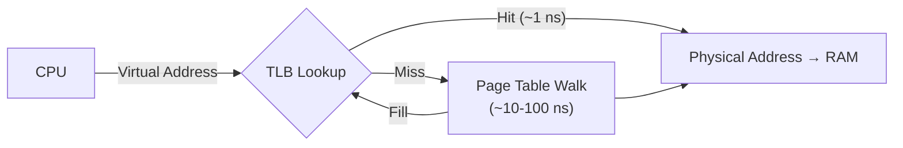
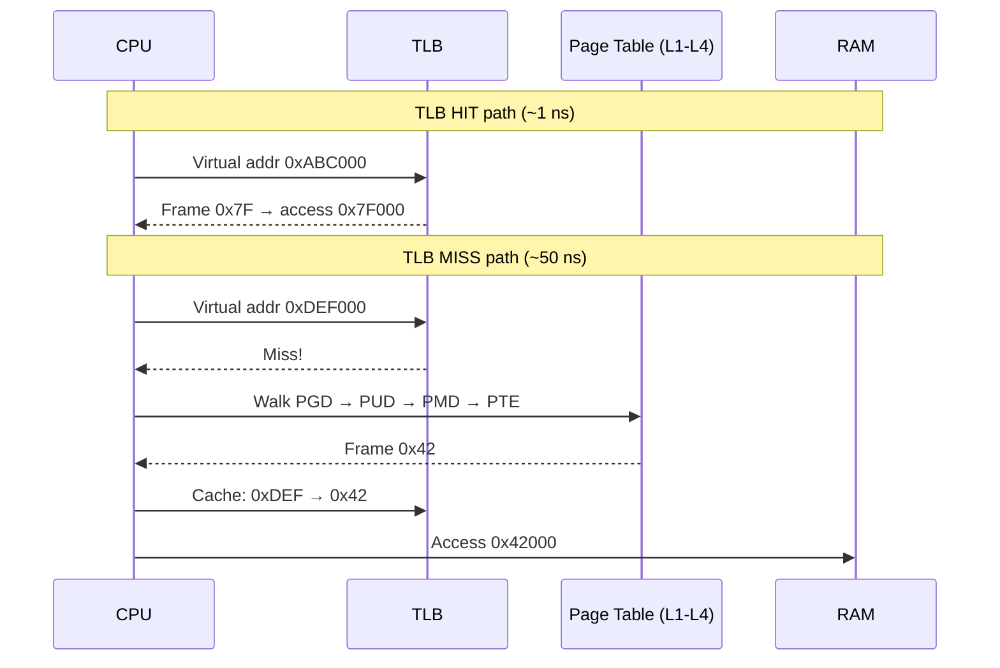
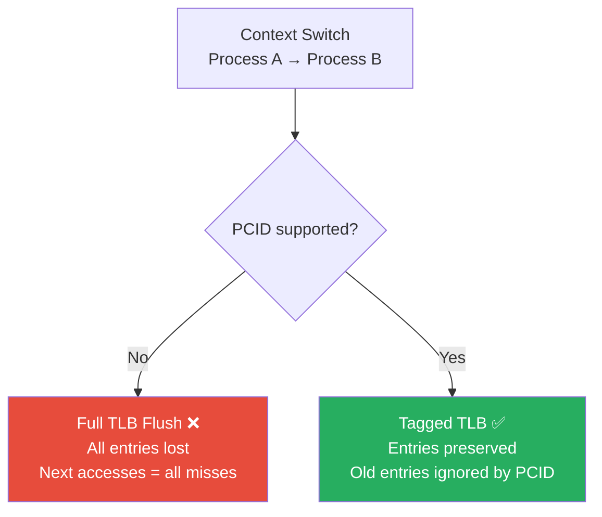
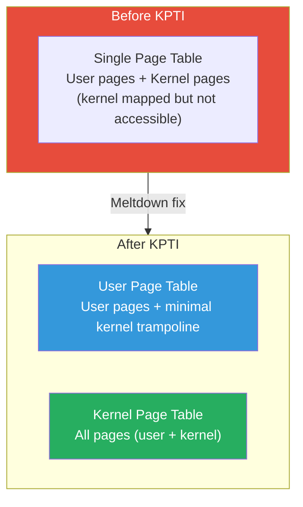
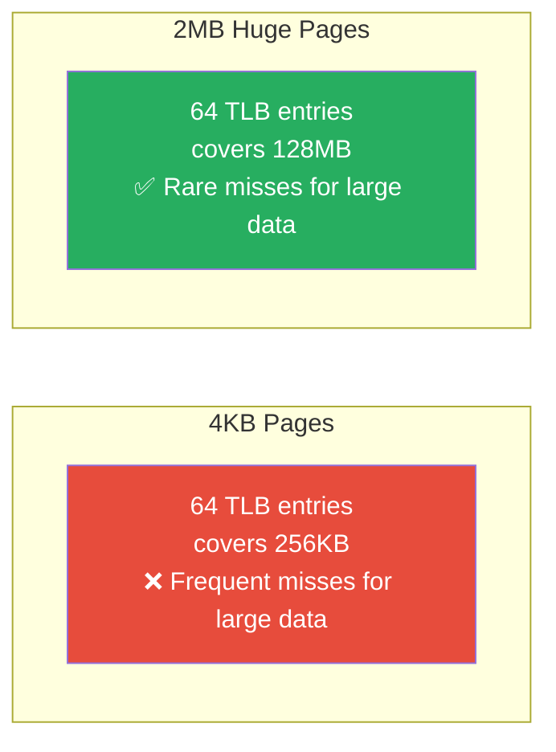

---

## 1️. What is the TLB?

The **TLB (Translation Lookaside Buffer)** is a **hardware cache** inside the CPU that stores recent virtual → physical address translations. It eliminates the need for a full page table walk on every memory access.



> Without a TLB, every memory access would require **4 extra memory reads** (one per page table level). The TLB reduces this to **0 extra reads** on a hit.

---

## 2️. TLB Structure

| Property | Typical Value |
| :--- | :--- |
| **L1 dTLB (data)** | 64 entries, 4-way set associative |
| **L1 iTLB (instruction)** | 64 entries |
| **L2 TLB (unified)** | 512–2048 entries |
| **Entry** | Virtual page → Physical frame + flags |
| **Lookup** | Fully/set-associative (parallel match) |
| **Hit time** | ~0.5–1 ns (same as L1 cache) |
| **Miss penalty** | ~10–100 ns (page table walk) |

### TLB Entry Contents

```
┌───────────────┬───────────────┬───┬───┬───┬──────┐
│  Virtual Page │ Physical Frame│ V │ D │ R │ PCID │
│    Number     │    Number     │   │   │ W │      │
└───────────────┴───────────────┴───┴───┴───┴──────┘
 V = Valid, D = Dirty, RW = Read/Write, PCID = Process Context ID
```

---

## 3️. TLB Hit vs Miss



### Performance Impact

| Scenario | Access Time |
| :--- | :--- |
| TLB hit | ~1 ns |
| TLB miss (page table in L1/L2 cache) | ~10–20 ns |
| TLB miss (page table in RAM) | ~50–100 ns |
| TLB miss + page fault (disk) | ~1–10 ms |

> With a 99% TLB hit rate, effective memory access time ≈ $0.99 \times 1\text{ns} + 0.01 \times 50\text{ns} = 1.5\text{ns}$

$$\text{EAT} = \text{hit\_rate} \times t_{hit} + (1 - \text{hit\_rate}) \times t_{miss}$$

---

## 4️. TLB Flush — When and Why

The TLB must be **flushed** (invalidated) when address translations change:

| Event | Action | Cost |
| :--- | :--- | :--- |
| **Process context switch** | Full TLB flush (without PCID) | High — all entries lost |
| **Page table update** | Single entry invalidation (`invlpg`) | Low — one entry |
| **Kernel mapping change** | Flush all entries or targeted | Medium |
| **`munmap()` / `mprotect()`** | Invalidate affected entries | Low |



---

## 5️. PCID (Process Context ID)

Modern CPUs tag each TLB entry with a **PCID** — a 12-bit process identifier. This avoids flushing the TLB on context switch.

| Without PCID | With PCID |
| :--- | :--- |
| Context switch → flush all TLB entries | Context switch → just change PCID |
| Next process starts with cold TLB | Old entries still valid for when process returns |
| Every access after switch = TLB miss | Entries from previous run still cached |

> PCID gives up to **4096 process tags**. After that, the OS must recycle IDs and flush associated entries.

---

## 6️. KPTI (Kernel Page Table Isolation)

After the **Meltdown vulnerability** (2018), Linux implemented KPTI — separate page tables for user/kernel mode.



### KPTI Impact on TLB

Every syscall now requires a **page table switch** (CR3 change):
- Enter kernel → switch to kernel page table → TLB entries invalidated
- Return to user → switch to user page table → TLB entries invalidated

**Performance cost**: ~30–50% overhead on syscall-heavy workloads (mitigated by PCID).

---

## 7️. Huge Pages & TLB Efficiency

The TLB has **limited entries** (64–2048). With 4KB pages:
- 64 TLB entries × 4KB = **256KB** of memory covered

With 2MB huge pages:
- 64 TLB entries × 2MB = **128MB** of memory covered → **512x improvement**



### When to Use Huge Pages

| Good For | Bad For |
| :--- | :--- |
| Databases (large buffer pools) | Small processes |
| JVM heaps (multi-GB) | Short-lived allocations |
| HPC / scientific computing | Sparse memory access patterns |
| Virtual machines (EPT/NPT) | Systems with many small processes |

---

## 8️. Practical Linux Commands

```bash
# Check TLB miss rates
sudo perf stat -e dTLB-load-misses,dTLB-loads,dTLB-store-misses,dTLB-stores ./my_program
# TLB miss rate = misses / loads

# TLB misses for a running process
sudo perf stat -e dTLB-load-misses -p 1234 -- sleep 10

# Check if PCID is supported
grep pcid /proc/cpuinfo

# Check if KPTI is enabled
cat /sys/devices/system/cpu/vulnerabilities/meltdown
# Output: "Mitigation: PTI" = KPTI active

# Disable KPTI (for benchmarking only — NOT production)
# Boot with: nopti

# Huge pages — check current state
cat /proc/meminfo | grep -i huge
# HugePages_Total, HugePages_Free, Hugepagesize

# Allocate 256 huge pages (256 × 2MB = 512MB)
echo 256 | sudo tee /proc/sys/vm/nr_hugepages

# Transparent Huge Pages (automatic)
cat /sys/kernel/mm/transparent_hugepage/enabled
# [always] madvise never

# Set THP to madvise-only (recommended for databases)
echo madvise | sudo tee /sys/kernel/mm/transparent_hugepage/enabled

# See per-process huge page usage
grep -i huge /proc/1234/smaps | head -20

# Monitor TLB flushes (requires perf events)
sudo perf stat -e tlb:tlb_flush -a -- sleep 5

# Detailed TLB analysis
sudo perf record -e dTLB-load-misses -g ./my_program
sudo perf report
```

---

## 9️. TLB Optimization Summary

| Technique | Effect |
| :--- | :--- |
| **Huge pages (2MB/1GB)** | 512x–256Kx more coverage per TLB entry |
| **PCID** | Avoid TLB flush on context switch |
| **Memory locality** | Access memory sequentially → fewer unique pages |
| **Reduce processes** | Fewer context switches → fewer flushes |
| **Pin threads to CPUs** | Avoid cross-core migration (TLB is per-core) |
| **`madvise(MADV_HUGEPAGE)`** | Hint to kernel to use huge pages for a region |

---

## 10. Interview Angles

### "What is the TLB and why does it matter for performance?"

> The TLB is a hardware cache storing recent virtual→physical address mappings. Without it, every memory access would require a 4-level page table walk (~50-100ns). With a TLB hit (~1ns), we avoid this overhead. A 99% hit rate is typical; dropping to 95% can **double** effective memory access time for memory-intensive workloads.

### "What happens to the TLB on a context switch?"

> Without PCID, a context switch **flushes the entire TLB** because the new process has a different address space. The new process starts with a cold TLB — every access is a miss until it warms up. With PCID (modern CPUs), TLB entries are tagged with a process ID, so old entries are preserved and valid when the process is re-scheduled.

### "How do huge pages reduce TLB misses?"

> Each TLB entry maps one page. With 4KB pages and 64 entries, you cover only 256KB. With 2MB huge pages, the same 64 entries cover 128MB — a 512x improvement. This is critical for databases and VMs that access multi-GB working sets. The trade-off is increased internal fragmentation and less flexible memory allocation.

### "What is KPTI and how does it affect syscall performance?"

> KPTI (Kernel Page Table Isolation) was introduced to mitigate **Meltdown**. It maintains separate page tables for user and kernel mode. Every syscall now requires a CR3 swap (page table base change), which invalidates TLB entries. This added ~30-50% overhead to syscall-heavy workloads. PCID partially mitigates this by tagging entries so they survive the switch.
