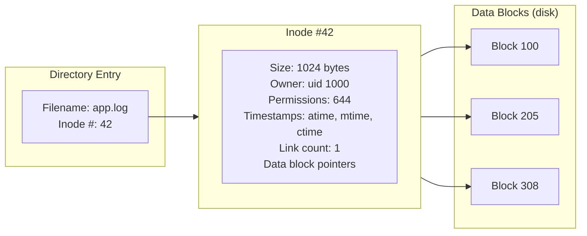
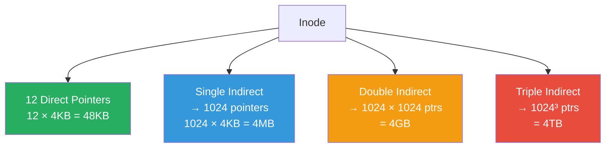
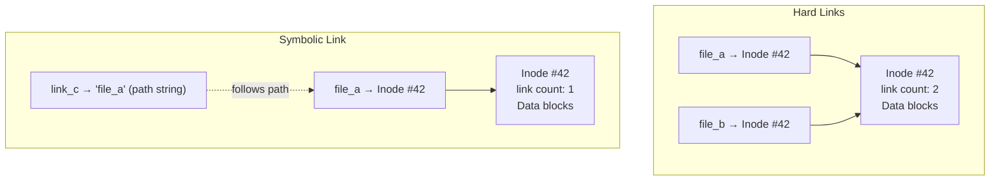
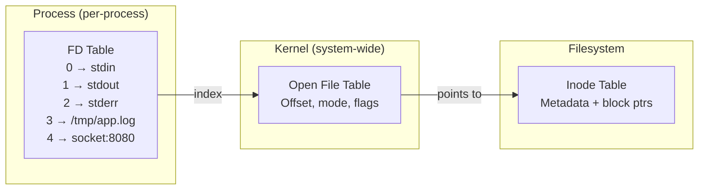
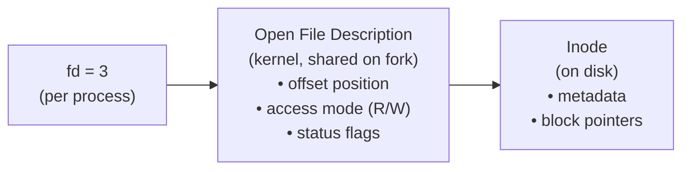
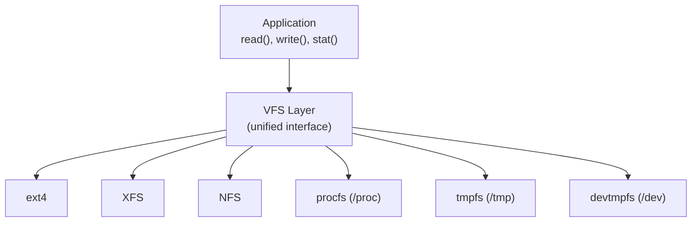

---

## 1️. "Everything is a File"

In Linux, almost **every resource** is represented as a file — regular files, directories, devices, sockets, pipes, even processes (`/proc`).

| Resource | File Path | Type |
| :--- | :--- | :--- |
| Regular file | `/home/user/app.log` | Regular |
| Directory | `/home/user/` | Directory |
| Block device (disk) | `/dev/sda` | Block special |
| Character device (terminal) | `/dev/tty` | Character special |
| Named pipe | `/tmp/my_pipe` | FIFO |
| Unix socket | `/var/run/docker.sock` | Socket |
| Process info | `/proc/1234/status` | Pseudo-file |
| System config | `/sys/class/net/eth0/speed` | Pseudo-file |

> This unifies the API — you can `read()`, `write()`, `stat()`, `poll()` on almost anything. One interface to rule them all.

---

## 2️. What is an Inode?

An **inode** (index node) is a data structure on disk that stores **all metadata** about a file — everything **except** the filename and the data itself.



### Inode Contents

| Field | Description |
| :--- | :--- |
| **File type** | Regular, directory, symlink, socket, pipe, device |
| **Permissions** | rwx for owner/group/others (mode bits) |
| **Owner** | UID and GID |
| **Size** | File size in bytes |
| **Timestamps** | `atime` (access), `mtime` (modify), `ctime` (inode change) |
| **Link count** | Number of hard links pointing to this inode |
| **Data block pointers** | Direct + indirect pointers to actual data on disk |

> **Filename is NOT in the inode** — it's in the directory entry. This is why hard links work: multiple names → same inode.

---

## 3️. Block Pointers (ext4)

An inode needs to locate data blocks on disk. ext4 uses **extents** (contiguous runs), but the classic ext2/3 model illustrates the concept:



| Level | Blocks Reachable | Max File Size Covered |
| :--- | :--- | :--- |
| 12 direct | 12 | 48 KB |
| Single indirect | 1024 | 4 MB |
| Double indirect | 1024² | 4 GB |
| Triple indirect | 1024³ | 4 TB |

> **ext4 uses extents** instead — a single extent describes a contiguous run of blocks (start block + length), making large file access much faster.

---

## 4️. Hard Links vs Soft Links



| | Hard Link | Symbolic (Soft) Link |
| :--- | :--- | :--- |
| **Points to** | Inode directly | File path (string) |
| **Cross filesystem** | ❌ No (same inode table) | ✅ Yes |
| **Directories** | ❌ No (prevents cycles) | ✅ Yes |
| **Original deleted** | ✅ Still works (inode persists) | ❌ Dangling link |
| **Own inode** | No (shares target's inode) | Yes (separate inode) |

```bash
# Create hard link
ln original.txt hard_link.txt

# Create symbolic link
ln -s original.txt soft_link.txt

# See inode number
ls -i original.txt

# See link count
stat original.txt
```

> A file is **truly deleted** only when its link count reaches 0 **and** no process has it open.

---

## 5️. File Descriptors (fd)

A **file descriptor** is an integer that a process uses to refer to an open file. It's an index into the process's **file descriptor table**.



### Three-Level Indirection



| Level | Scope | What It Stores |
| :--- | :--- | :--- |
| **File Descriptor** | Per-process | Integer index into the table |
| **Open File Description** | Kernel-wide (shared across fork) | Current offset, access mode, flags |
| **Inode** | Filesystem | Metadata, permissions, block pointers |

### Default File Descriptors

| fd | Name | Default |
| :--- | :--- | :--- |
| 0 | `stdin` | Terminal input |
| 1 | `stdout` | Terminal output |
| 2 | `stderr` | Terminal error output |

---

## 6️. File Descriptor Limits

```bash
# Per-process fd limit (soft/hard)
ulimit -n        # soft limit (default: 1024)
ulimit -Hn       # hard limit

# Raise soft limit for current shell
ulimit -n 65536

# System-wide maximum open files
cat /proc/sys/fs/file-max

# Currently open files system-wide
cat /proc/sys/fs/file-nr
# Output: allocated  free  max

# Set permanent limit in /etc/security/limits.conf
# * soft nofile 65536
# * hard nofile 65536
```

> A server handling 10,000 concurrent connections needs 10,000+ file descriptors. The default 1024 limit is a common production issue — `Too many open files`.

---

## 7️. Practical Linux Commands

```bash
# List open files for a process
lsof -p 1234

# Count open fds for a process
ls -la /proc/1234/fd | wc -l

# See what each fd points to
ls -la /proc/1234/fd
# Shows symlinks: 0 → /dev/pts/0, 3 → /tmp/app.log, 4 → socket:[12345]

# Find all processes with a specific file open
lsof /var/log/syslog

# Find which process is using a port
lsof -i :8080

# Inode info for a file
stat myfile.txt

# See all inodes on a filesystem
df -i
# Shows total, used, free inodes

# Find files by inode number
find / -inum 42 2>/dev/null

# See filesystem block size
tune2fs -l /dev/sda1 | grep "Block size"

# Deleted files still open (taking disk space)
lsof +L1
# Shows files with link count 0 but still open

# File descriptor usage per process (top consumers)
for pid in /proc/[0-9]*; do
    echo "$(ls $pid/fd 2>/dev/null | wc -l) $(cat $pid/comm 2>/dev/null) ($(basename $pid))"
done | sort -rn | head -10

# Trace file operations
strace -e open,openat,close,read,write -p 1234

# Check filesystem type
mount | grep "^/dev"
# or: df -T
```

---

## 8️. VFS (Virtual File System)

Linux abstracts all filesystems behind a **Virtual File System** layer — one API for ext4, XFS, NFS, procfs, tmpfs, etc.



> The VFS uses **inode**, **dentry** (directory entry cache), **superblock**, and **file** objects internally. This is why `stat()` works the same on ext4, NFS, and procfs.

---

## 9️. Interview Angles

### "What is an inode?"

> An inode stores all **metadata** about a file — permissions, owner, size, timestamps, and pointers to data blocks on disk. The filename is NOT in the inode — it's in the directory entry, which maps name → inode number. This separation enables hard links: multiple names pointing to the same inode.

### "What happens when you delete a file?"

> Deleting (`unlink()`) removes the directory entry and decrements the inode's **link count**. The inode and data blocks are freed **only when** link count = 0 AND no process has the file open. This is why a log file can be "deleted" but still consuming disk — because the logging process still has an open fd to it. Use `lsof +L1` to find these.

### "Explain file descriptors and why there's a limit."

> A file descriptor is a per-process integer index into the kernel's open file table. Each open file/socket/pipe consumes one fd. The default limit (1024) prevents a single process from exhausting kernel memory with open files. High-concurrency servers (Nginx, databases) must raise this via `ulimit -n` or `/etc/security/limits.conf`.

### "'Everything is a file' — why does this matter?"

> It provides a **unified API**. You can `read()`/`write()` to a regular file, a network socket, a device, or a pipe — all through the same syscalls. This simplifies tooling (`cat /proc/cpuinfo`, `echo 1 > /sys/...`), enables composition via pipes, and means every I/O debugging tool (`lsof`, `strace`, `fstat`) works across all resource types.
