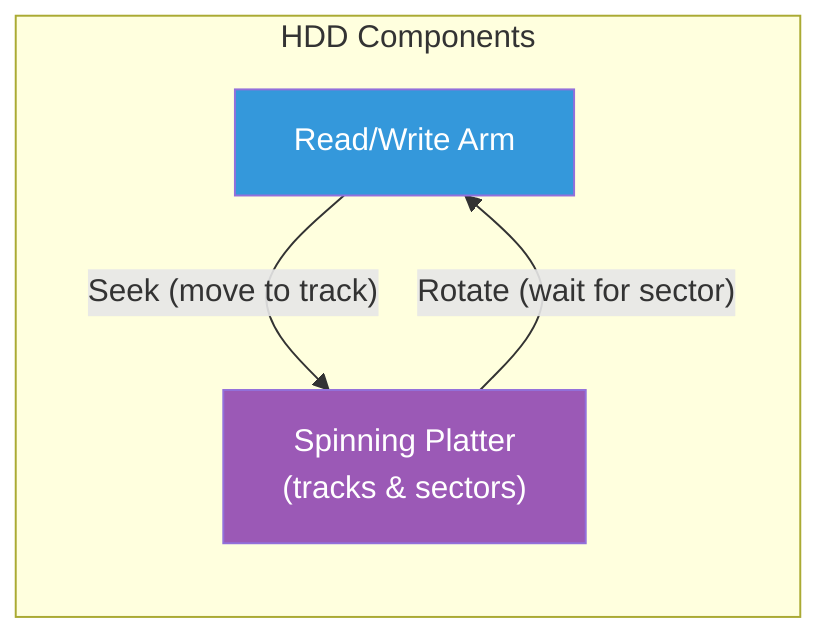
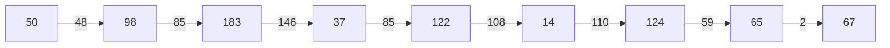
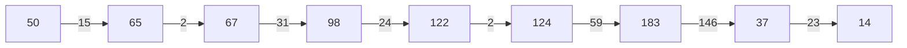
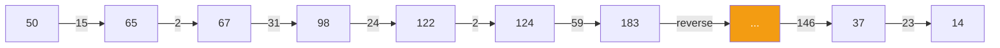
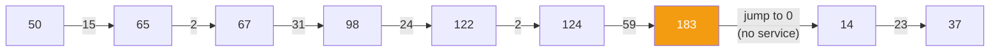
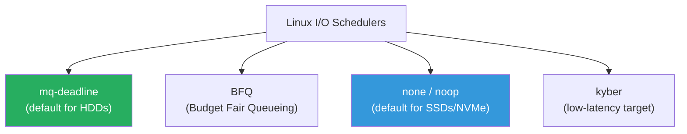

---

## 1️. Why Disk Scheduling Matters

For **HDDs** (spinning disks), each I/O request has a physical cost:

$$\text{Access Time} = \text{Seek Time} + \text{Rotational Latency} + \text{Transfer Time}$$

| Component | What It Is | Typical Cost |
| :--- | :--- | :--- |
| **Seek time** | Moving the arm to the correct track | ~3–10 ms |
| **Rotational latency** | Waiting for the sector to spin under the head | ~2–6 ms (7200 RPM) |
| **Transfer time** | Reading/writing the data | ~0.01 ms per sector |

> **Seek time dominates**. The scheduler's goal: minimize total head movement across queued requests.



---

## 2️. Scheduling Algorithms

Request queue example: Head at track **50**, requests for tracks: `98, 183, 37, 122, 14, 124, 65, 67`

---

### FCFS (First Come First Served)

Process requests in **arrival order**. Simple but wildly inefficient.



**Total head movement**: 48 + 85 + 146 + 85 + 108 + 110 + 59 + 2 = **643 tracks**

| Pros | Cons |
| :--- | :--- |
| Fair, no starvation | Worst performance — arm zigzags |

---

### SSTF (Shortest Seek Time First)

Always service the **closest request** next. Greedy approach.



**Total head movement**: 15 + 2 + 31 + 24 + 2 + 59 + 146 + 23 = **302 tracks**

| Pros | Cons |
| :--- | :--- |
| Much better than FCFS | ❌ **Starvation** — far-away requests may never be served |

---

### SCAN (Elevator Algorithm)

Head moves in **one direction**, servicing requests. At the end, reverses direction.



**Total head movement**: 15 + 2 + 31 + 24 + 2 + 59 + 146 + 23 = **302 tracks** (but fairer than SSTF)

| Pros | Cons |
| :--- | :--- |
| No starvation, predictable | Edges get less service (just missed = wait full sweep) |

---

### C-SCAN (Circular SCAN)

Like SCAN but only services in **one direction**. At the end, jumps back to the start without servicing.



| Pros | Cons |
| :--- | :--- |
| **Uniform wait time** — all positions treated equally | Slightly more total movement |

---

### C-LOOK

Like C-SCAN but doesn't go all the way to the disk end — only to the **last request** in each direction.

| Pros | Cons |
| :--- | :--- |
| Best practical performance for HDDs | Slightly more complex |

---

## 3️. Algorithm Comparison

| Algorithm | Total Movement | Starvation | Fairness | Used In |
| :--- | :--- | :--- | :--- | :--- |
| **FCFS** | Worst | ❌ None | ✅ Perfect | Baseline |
| **SSTF** | Good | ✅ Possible | ❌ Poor | Rarely alone |
| **SCAN** | Good | ❌ None | ✅ Good | Classic disks |
| **C-SCAN** | Good | ❌ None | ✅ Best | Production HDDs |
| **C-LOOK** | Best | ❌ None | ✅ Best | **Linux default (CFQ basis)** |

---

## 4️. Linux I/O Schedulers

Modern Linux offers multiple I/O schedulers. Since kernel 5.0, the defaults are:



| Scheduler | Best For | Strategy |
| :--- | :--- | :--- |
| **mq-deadline** | HDDs | Deadline-based — prevents starvation with read/write deadlines |
| **BFQ** | Desktop HDDs | Per-process fair bandwidth — good for interactive use |
| **none (noop)** | SSDs / NVMe | No reordering — SSDs have no seek time, let the hardware decide |
| **kyber** | Low-latency SSDs | Token-based throttling for latency targets |

### HDD vs SSD — Why Scheduling Differs

| | HDD | SSD / NVMe |
| :--- | :--- | :--- |
| **Random access** | ~10 ms (seek + rotation) | ~0.1 ms (no moving parts) |
| **Scheduler value** | High — reordering saves ms | Low — hardware handles parallelism |
| **Best scheduler** | `mq-deadline` or `bfq` | `none` (pass-through) |

> SSDs have no seek penalty → scheduling overhead > benefit. Let the NVMe controller handle queue ordering internally.

---

## 5️. Practical Linux Commands

```bash
# Check current I/O scheduler for a disk
cat /sys/block/sda/queue/scheduler
# Output: [mq-deadline] kyber bfq none

# Change scheduler (runtime, non-persistent)
echo "bfq" | sudo tee /sys/block/sda/queue/scheduler

# Persistent change via kernel parameter (GRUB)
# Add to GRUB_CMDLINE_LINUX: elevator=mq-deadline

# Check if disk is rotational (HDD) or not (SSD)
cat /sys/block/sda/queue/rotational
# 1 = HDD, 0 = SSD

# Monitor disk I/O in real-time
iostat -xz 1
# r/s, w/s = reads/writes per sec
# await = average wait time (ms) — key metric
# %util = disk utilization

# Per-process I/O stats
iotop -o
# Shows which processes are doing I/O

# I/O latency breakdown
sudo perf trace -e block:* -- sleep 5

# Queue depth
cat /sys/block/sda/queue/nr_requests

# Disk read/write stats
cat /proc/diskstats

# Benchmark disk I/O
# Sequential read
sudo hdparm -t /dev/sda

# Random read (fio)
fio --name=randread --rw=randread --bs=4k --size=1G --numjobs=4 --runtime=30

# See pending I/O requests
cat /sys/block/sda/stat
# Field 9 = I/O currently in progress

# Trace block layer events
sudo blktrace -d /dev/sda -o - | blkparse -i -
```

---

## 6️. Interview Angles

### "Why does disk scheduling matter?"

> For HDDs, the arm **physically moves** to reach different tracks. A random I/O pattern causes excessive seeking (~10ms per seek). Disk schedulers reorder requests to minimize total head movement — similar to how an elevator doesn't go floor-by-floor in request order but sweeps up, then down.

### "Why don't SSDs need disk scheduling?"

> SSDs have no moving parts — every block is accessible in ~0.1ms regardless of location. There's no seek penalty to optimize away. The NVMe controller has its own internal queue and parallelism. Adding a software scheduler just adds overhead. That's why Linux defaults to `none` for NVMe/SSD.

### "SSTF vs SCAN — what's the trade-off?"

> **SSTF** (Shortest Seek Time First) gives the best throughput but can **starve** distant requests — if new nearby requests keep arriving, far-away ones never get served. **SCAN** (elevator) guarantees bounded wait time by sweeping in one direction, then reversing. C-SCAN improves fairness further by only servicing in one direction.
