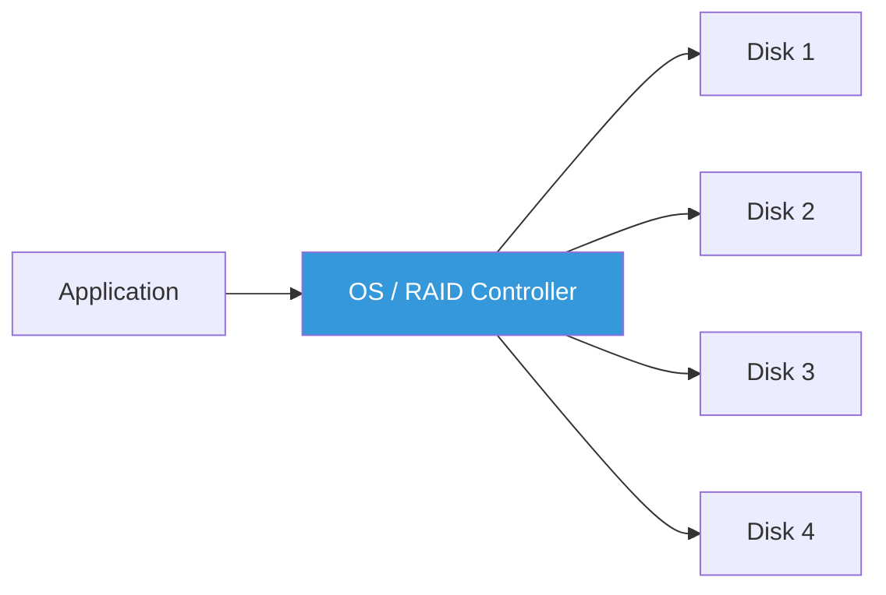
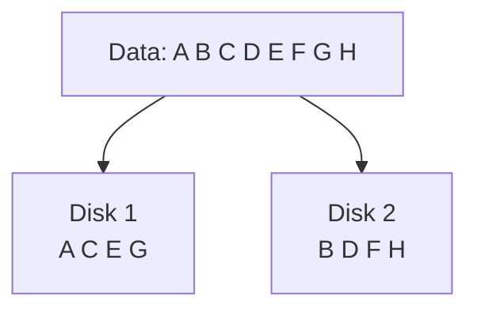
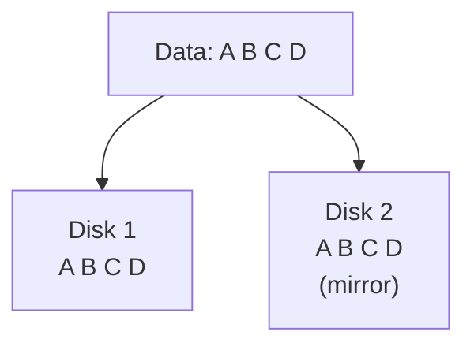
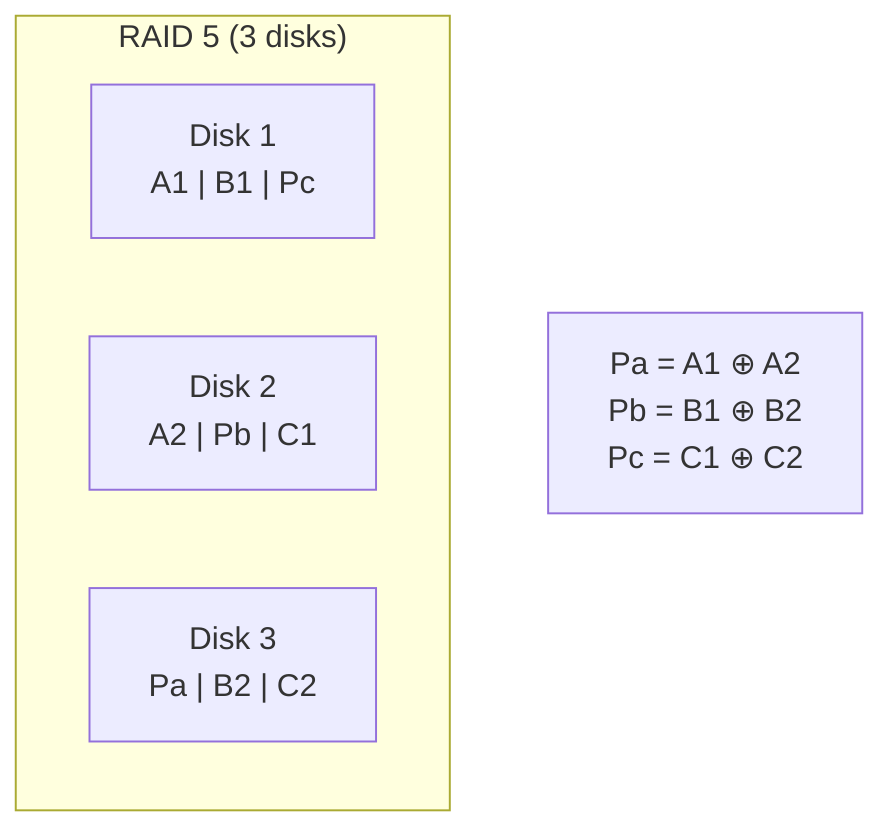
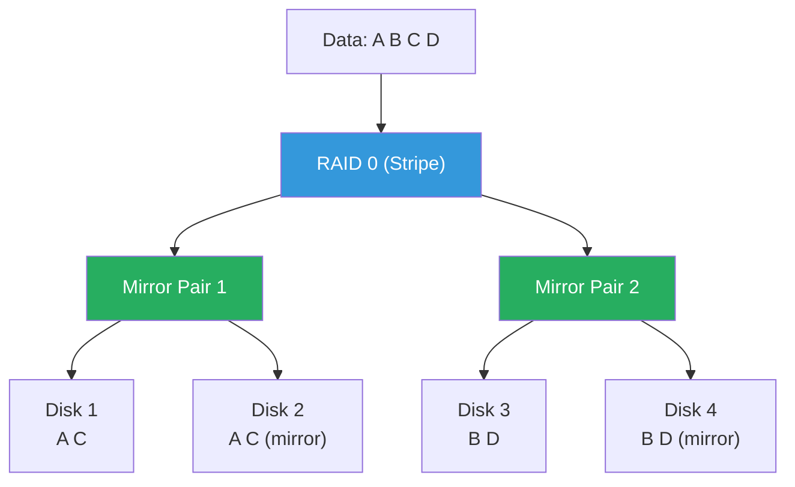
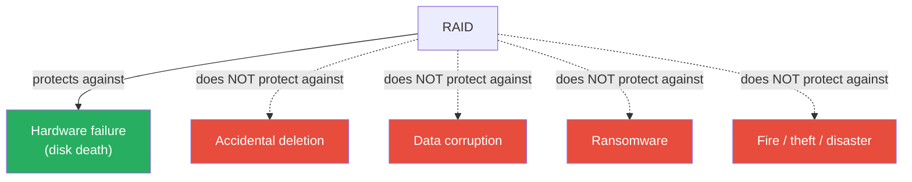

---

## 1️. What is RAID?

**RAID** (Redundant Array of Independent Disks) combines multiple physical disks into a single logical unit for **performance**, **redundancy**, or **both**.



| Goal | RAID Level |
| :--- | :--- |
| **Speed only** | RAID 0 |
| **Redundancy only** | RAID 1 |
| **Speed + redundancy (parity)** | RAID 5 |
| **Speed + redundancy (best)** | RAID 10 |

---

## 2️. RAID 0 — Striping

Data is **split across all disks** in blocks. No redundancy.



| Property | Value |
| :--- | :--- |
| **Read speed** | ⚡ N× (parallel reads across N disks) |
| **Write speed** | ⚡ N× (parallel writes) |
| **Usable capacity** | 100% (N disks) |
| **Fault tolerance** | ❌ **None** — one disk dies = ALL data lost |
| **Min disks** | 2 |

> Use for: scratch space, temp data, video editing where speed matters and data is replaceable.

---

## 3️. RAID 1 — Mirroring

Data is **duplicated** on every disk. Full redundancy.



| Property | Value |
| :--- | :--- |
| **Read speed** | ⚡ 2× (read from either disk) |
| **Write speed** | 1× (must write to both) |
| **Usable capacity** | 50% (N/2) |
| **Fault tolerance** | ✅ Survives 1 disk failure |
| **Min disks** | 2 |

> Use for: OS drives, critical databases where data loss is unacceptable and capacity isn't the priority.

---

## 4️. RAID 5 — Striping with Distributed Parity

Data is striped, and a **parity block** is distributed across all disks. Parity allows reconstruction of any single failed disk.



> **Parity** = XOR of the data blocks. If any one disk fails, the missing data is reconstructed from the remaining data + parity.

$$\text{Parity} = D_1 \oplus D_2 \oplus ... \oplus D_{n-1}$$

| Property | Value |
| :--- | :--- |
| **Read speed** | ⚡ (N-1)× (parallel reads, skip parity) |
| **Write speed** | Slower (must compute & write parity) |
| **Usable capacity** | (N-1)/N — lose 1 disk worth to parity |
| **Fault tolerance** | ✅ Survives 1 disk failure |
| **Min disks** | 3 |

### The Write Penalty

Every write requires:
1. Read old data
2. Read old parity
3. Compute new parity
4. Write new data
5. Write new parity

> **4 I/O operations per write** → RAID 5 writes are slow. Bad for write-heavy workloads.

---

## 5️. RAID 10 (1+0) — Mirror + Stripe

**Combine RAID 1 (mirror) and RAID 0 (stripe)**. First mirror pairs, then stripe across pairs.



| Property | Value |
| :--- | :--- |
| **Read speed** | ⚡ N× (reads from all disks) |
| **Write speed** | ⚡ N/2× (writes to half, mirrored) |
| **Usable capacity** | 50% (N/2) |
| **Fault tolerance** | ✅ Survives 1 disk per mirror pair |
| **Min disks** | 4 |

> RAID 10 is the **gold standard for databases** — best read/write performance with redundancy. No parity computation overhead.

---

## 6️. Comparison

| RAID | Read | Write | Capacity | Fault Tolerance | Min Disks | Best For |
| :--- | :--- | :--- | :--- | :--- | :--- | :--- |
| **0** | ⚡ N× | ⚡ N× | 100% | ❌ None | 2 | Temp/scratch data |
| **1** | ⚡ 2× | 1× | 50% | ✅ 1 disk | 2 | OS, boot drives |
| **5** | ⚡ (N-1)× | 🐢 Slow | (N-1)/N | ✅ 1 disk | 3 | Read-heavy, archival |
| **6** | ⚡ (N-2)× | 🐢🐢 Slower | (N-2)/N | ✅ 2 disks | 4 | High availability |
| **10** | ⚡ N× | ⚡ N/2× | 50% | ✅ 1/pair | 4 | **Databases, production** |

---

## 7️. RAID Is NOT a Backup



> Deleting a file on RAID instantly deletes it from all disks. Corruption propagates to all mirrors. RAID = availability, NOT backup. Always have a separate backup strategy.

---

## 8️. Software vs Hardware RAID

| | Software RAID (mdadm) | Hardware RAID |
| :--- | :--- | :--- |
| **Cost** | Free (Linux kernel) | Expensive (dedicated controller) |
| **CPU usage** | Uses host CPU for parity | Dedicated processor |
| **Flexibility** | Move disks to any Linux machine | Tied to controller model |
| **Battery backup** | No (use filesystem journal) | Yes (BBU protects write cache) |
| **Performance** | Good for RAID 1/10 | Better for RAID 5/6 (hardware parity) |

---

## 9️. Practical Linux Commands

```bash
# Check if any RAID arrays exist
cat /proc/mdstat

# Create RAID 1 (mirror) with 2 disks
sudo mdadm --create /dev/md0 --level=1 --raid-devices=2 /dev/sdb /dev/sdc

# Create RAID 5 with 3 disks
sudo mdadm --create /dev/md1 --level=5 --raid-devices=3 /dev/sdb /dev/sdc /dev/sdd

# Create RAID 10 with 4 disks
sudo mdadm --create /dev/md2 --level=10 --raid-devices=4 /dev/sdb /dev/sdc /dev/sdd /dev/sde

# View RAID array details
sudo mdadm --detail /dev/md0

# Monitor RAID status
watch cat /proc/mdstat

# Add a hot spare
sudo mdadm /dev/md0 --add /dev/sdd

# Simulate disk failure (testing)
sudo mdadm /dev/md0 --fail /dev/sdc

# Remove failed disk
sudo mdadm /dev/md0 --remove /dev/sdc

# Save RAID config
sudo mdadm --detail --scan >> /etc/mdadm/mdadm.conf

# Check rebuild progress
cat /proc/mdstat
# Shows [====>........] 35.2% — rebuild in progress

# Benchmark RAID performance
sudo hdparm -t /dev/md0

# I/O stats for RAID members
iostat -x /dev/sd[bcd] 1
```

---

## 10. Interview Angles

### "RAID 5 vs RAID 10 — which would you choose for a database?"

> **RAID 10**. Databases are write-heavy, and RAID 5 has a severe **write penalty** (4 I/O ops per write due to parity calculation). RAID 10 writes to two disks (mirror) with no parity overhead — 2 I/O ops. RAID 10 also rebuilds faster (copy one disk vs recompute parity from all). The trade-off is capacity: RAID 10 uses 50% vs RAID 5's (N-1)/N.

### "Can you lose data with RAID?"

> Yes. RAID protects against **disk failure** only. It doesn't protect against accidental deletion (instantly reflected across all disks), corruption (bad data replicated to mirrors), ransomware (encryption propagates), or site disasters. RAID is **availability**, not backup. You need separate backups (offsite, versioned).

### "RAID 5 — what happens when a disk fails?"

> The array continues operating in **degraded mode** — missing data is reconstructed on-the-fly by XOR-ing the remaining data and parity blocks. Performance drops significantly because every read now requires reading from all remaining disks. If a **second disk fails** before rebuild completes, all data is lost. This is why RAID 6 (dual parity) exists for large arrays where rebuild times are long.
